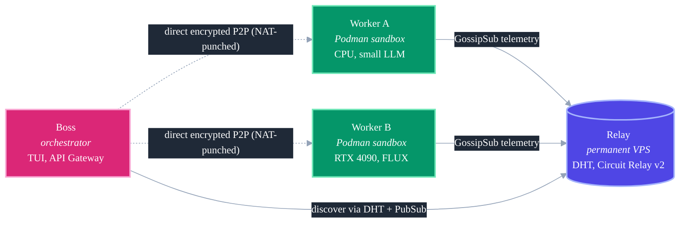

<div align="center">
  

  <br />
  <br />

  [](https://golang.org)
  [](https://libp2p.io)
  [](https://podman.io)
  [](LICENSE)
  [](#)

  <h3>SETI@Home, but for AI. A peer-to-peer compute grid for your containerized agents.</h3>
  <p><i>Zero-config P2P networking. Hardware-aware routing. OpenAI-compatible API. Live artifact streaming.</i></p>
  <p><strong><a href="https://agentfm.net">agentfm.net</a></strong></p>

  <h4>One-Line Install (macOS &amp; Linux)</h4>

  ```bash
  curl -fsSL https://api.agentfm.net/install.sh | bash
  ```
</div>

---

## What is AgentFM

A peer-to-peer compute grid that turns idle hardware into a decentralized AI supercomputer. Package your agent as a Podman container, advertise it on a libp2p mesh, and any client (your Next.js app, a LangChain script, a `curl` one-liner) can dispatch tasks over an end-to-end encrypted tunnel. **No cloud accounts, no API keys, no data egress.**

**Three roles:** a *Worker* runs your agent in a Podman sandbox; a *Boss* orchestrates and dispatches tasks (TUI or HTTP gateway); a *Relay* helps peers discover each other and punch through NAT. All you need to start is a laptop with Podman.

**Two things make it interesting:**

1. **OpenAI-compatible** — point any OpenAI SDK at your local mesh and it just works.
2. **Hardware-aware** — workers broadcast live CPU / GPU / queue state; the matcher picks the least-loaded peer for every request.

---

## Hello World

Boot a worker that runs a local **Llama 3.2** model, then dispatch tasks to it.

```bash
# 1. Prereqs (macOS shown; apt for Ubuntu)
brew install podman && podman machine init && podman machine start
curl -fsSL https://ollama.com/install.sh | sh
ollama run llama3.2

# 2. Clone and start a worker
git clone https://github.com/Agent-FM/agentfm-core.git && cd agentfm-core
agentfm -mode worker \
  -agentdir "./agent-example/sick-leave-generator/agent" \
  -image "agentfm-sick-leave:v1" \
  -model "llama3.2" -agent "HR Specialist" \
  -maxtasks 10 -maxcpu 60 -maxgpu 70

# 3. In another terminal, start the API gateway and hit it
agentfm -mode api -apiport 8080 &
curl http://127.0.0.1:8080/v1/chat/completions -H 'Content-Type: application/json' \
  -d '{"model":"llama3.2","messages":[{"role":"user","content":"Draft a sick-leave email"}]}'
```

That's it. Files the agent drops into `/tmp/output` get zipped and shipped back to `./agentfm_artifacts/<task_id>.zip`.

> **Want the interactive radar?** Skip step 3 and run `agentfm -mode boss` for the live TUI.

---

## OpenAI-compatible API

The gateway speaks OpenAI's wire format on `/v1/*`. Existing OpenAI SDKs (LangChain, LlamaIndex, LiteLLM, Continue, the raw `openai` Python or Node clients, Open WebUI) point at an AgentFM mesh by changing only `base_url` and `api_key`.

```python
from openai import OpenAI

client = OpenAI(
    base_url="http://127.0.0.1:8080/v1",
    api_key="anything",  # not validated in v1; see Security
)

resp = client.chat.completions.create(
    model="llama3.2",
    messages=[{"role": "user", "content": "Draft a 500-word leave policy."}],
)
print(resp.choices[0].message.content)
```

### Routes

| Route | Behaviour |
|---|---|
| `GET /v1/models` | One entry per peer currently visible. `id` is the libp2p peer ID; `agentfm_*` extension fields carry per-peer status, hardware, GPU, load. |
| `POST /v1/chat/completions` | Standard OpenAI chat. `stream:true` for SSE deltas terminating with `data: [DONE]`. |
| `POST /v1/completions` | Legacy text-completion endpoint. `prompt` must be a string (array form returns 400). |

### How `model` routes (hybrid)

The incoming `model` is matched against three identifiers in order, first hit wins:

1. **PeerID exact match** — pin a request to a specific machine: `model: "12D3KooW..."`.
2. **AgentName** (case-insensitive) — target a named agent: `model: "my-research-agent"`.
3. **Model engine** (case-insensitive) — standard OpenAI semantics: `model: "llama3.2"` routes to any worker advertising that engine.

Within a tier with multiple matches, the least-loaded worker wins. All-busy returns `503 mesh_overloaded`; no-match returns `404 model_not_found`. All errors use OpenAI's standard error envelope.

### Caveats

- **Auth.** `Authorization: Bearer ...` is accepted but not validated; the gateway binds to `127.0.0.1` by default. For public exposure, put a reverse proxy with auth in front.
- **Token counts** in `usage` are returned as `0`; AgentFM does not tokenize.
- **Streaming is line-buffered**, not character-by-character.
- **Not yet implemented:** `tools` / `tool_choice`, `logprobs`, image / vision parts, `n>1`, `/v1/embeddings`, `/v1/images/generations`, `/v1/audio/*`.

---

## Python SDK

```bash
pip install agentfm
```

The SDK is a thin typed client over the gateway HTTP API. mypy-strict clean, async + sync clients, OpenAI-compatible namespace, scatter-gather batching, signed webhook receiver.

### Discover and dispatch

```python
from agentfm import AgentFMClient

with AgentFMClient(gateway_url="http://127.0.0.1:8080") as client:
    # List workers, optionally filtered by model / agent name / availability
    workers = client.workers.list(model="llama3.2", available_only=True)

    # Blocking single-task dispatch — returns text + extracted artifact paths
    result = client.tasks.run(
        worker_id=workers[0].peer_id,
        prompt="Draft a sick-leave email.",
    )
    print(result.text)
    print(result.artifacts)  # list of pathlib.Path under ./agentfm_artifacts/
```

### Streaming

```python
for chunk in client.tasks.stream(worker_id=peer_id, prompt="..."):
    if chunk.kind == "text":
        print(chunk.text, end="", flush=True)
```

### Scatter-gather (batch across multiple peers)

```python
prompts = ["summarise doc 1", "summarise doc 2", ...]
results = client.tasks.scatter_by_model(
    prompts, model="llama3.2", max_concurrency=8, max_retries=2,
)
# Results returned in submission order; failed prompts surface as
# ScatterResult(status="failed", error="...") — never raises.
```

### OpenAI namespace (typed)

```python
chat = client.openai.chat.completions.create(
    model="12D3KooW...",
    messages=[{"role": "user", "content": "hi"}],
)
# Or stream:
for chunk in client.openai.chat.completions.create(model=..., messages=..., stream=True):
    print(chunk.choices[0].delta.content or "", end="", flush=True)
```

### Async client

Mirror surface — `AsyncAgentFMClient` with `async`/`await`. Async streaming requires `await` first, then `async for`:

```python
async with AsyncAgentFMClient(gateway_url="http://127.0.0.1:8080") as client:
    stream = await client.openai.chat.completions.create(model=..., messages=..., stream=True)
    async for chunk in stream:
        ...
```

### Async webhook callbacks

Submit fire-and-forget tasks and receive HMAC-signed callbacks when they finish:

```python
from agentfm import AgentFMClient, WebhookReceiver, WebhookPayload

def on_done(payload: WebhookPayload) -> None:
    print(f"task {payload.task_id} → {payload.status}")

# Verify HMAC-SHA256 signatures by setting AGENTFM_WEBHOOK_SECRET on the gateway
# and passing the same secret here:
with WebhookReceiver(port=8000, callback=on_done, secret="shared-secret") as rx:
    with AgentFMClient(gateway_url="http://127.0.0.1:8080") as client:
        ack = client.tasks.submit_async(
            worker_id=peer_id,
            prompt="...",
            webhook_url="https://my-host:8000/cb",
        )
        print(f"queued task {ack.task_id}")
        input("Press Enter to stop receiver...\n")
```

The receiver enforces a 64 KiB body cap, validates Content-Type, and verifies HMAC in constant time. The gateway-side validator refuses webhook URLs pointing at loopback / link-local / RFC1918 addresses (set `AGENTFM_WEBHOOK_ALLOW_PRIVATE=1` to opt back in for trusted private deploys).

### Exception hierarchy

Every error is a typed subclass of `AgentFMError` (no raw httpx exceptions ever surface):

| Exception | When |
|---|---|
| `GatewayConnectionError` | Local gateway unreachable / mid-stream transport failure |
| `GatewayInternalError` | Gateway returned an `internal_error` envelope |
| `GatewayProtocolError` | Gateway response can't be decoded |
| `WorkerNotFoundError` | Peer ID not in current telemetry |
| `WorkerStreamError` | libp2p stream failed mid-task |
| `WorkerUnreachableError` | Boss couldn't dial the worker |
| `ModelNotFoundError` | No worker advertises the requested model |
| `MeshOverloadedError` | All matching workers at capacity |
| `InvalidRequestError` | 4xx from gateway (bad model field, malformed URL, etc.) |
| `ArtifactError` | Zip extraction failed (corrupt / zip-slip / size cap) |

---

## Raw HTTP API

For non-Python clients (Next.js, n8n, curl, Slack bots).

| Route | Description |
|---|---|
| `GET /api/workers` | Live list of every worker on the mesh with telemetry. |
| `POST /api/execute` | Sync streaming task dispatch. Body: `{"worker_id":..., "prompt":..., "task_id":...}`. Streams worker stdout back chunked. |
| `POST /api/execute/async` | Fire-and-forget. Returns `202 {"task_id":...}` immediately. POSTs to `webhook_url` on completion (signed if `AGENTFM_WEBHOOK_SECRET` is set). |
| `GET /metrics` | Prometheus scrape endpoint (see Observability). |

Webhook POSTs are bounded by a 30 s timeout, do not follow redirects, and the response body is capped at 64 KiB.

---

## Run a Worker

```bash
agentfm -mode worker \
  -agentdir "./my-agent" -image "my-agent:v1" \
  -agent "My Bot" -model "llama3.2" -author "you" \
  -maxtasks 10 -maxcpu 60 -maxgpu 70
```

The agent directory must contain a `Dockerfile` or `Containerfile`. On startup the worker builds the image, then advertises capabilities via GossipSub every 2 s.

**Circuit breakers** auto-reject tasks and flip status to BUSY when any of `-maxtasks`, `-maxcpu`, `-maxgpu` is exceeded. A node serving the public mesh can't be DoS'd into hurting its operator.

### Authoring agents — the three streaming rules

Because AgentFM pipes your container's stdout directly over a libp2p stream, *how* you write to stdout is the single most important UX decision in your agent.

```python
# 1. Always flush
print("Analyzing the CSV file...", flush=True)

# 2. Set PYTHONUNBUFFERED=1 in your Dockerfile

# 3. Trap noisy framework chatter into a StringIO so the Boss sees clean output:
import io, sys
from contextlib import redirect_stdout, redirect_stderr

boss_stream = sys.stdout
trap = io.StringIO()
with redirect_stdout(trap), redirect_stderr(trap):
    result = run_heavy_pipeline()
print(str(result), file=boss_stream, flush=True)
```

Anything you write to `/tmp/output` gets zipped and streamed back to the Boss automatically. No SDK, no decorators, no callbacks.

```dockerfile
RUN mkdir -p /tmp/output && chmod 777 /tmp/output
ENV PYTHONUNBUFFERED=1
```

### Local sandbox testing

Test offline before broadcasting to the mesh:

```bash
agentfm -mode test -agentdir "./my-agent" -image "my-agent:v1" \
  -agent "My Bot" -model "llama3.2" \
  -prompt "Write a haiku about compilers."
```

---

## Observability

Every role exposes Prometheus `/metrics` and structured `slog` logs. A single Prometheus + Grafana stack watches the entire grid.

### Metric endpoints

| Role | Endpoint | Bind | Override |
|---|---|---|---|
| **Boss (api mode)** | `:8080/metrics` | same as `-apiport` | n/a |
| **Worker** | `:9090/metrics` | `127.0.0.1` (loopback) | `-prom-listen 0.0.0.0:9090`; `-prom-listen -` to disable |
| **Relay** | `:9091/metrics` | `127.0.0.1` (loopback) | same `-prom-listen` flag |

### Metric families

| Name | Type | Labels |
|---|---|---|
| `agentfm_tasks_total` | Counter | `status` ∈ `{ok, error, rejected, timeout}` |
| `agentfm_task_duration_seconds` | Histogram | (none) — buckets tuned for AI workloads (1s → 30 min) |
| `agentfm_workers_online` | Gauge | (none) |
| `agentfm_artifact_bytes_sent_total` | Counter | (none) |
| `agentfm_stream_errors_total` | Counter | `protocol` ∈ `{task, artifacts, feedback}`, `reason` ∈ enum |
| `agentfm_dht_queries_total` | Counter | `op` ∈ `{find_peer, provide, get_value}` (relay only) |

Plus the standard `process_*` and `go_*` runtime collectors. All label tuples are pre-warmed at zero so dashboards don't false-alert on a fresh node.

### Structured logs

Every binary accepts `-log-format` (`json`/`console`/`auto`) and `-log-level` (`debug`/`info`/`warn`/`error`). `auto` (default) uses `console` on a TTY and `json` everywhere else. JSON entries always include `time`, `level`, `msg`, `component`, plus `err`/`task_id`/`peer_id`/`protocol` when applicable.

```json
{"time":"2026-04-26T18:42:11Z","level":"ERROR","msg":"worker stream","component":"api","err":"context deadline exceeded","task_id":"task_abc","protocol":"task"}
```

---

## Private Swarms

Connect your office laptop to your home GPU PC behind strict corporate firewalls, with zero traffic visible to the public mesh.

```bash
# 1. On a $5/mo VPS — boot a relay
agentfm-relay -port 4001
# (prints a permanent multiaddr backed by relay_identity.key)

# 2. On any laptop — generate a swarm key
agentfm -mode genkey  # writes ./swarm.key — distribute out-of-band

# 3. Join nodes with both -swarmkey and -bootstrap
agentfm -mode worker -swarmkey ./swarm.key \
  -bootstrap "/ip4/198.51.100.23/tcp/4001/p2p/12D3KooWQHw8..." \
  -agentdir "./my-agent" -image "my-agent:v1" -agent "Home Rig" -model "mistral-nemo"
```

The swarm key is a 256-bit PSK applied at the libp2p `pnet` layer. Peers without it see ciphertext garbage at the TCP layer and the connection is dropped before a single byte of AgentFM protocol is exchanged. Treat the key like an SSH private key.

---

## Architecture



### Wire protocols

| Protocol | Direction | Deadline | Purpose |
|---|---|---|---|
| `agentfm-telemetry-v1` (GossipSub) | Worker → mesh | (pubsub) | 2s heartbeat: CPU / GPU / RAM / queue. |
| `/agentfm/task/1.0.0` | Boss → Worker | 10 min idle | JSON envelope in, streaming stdout back. |
| `/agentfm/feedback/1.0.0` | Boss → Worker | 30 s | Post-task feedback message. |
| `/agentfm/artifacts/1.0.0` | Worker → Boss | 30 min | Size-headered zip of `/tmp/output`, capped at 5 GiB. |

### Stream hygiene

- Every stream gets explicit `SetDeadline` on accept. No unbounded streams.
- Error paths call `stream.Reset()`; only happy paths call `stream.Close()`.
- Incoming task JSON capped at 1 MiB via `io.LimitReader`.
- Artifact stream length-prefixed (8-byte int64) and additionally `LimitReader`-bounded — a worker that lies about size can't push more than its declaration.
- Workers attribute artifacts by SDK-generated UUID basename (`<task_id>.zip`); concurrent `tasks.run` calls cannot steal each other's outputs.

---

## Security Model

Zero-trust threat model. Every remote peer is treated as potentially slow, faulty, or malicious.

| Layer | Defense |
|---|---|
| **Transport** | End-to-end encrypted libp2p streams (Noise / TLS). |
| **Authentication** | Peer IDs are Ed25519 public keys; identities persist via `relay_identity.key` (mode `0600`). |
| **Private networks** | `-swarmkey` enables PSK; non-key-holders dropped before any protocol byte. |
| **Execution** | Every task runs in a fresh Podman container with `--rm --network host`. SIGKILLed the instant the stream dies. |
| **DoS / Slow-loris** | Every libp2p stream has explicit deadlines. HTTP server has full timeout matrix. Payloads capped with `io.LimitReader`. |
| **Webhook SSRF** | Webhook URLs validated against private/loopback/link-local; resolves at validation AND re-validates each candidate IP at dial-time (TOCTOU safe). Set `AGENTFM_WEBHOOK_ALLOW_PRIVATE=1` to opt back in. |
| **Webhook integrity** | Set `AGENTFM_WEBHOOK_SECRET` to enable HMAC-SHA256 signing (`X-AgentFM-Signature` header). Python `WebhookReceiver(secret=...)` verifies in constant time. |
| **Webhook DoS** | Response body capped at 64 KiB; redirects not followed; 30 s connection timeout. |
| **Artifact safety** | Zip extraction defends against zip-slip + zip-bomb (per-entry chunked copy, 1 GiB total budget, partial files unlinked on overflow). |
| **Resource budgets** | Workers reject tasks past `-maxcpu`, `-maxgpu`, `-maxtasks`. |

> **What AgentFM does NOT protect against:** a malicious worker you've voluntarily dispatched to with sensitive prompt data. On the public mesh, treat your prompt as "published." If confidentiality matters, **use a private swarm.**

---

## CLI Reference

| Flag | Default | Description |
|---|:---:|---|
| `-mode` | *required* | `boss`, `worker`, `relay`, `api`, `test`, `genkey` |
| `-agentdir` | (none) | Path to agent dir (must contain `Dockerfile`/`Containerfile`) |
| `-image` | (none) | Podman image tag |
| `-agent` | (none) | Advertised agent name (max 20 chars) |
| `-model` | `llama3.2` | Advertised model engine (max 40 chars) |
| `-desc` | (none) | Agent description (max 1000 chars) |
| `-author` | `Anonymous` | Operator handle (max 50 chars) |
| `-maxtasks` | `1` | Max concurrent tasks (1-1000) |
| `-maxcpu` | `80.0` | Reject tasks above this CPU % (0-99) |
| `-maxgpu` | `80.0` | Reject tasks above this GPU VRAM % (0-99) |
| `-apiport` | `8080` | Port for `-mode api` HTTP gateway |
| `-prom-listen` | mode default | Prometheus `/metrics` bind. `-` disables |
| `-log-format` | `auto` | `json`, `console`, or `auto` (TTY → console, else json) |
| `-log-level` | `info` | `debug` / `info` / `warn` / `error` |
| `-swarmkey` | (none) | Path to `swarm.key` for private mesh |
| `-bootstrap` | *public lighthouse* | Custom relay multiaddr |
| `-port` | `0` | Listen port (0 = random; relays should use 4001) |
| `-prompt` | (none) | One-shot prompt for `-mode test` |

---

## Installation

### Prerequisites

- **Podman** for worker nodes (boss / api / relay don't need it)
- **Go 1.25+** only if building from source

### One-line install (recommended)

```bash
curl -fsSL https://api.agentfm.net/install.sh | bash
```

Drops `agentfm` and `agentfm-relay` into `/usr/local/bin`.

### From source

```bash
git clone https://github.com/Agent-FM/agentfm-core.git
cd agentfm-core/agentfm-go
make build && make install
```

`make build-all` cross-compiles for macOS / Linux / Windows on amd64 + arm64.

---

## Development

### Repo layout

```
agentfm-core/
├── agentfm-go/         # Core Go daemon (agentfm + relay binaries)
├── agentfm-python/     # Official Python SDK
└── agent-example/      # Reference agents
```

### Testing

```bash
cd agentfm-go
make test              # Unit tests
make test-integration  # End-to-end scenarios over real libp2p
make test-race         # Everything under -race
```

Every test must pass under `-race`, clean up via `t.Cleanup`, bound network calls with `context.WithTimeout`, and use **real** libp2p hosts (`testutil.NewHost`) — not mocknet, which silently bypasses `SetDeadline`.

Python SDK:

```bash
cd agentfm-python
pip install -e ".[dev]"
pytest && ruff check src/ tests/ && mypy --strict src/agentfm/
```

Full contributor / branching / PR workflow: [`CONTRIBUTING.md`](CONTRIBUTING.md).

---

<div align="center">

**Built with Go, libp2p, and a belief that compute should belong to everyone.**

</div>
