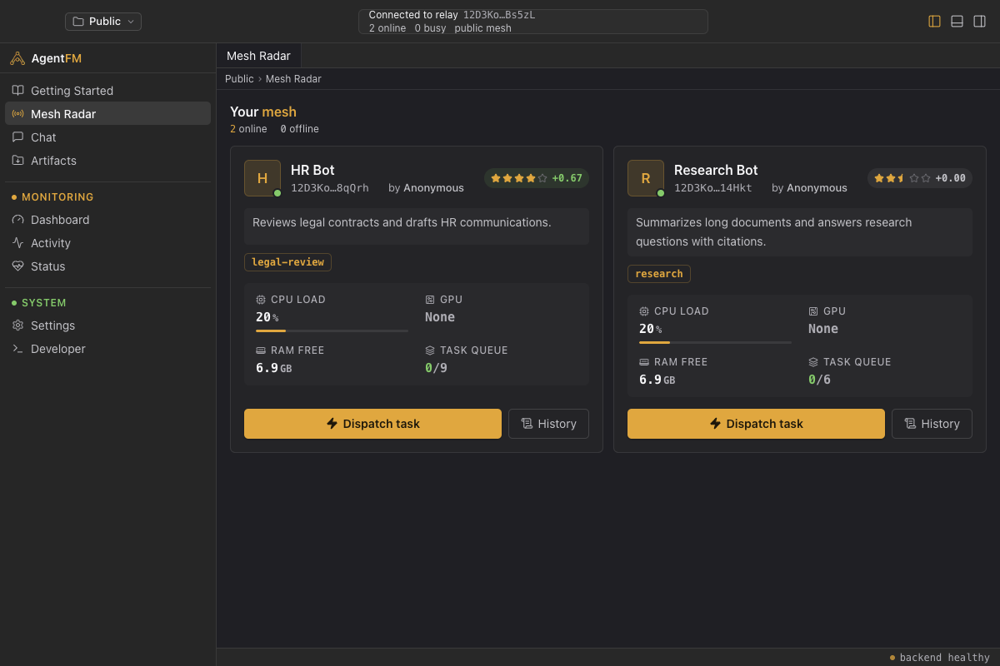
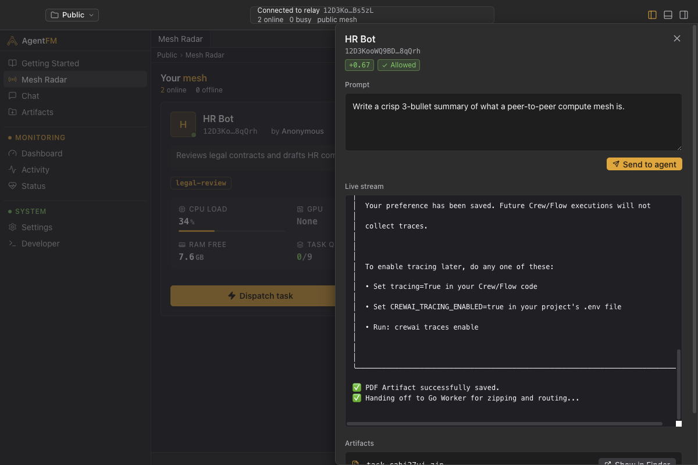
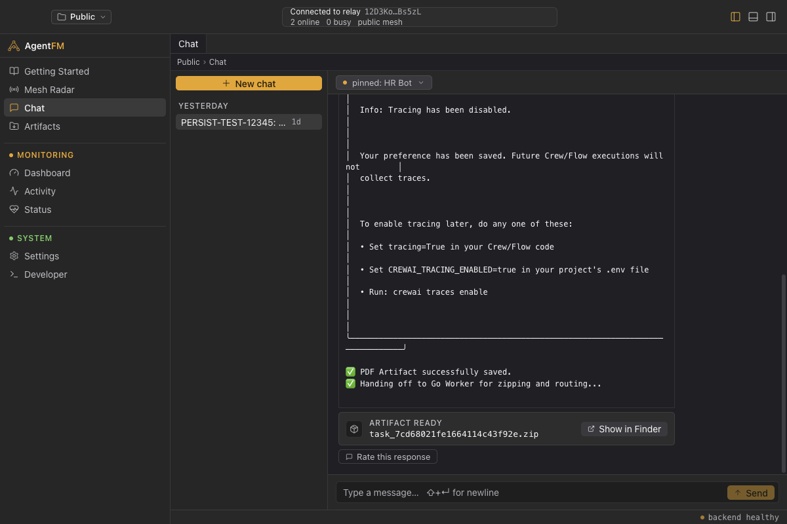
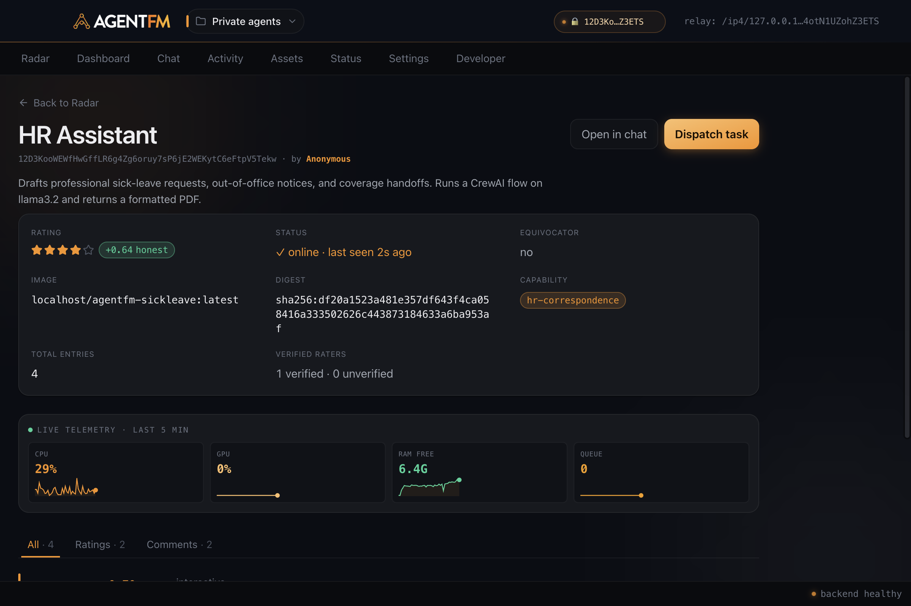
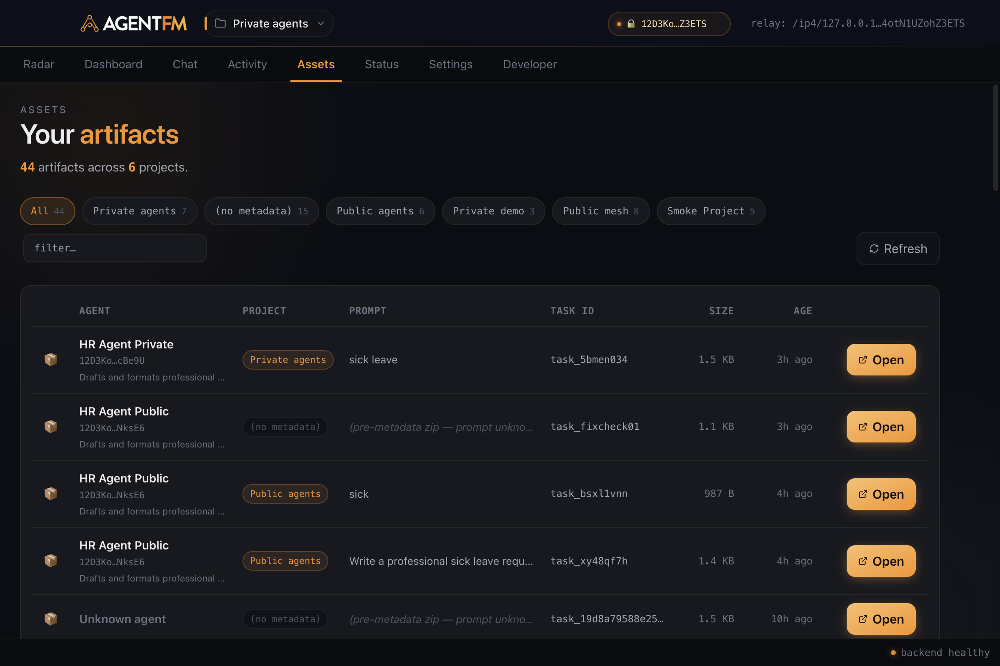
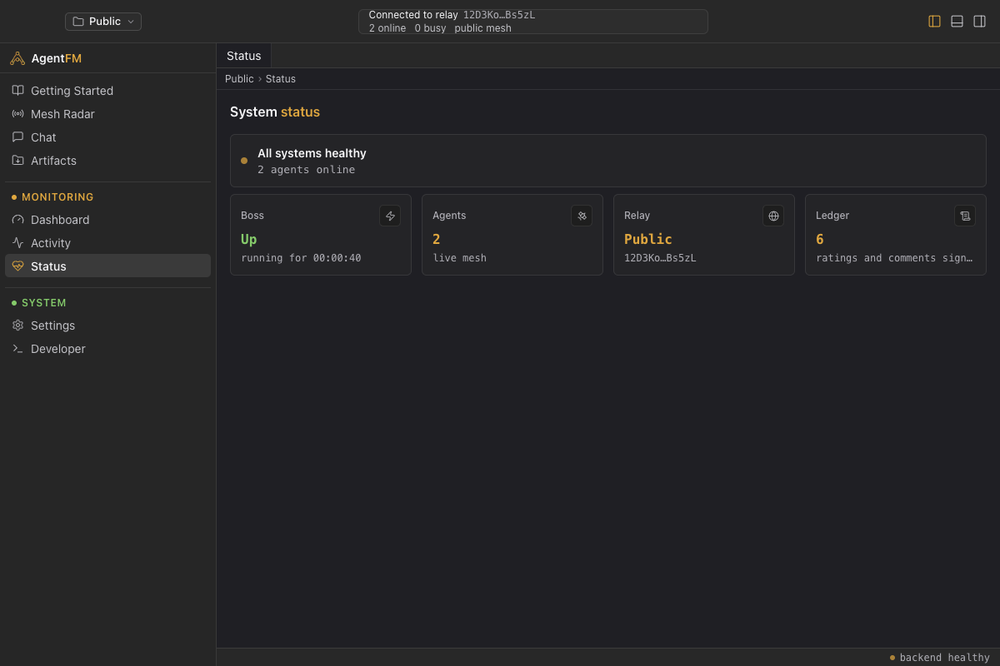
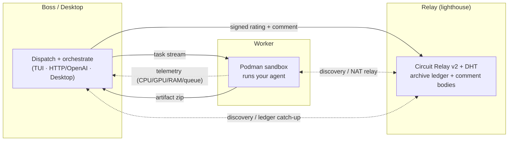
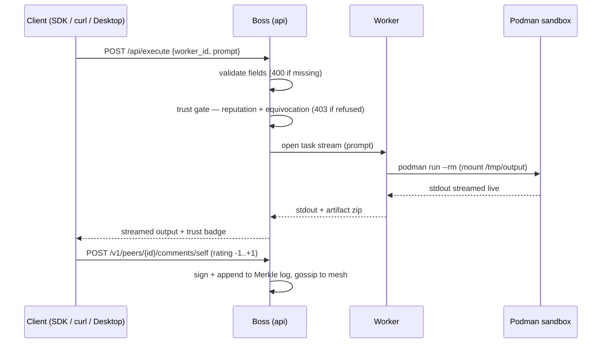

<div align="center">
  

  <br /><br />

  [](https://golang.org)
  [](https://libp2p.io)
  [](https://podman.io)
  [](LICENSE)

  <h3>Run AI agents on a peer-to-peer mesh of idle machines.</h3>
  <p><b>AI Agents, but distributed.</b> Package an agent as a container, drop it on the mesh, and dispatch tasks to it from a desktop app, a <code>curl</code> one-liner, or any OpenAI SDK — end-to-end encrypted, no cloud account, no data egress.</p>

  <p>
    <a href="#-desktop-app"><b>Desktop App</b></a> ·
    <a href="#-what-is-agentfm"><b>What is it</b></a> ·
    <a href="#-quick-start"><b>Quick Start</b></a> ·
    <a href="#-python-sdk"><b>Python SDK</b></a> ·
    <a href="#-documentation">Docs</a> ·
    <a href="https://agentfm.net">agentfm.net</a>
  </p>
</div>

---

## 🖥️ Desktop App

The easiest way in. A calm, native mesh console for **Mac & Linux** (Windows in progress) — see every agent on your mesh, dispatch a task, watch it stream, rate the result. No terminal required. **It bundles the full mesh backend, so installing it gives you a complete node.**

<table>
  <tr>
    <td width="50%"><br/><sub><b>Mesh Radar</b> — every agent, live CPU/GPU/RAM/queue, honesty stars, one-click dispatch</sub></td>
    <td width="50%"><br/><sub><b>Dispatch</b> — live-streamed output with a trust badge (<code>+0.67 · Allowed</code>)</sub></td>
  </tr>
  <tr>
    <td width="50%"><br/><sub><b>Chat</b> — pin an agent, stream responses, rate each reply</sub></td>
    <td width="50%"><br/><sub><b>Agent profile</b> — reputation, signed ratings, Merkle-backed history</sub></td>
  </tr>
  <tr>
    <td width="50%"><br/><sub><b>Artifacts</b> — every file an agent produced, organized by project</sub></td>
    <td width="50%"><br/><sub><b>Status</b> — node health, relay connectivity, mesh reachability</sub></td>
  </tr>
</table>

**Download:** [**Releases** → `AgentFM-*.dmg` (macOS, arm64 + x64) · `AgentFM-*.AppImage` (Linux)](https://github.com/Agent-FM/agentfm-core/releases)

> Prefer the terminal? The [CLI](#-quick-start) and [SDK](#-python-sdk) drive the exact same mesh. Full tour: **[docs/DESKTOP.md](docs/DESKTOP.md)**.

---

## 🌐 What is AgentFM

A peer-to-peer compute grid that turns idle hardware into a decentralized AI supercomputer. **Three cooperating roles, one binary** — pick the role with `-mode`.



- **Worker** — runs your agent in a fresh Podman sandbox (`podman run --rm`) and broadcasts live hardware over a libp2p mesh.
- **Boss** — orchestrates and dispatches tasks: the desktop app, an interactive TUI, or a headless HTTP gateway.
- **Relay** — a permanent lighthouse that helps peers discover each other, punches through NAT, and persists the trust ledger + comment bodies so a fresh Boss can recover full history from the relay alone.

**Why it's interesting:**

1. **OpenAI-compatible** — point any OpenAI SDK at your local mesh and it just works.
2. **Hardware-aware** — workers broadcast CPU/GPU/RAM/queue every ~2 s; the matcher routes each task to the least-loaded peer.
3. **Trust without a middleman** — every rating and comment is Ed25519-signed, with the pubkey derived *from the rater's peer id*, so identity and signature are cryptographically bound. Ratings land on a per-peer append-only Merkle log (RFC 6962 inclusion proofs); reputation is EigenTrust-lite; equivocators are caught by witnesses and floored mesh-wide. No allow-lists, no central authority, no blockchain. → [Trust & Verification](docs/trust.md)

---

## 🚀 Quick Start

### Desktop (recommended)

1. Download the installer from [**Releases**](https://github.com/Agent-FM/agentfm-core/releases) — `.dmg` (macOS) or `.AppImage` (Linux).
2. Launch it. The bundled node connects to the public mesh automatically.
3. Open **Mesh Radar**, pick an agent, and hit **Dispatch**. Watch it stream. Rate it. Done.

> Installers are **unsigned in v1** — on macOS, right-click → Open the first time.

### CLI

Boot a worker running local **Llama 3.2**, then dispatch to it over the OpenAI-compatible gateway.

```bash
# 1. Prereqs (macOS shown; use apt on Ubuntu)
brew install podman && podman machine init && podman machine start
curl -fsSL https://ollama.com/install.sh | sh && ollama run llama3.2

# 2. Install AgentFM (or grab a binary from Releases)
curl -fsSL https://api.agentfm.net/install.sh | bash

# 3. Start a worker
agentfm -mode worker -agentdir ./agent-example/sick-leave-generator/agent \
  -image agentfm-sick-leave:v1 -model llama3.2 -agent "HR Assistant" -maxtasks 10

# 4. In another terminal, start the API gateway and hit it with any OpenAI client
agentfm -mode api -apiport 8080 &
curl http://127.0.0.1:8080/v1/chat/completions -H 'Content-Type: application/json' \
  -d '{"model":"llama3.2","messages":[{"role":"user","content":"Draft a sick-leave email"}]}'
```

Files the agent drops in `/tmp/output` come back zipped to `./agentfm_artifacts/<task_id>.zip`.

> **Want the interactive TUI instead of curl?** Run `agentfm -mode boss`.

---

## 🔀 How a dispatch flows

Every dispatch passes the **trust gate** before a stream is opened. Equivocators are blocked; peers below `--reputation-floor` are refused with `403`; missing fields fail fast with `400`.



---

## 🐍 Python SDK

```bash
pip install agentfm-sdk
```

```python
from agentfm import AgentFMClient

with AgentFMClient(gateway_url="http://127.0.0.1:8080") as client:
    workers = client.workers.list(model="llama3.2", available_only=True)
    result = client.tasks.run(worker_id=workers[0].peer_id, prompt="Draft a leave policy.")
    print(result.text, result.artifacts)   # artifacts: list[Path], auto-extracted
```

Typed sync + async clients, the full OpenAI-compatible namespace, `scatter`/`scatter_by_model` batch dispatch (never raises — failures come back as `ScatterResult(status="failed", ...)`), and signed webhook callbacks. Full guide: [**Python SDK**](agentfm-python/README.md) · every endpoint: [**HTTP API reference**](docs/http-api.md).

---

## 📡 Join the public mesh

No allow-list. Push your image anywhere, point a worker at the public lighthouse, and you're in — reputation accrues from honest behavior over time.

```bash
podman build -t ghcr.io/you/myagent:v1 ./my-agent && podman push ghcr.io/you/myagent:v1
agentfm -mode worker -agentdir ./my-agent -image ghcr.io/you/myagent:v1 \
  -agent "My Agent" -capability "research-assistant" -model llama3.2
```

The public lighthouse is baked in:
`/ip4/78.47.21.107/tcp/4001/p2p/12D3KooWQHw8mVQkx17kLTNiRTbYckU2cAGcAwFFLzVJhhmBs5zL`

Tighten the dispatch gate with `--reputation-floor=-0.3`, or run a fully isolated darknet with `--swarmkey`. → [Private Swarms](docs/private-swarms.md)

---

## 🧩 Modes — one binary, `-mode` picks the role

Every role ships in the same `agentfm` binary, each with its own flags (`agentfm --help`). Add `-swarmkey` + `-bootstrap` to make any of them join a private swarm.

| Mode | Role | Example |
|---|---|---|
| `worker` | Run your agent in a Podman sandbox | `agentfm -mode worker -agentdir ./a -image a:v1 -agent "My Agent" -model llama3.2 -maxtasks 4` |
| `api` | Headless HTTP + OpenAI gateway (**bundled by the desktop app**) | `agentfm -mode api -apiport 8080 -reputation-floor -0.3` |
| `boss` | Interactive TUI dispatcher | `agentfm -mode boss` |
| `relay` | Lighthouse — Circuit Relay v2 + DHT + archive ledger | `agentfm -mode relay -port 4001 -swarmkey ./swarm.key` |
| `witness` | Ledger-only replica that catches equivocation | `agentfm -mode witness` |
| `genkey` | Generate a private-swarm key | `agentfm -mode genkey` |

Full per-flag reference: [docs/cli.md](docs/cli.md).

---

## 📚 Documentation

| | |
|---|---|
| 🖥️ **Desktop app** guide | [docs/DESKTOP.md](docs/DESKTOP.md) |
| 📦 Install the binaries | [docs/install.md](docs/install.md) |
| 🏃 Run a worker | [docs/worker.md](docs/worker.md) |
| 🌐 **HTTP API** — every endpoint | [docs/http-api.md](docs/http-api.md) |
| 🤖 OpenAI-compatible API | [docs/openai.md](docs/openai.md) |
| 🐍 Python SDK | [agentfm-python/README.md](agentfm-python/README.md) |
| 🔐 Authentication | [docs/auth.md](docs/auth.md) |
| 🛡️ Trust & verification | [docs/trust.md](docs/trust.md) |
| 🔒 Security model | [docs/security.md](docs/security.md) |
| 🕸️ Private swarms | [docs/private-swarms.md](docs/private-swarms.md) |
| 🏗️ Architecture & wire protocols | [docs/architecture.md](docs/architecture.md) |
| 📊 Observability | [docs/observability.md](docs/observability.md) |
| ⚙️ CLI reference | [docs/cli.md](docs/cli.md) |
| 🧑‍💻 Build from source / contribute | [docs/development.md](docs/development.md) · [CONTRIBUTING.md](CONTRIBUTING.md) |

---

<div align="center">
  <sub>Built with Go, libp2p, and a belief that compute should belong to everyone.</sub>
  <br/><br/>
  <b>⭐ Star the repo if a distributed agent mesh sounds useful — it helps a lot.</b>
</div>
