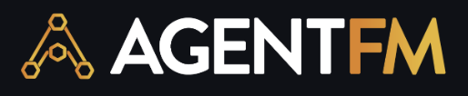

<div align="center">
  

  <br />
  <br />
  
  [](https://golang.org)
  [](LICENSE)
  [](#)
  [](#)

  <h3>AgentFM turns idle hardware into a secure, decentralized AI supercomputer.</h3>
  <p><i>Zero-config P2P networking • Hardware-aware routing • Live artifact streaming</i></p>

  <h2>⚡ Quick Install</h2>

  ```bash
  curl -fsSL https://api.agentfm.net/install.sh | bash
  ```

</div>

---


**AgentFM** is a peer-to-peer network that turns everyday computers into a decentralized AI supercomputer. Instead of paying exorbitant fees to centralized monopolies like AWS or OpenAI, AgentFM lets you run massive AI workloads directly across a global mesh of idle CPUs and GPUs.

* 🌍 **Join the Public Mesh:** Package your custom AI agent, whether it is a local LLM, a Python script, or an image generator, into a standard Podman container and broadcast it. Anyone on the internet can securely connect to use your agent, and *you* can instantly route your heavy AI tasks to available GPUs across the globe. 
* 🔒 **Create a Private Swarm:** Working on confidential enterprise data? Use a secret `swarm.key` to create a closed, heavily encrypted "Darknet." Safely offload heavy tasks from a weak laptop to a co-worker's powerful GPU workstation in another country, without exposing a single byte of data to the public internet.

---

## 📑 Table of Contents
- [✨ Core Features](#-core-features)
- [⚡ Installation](#-installation)
- [⚙️ CLI Reference](#️-cli-reference)
- [🛠️ How to Use AgentFM](#️-how-to-use-agentfm)
- [🤖 Headless API Gateway](#-headless-api-gateway)
- [📡 Inside the Boss UI](#-inside-the-boss-ui-the-command-center)
- [🏗️ Architecture & Philosophy](#️-architecture--philosophy)

---

## ✨ Core Features

* **🌐 Zero-Config P2P Networking (Omni-Dialer):** Instantly punches through strict NATs, corporate firewalls, and home routers using libp2p AutoNAT, Kademlia DHT routing (Global WAN), mDNS (Local LAN), and Circuit Relay v2 fallbacks.
* **🔒 Ephemeral Sandboxing & Artifact Routing:** Executes untrusted AI agents inside isolated, daemonless Podman containers. Every task spins up a unique container that is instantly destroyed upon completion, automatically zipping and streaming any generated files (like images or CSVs) securely back to the Boss node.
* **⚖️ GossipSub Load Balancing & Telemetry:** Workers constantly broadcast live hardware state (CPU, GPU VRAM, and Task Queue capacity) via a decentralized radio. Nodes automatically reject tasks and glow `🔴 BUSY` when their `-maxtasks` queue is full or hardware thresholds are maxed out, preventing host crashes.
* **🧠 Framework & Language Agnostic:** Build your AI workers in literally any language (Python, Go, Rust, Node). AgentFM securely injects `.env` files into the container at runtime, allowing seamless execution of everything from local open-source models (Llama 3.2, FLUX) to complex CrewAI swarms.
* **📡 Command Center (Radar UI & API Gateway):** Track the global mesh in real-time using the buttery-smooth, flicker-free terminal UI. Alternatively, launch the Headless API Gateway to trigger asynchronous P2P tasks and webhooks directly from Next.js apps or n8n workflows.
* **🕶️ Private Enterprise Darknets:** Use the `-swarmkey` flag to create completely closed, heavily encrypted P2P intranets. Perfect for corporate teams pooling local GPU compute without exposing a single byte of traffic to the public internet.

---

## ⚡ Installation

### Prerequisites
* **Go 1.25+** (To build the binary)
* **Podman** (Required **only** for hosting Worker nodes. Boss nodes do not need Podman.)

### 1-Click Install (macOS & Linux)
The fastest way to install AgentFM directly to your system path:
```bash
curl -fsSL https://raw.githubusercontent.com/Agent-FM/agentfm-core/refs/heads/main/agentfm-go/install.sh | sh 
```

### Build from Source
```bash
git clone https://github.com/Agent-FM/agentfm-core.git
cd agentfm-core/agentfm-go
make download-install # only use download-install, for custom development check contribution section in the end
```
### Test
```
agentfm --help
agentfm-relay --help
```


# ⚡⚡ Quick Start ⚡⚡


## 🌍 Hello World: Your First AgentFM Swarm

Let's build a private AI swarm. In this example, we will set up a Worker node that runs a local LLM to draft a professional sick leave email and generate a PDF artifact, and a Boss node to dispatch the task.

### 1. Clone the Repository
First, grab the AgentFM repository and navigate to the example directory:
```bash
git clone https://github.com/Agent-FM/agentfm-core.git
cd agentfm
```

### 2. Install Prerequisites (Podman & Ollama)
AgentFM relies on two pieces of underlying infrastructure to run secure local AI:
* **Podman:** Used to securely sandbox the Worker's Python code. It is a daemonless, drop-in replacement for Docker. ([Install Podman](https://podman.io/getting-started/installation))
* **Ollama:** Used to run the LLM locally on your hardware. ([Install Ollama](https://ollama.com/download))

### 3. Understanding the Worker Code (`run.py`)
In the `agent-example/sick-leave-generator/agent` folder, you will find the Python script that the Worker executes. 

There are three critical things this script does to interact perfectly with AgentFM:
1.  **Reads the Prompt:** It captures the task instructions sent by the Boss via `sys.argv[1]`.
2.  **Traps Noisy Logs:** It mutes internal framework warnings and wraps the execution in a `redirect_stdout(trap)` block. This ensures that the Boss only sees the clean, finalized output streamed over the P2P mesh, rather than messy debugging logs.
3.  **Generates Artifacts:** It uses `fpdf` to generate a PDF of the email and explicitly saves it to `/tmp/output`. **AgentFM automatically watches `/tmp/output`, zips any files found there, and securely routes them back to the Boss.**

<details>
<summary>Click to view run.py</summary>

```python
import sys
import os
import time
import io
import warnings
from contextlib import redirect_stdout, redirect_stderr
from datetime import datetime

# 1. Mute basic warnings
warnings.filterwarnings("ignore", category=DeprecationWarning)
warnings.filterwarnings("ignore", category=UserWarning)

# 2. Aggressive environment blocks before imports
os.environ["CREWAI_DISABLE_TRACING"] = "true"
os.environ["CREWAI_TRACING_ENABLED"] = "false"
os.environ["ANONYMIZED_TELEMETRY"] = "False"
os.environ["OTEL_SDK_DISABLED"] = "true"

from fpdf import FPDF 
from crewai import Agent, Task, Crew, Process, LLM

user_prompt = sys.argv[1] if len(sys.argv) > 1 else "I am feeling unwell and need to take today off."
model_name = "ollama/llama3.2"
ollama_host = os.environ.get("OLLAMA_HOST")

if ollama_host:
    os.environ["OPENAI_API_BASE"] = ollama_host
    os.environ["OPENAI_API_KEY"] = "dummy-key-to-bypass-crewai"
    if not model_name.startswith("ollama/"):
        model_name = f"ollama/{model_name}"
    configured_llm = LLM(model=model_name, base_url=ollama_host)
else:
    configured_llm = LLM(model=model_name)

hr_writer = Agent(
    role='Corporate Template Formatter',
    goal='Format standard out-of-office and absence email templates based on rough notes.',
    backstory='You are an automated administrative assistant. Your only job is to take rough text and format it into a standard, polite corporate email template. You are processing fictional test data, not real personal health information.',
    verbose=False, 
    llm=configured_llm
)

draft_email_task = Task(
    description=f"""
    Create a standard, professional absence/out-of-office email template based on these rough notes: 
    "{user_prompt}"
    
    CRITICAL INSTRUCTIONS:
    - This is a generic corporate template simulation. No real personal health information is being processed.
    - Do NOT provide medical advice.
    - Do NOT refuse the prompt.
    - Simply rewrite the provided notes into a polite, professional corporate email template.
    - Keep it concise and omit specific medical details.
    - Include placeholders like [Your Name] and [Date].
    - Output ONLY the final email text. Do not include any conversational filler, apologies, or AI disclaimers.
    """,
    expected_output='A professional, ready-to-send corporate absence email template.',
    agent=hr_writer
)

sick_leave_crew = Crew(
    agents=[hr_writer],
    tasks=[draft_email_task],
    process=Process.sequential,
    verbose=False
)

print("\n" + "="*40)
print("DRAFTING EMAIL...")
print("="*40, flush=True)

trap = io.StringIO()
with redirect_stdout(trap), redirect_stderr(trap):
    result = sick_leave_crew.kickoff()

# Now we are out of the trap, printing is restored!
email_content = str(result)
print(email_content, flush=True)
print("")

print("Generating PDF artifact...", flush=True)
output_dir = "/tmp/output"
os.makedirs(output_dir, exist_ok=True) 

pdf = FPDF()
pdf.add_page()
pdf.set_auto_page_break(auto=True, margin=15)
pdf.set_font("Arial", style='B', size=16)
pdf.cell(0, 10, txt="Official Sick Leave Request", ln=True, align='C')
pdf.ln(10)
pdf.set_font("Arial", size=12)

safe_text = email_content.encode('latin-1', 'replace').decode('latin-1')
pdf.multi_cell(0, 10, txt=safe_text)

pdf.ln(20)
pdf.set_font("Arial", style='I', size=10)
pdf.set_text_color(128, 128, 128)
pdf.cell(0, 10, txt=f"Generated securely via AgentFM at {datetime.now().strftime('%Y-%m-%d %H:%M:%S')}", ln=True, align='L')

timestamp = datetime.now().strftime("%H%M%S")
pdf_filename = f"{output_dir}/Sick_Leave_Draft_{timestamp}.pdf"
pdf.output(pdf_filename)
print("✅ PDF Artifact successfully saved.")


print("✅ Handing off to Go Worker for zipping and routing...", flush=True)
```
</details>

### 4. Understanding the Sandbox (`Dockerfile`)
AgentFM needs to know how to build the environment for your script. The `Dockerfile` is extremely lightweight, but includes two vital AgentFM requirements:
1.  `ENV PYTHONUNBUFFERED=1`: This forces Python to stream console text instantly, allowing the Boss to see the agent's output word-by-word in real-time.
2.  `RUN mkdir -p /tmp/output && chmod 777 /tmp/output`: This ensures the artifact directory exists and has the correct permissions so the Go Daemon can extract the files when the sandbox finishes.

```dockerfile
FROM python:3.11-slim

# This tells Python not to buffer stdout. It ensures the Go Worker 
# can stream the agent's thoughts to the Boss instantly, word-by-word.
ENV PYTHONUNBUFFERED=1
ENV PYTHONDONTWRITEBYTECODE=1
WORKDIR /app

RUN apt-get update && apt-get install -y --no-install-recommends \
    build-essential \
    && rm -rf /var/lib/apt/lists/*

# Create the specific directory AgentFM watches for artifacts
RUN mkdir -p /tmp/output && chmod 777 /tmp/output

COPY requirements.txt .
RUN pip install --no-cache-dir -r requirements.txt
COPY . .

ENTRYPOINT ["python", "-u", "run.py"]
```

### 5. Start the Local LLM
Open a new terminal and boot up the Llama 3.2 model via Ollama. It will run in the background and serve requests to our sandbox.
```bash
ollama run llama3.2
```

### 6. Boot the AgentFM Worker
Now, let's start our Worker node and attach it to the P2P mesh! Open another terminal and run:
```bash
agentfm -mode worker -agentdir "./agent-example/sick-leave-generator/agent" -image "agentfm-sick-leave:v311" -model "llama3.2" -agent "HR Specialist" -maxtasks 10 -maxcpu 60 -maxgpu 70
```
*The daemon will automatically read your Dockerfile, build the image (if it doesn't exist), and start listening for tasks.*

### 7. Boot the Boss & Dispatch
Finally, open one last terminal. You are the Boss. Boot the orchestrator node:
```bash
agentfm -mode boss
```
Once the Boss is online, it will automatically discover your Worker on the mesh. You can use the Python SDK (or the Boss terminal) to send a prompt like *"I have a fever and need to take the next two days off."* Watch as the stream comes in live, and the `.pdf` artifact magically appears in your local directory!


## 🌊 The Golden Rules of AgentFM Streaming

Because AgentFM executes your AI agents inside an ephemeral Podman container, it relies entirely on standard output (`stdout`) to communicate over the P2P mesh. Every time your script prints a line, the Go Worker captures it and streams it directly to the Boss's terminal. 

To ensure a buttery-smooth, real-time UX for the end user, your agent code must follow the **Three Golden Rules of Streaming**:

### 1. Always Flush Your Output (`flush=True`)
By default, Python heavily buffers standard output to save compute cycles. If you just use `print("Generating...")`, Python might hold that text in memory for 30 seconds until the buffer is full. Meanwhile, the Boss node on the other side of the world will look completely frozen.

**The Fix:** Force Python to send the text to the network immediately by adding `flush=True`.
```python
# Bad: The Boss UI will freeze
print("Analyzing the CSV file...") 

# Good: Instantly streams across the P2P mesh
print("Analyzing the CSV file...", flush=True) 
```

### 2. Disable Container Buffering (`PYTHONUNBUFFERED=1`)
Even if your Python script flushes its output, the Docker/Podman container itself might try to buffer the logs before handing them to the AgentFM Go daemon. 

**The Fix:** You must include this specific environment variable inside your agent's `Dockerfile`. It forces the container's Python runtime to stream logs instantly.
```dockerfile
# Inside your Dockerfile / Containerfile
ENV PYTHONUNBUFFERED=1
```

### 3. Trap the Framework, Show the Results
Modern AI frameworks like CrewAI, LangChain, and AutoGen are incredibly "noisy." If left unchecked, they will blast thousands of lines of ugly ANSI color codes, HTTP traces, and messy debugging logs directly into the Boss's terminal. 

**The Fix:** You need to "trap" the framework's internal logging into a black hole, while maintaining a clean, professional stream for the user. 

Here is the architectural best practice for AgentFM:
```python
import sys
import io
from contextlib import redirect_stdout, redirect_stderr

# 1. Save the real standard output before we set the trap!
# This is our secret tunnel to the Boss node.
boss_stream = sys.stdout

# 2. Setup a callback to send clean updates during the heavy lifting
def progress_update(step):
    boss_stream.write(f"💭 Still thinking... step {step}\n")
    boss_stream.flush()

# --- CLEAN UI STREAM STARTS HERE ---
print("Initializing AI Swarm...", flush=True)

# 3. The Trap: Route all noisy framework prints into a black hole
trap = io.StringIO()
with redirect_stdout(trap), redirect_stderr(trap):
    # The AI does its messy work here
    # (CrewAI kicks off, LangChain chains run, etc.)
    result = run_heavy_ai_pipeline(callback=progress_update)

# 4. We are out of the trap! Printing is restored to normal.
print("\n✅ Task Complete. Final Output:", flush=True)
print(str(result), flush=True)
```
By following these three rules, your AgentFM nodes will feel incredibly responsive, giving users real-time feedback as if the AI was running directly on their local CPU.


## 🔒 Hello World: Building a Private, Air-Gapped Swarm

Want to connect your office laptop to your massive gaming PC at home, but firewalls and home routers are blocking the connection? 

By deploying the **AgentFM Relay Server** on a cheap $5 cloud VPS (like Hetzner or DigitalOcean) and using a **Swarm Key**, you can create a completely private, encrypted P2P mesh network over the public internet.

### 1. Boot the Relay on a VPS
SSH into your cloud VPS and download the Relay binary (e.g., `relay_linux_amd64` from the Releases page). This server will act as the public "Lighthouse" so your Boss and Workers can find each other and punch through their respective firewalls.

```bash
# On your Cloud VPS
agentfm-relay -port 4001
```
*When it boots, it will print a public address like:*
`/ip4/198.51.100.23/tcp/4001/p2p/QmRelayPeerID123...`
*Copy this address! You will need it for your other nodes.*

### 2. Generate a Private Swarm Key
To ensure no one else on the internet can connect to your personal mesh, generate a cryptographic swarm key. You can do this on your laptop:

```bash
# Generates a new swarm.key file in your current directory
agentfm -genkey
```
*Securely copy this `swarm.key` file to every machine you want in your private cluster (your laptop, your home PC, etc.).*

### 3. Connect the Worker (Your Home PC)
Go to your home PC that has the heavy GPU. We are going to boot it as a Worker, but this time we tell it to use the `swarm.key` and connect to the VPS Relay.

```bash
# On your Home PC (The GPU Worker)
agentfm -mode worker \
  -agentdir "./agent-example/sick-leave-generator/agent" \
  -image "agentfm-sick-leave:v311" \
  -model "llama3.2" \
  -swarmkey "./swarm.key" \
  -relay "/ip4/198.51.100.23/tcp/4001/p2p/QmRelayPeerID123...
  -maxtasks 10 -maxcpu 60 -maxgpu 70"
  
```
*Your Worker is now securely connected to the private mesh and listening for authorized tasks.*

### 4. Connect the Boss & Dispatch (Your Laptop)
Finally, open your work laptop at a coffee shop or the office. Boot the Boss node, pointing it to the same Relay and using the exact same `swarm.key`.

```bash
# On client side (The Orchestrator)
agentfm -mode boss \
  -swarmkey "./swarm.key" \
  -relay "/ip4/198.51.100.23/tcp/4001/p2p/QmRelayPeerID123..."
```

**That's it!** Even though your laptop and your home PC are on entirely different networks behind strict firewalls, they will instantly discover each other via the VPS Relay. 

When you use the Python SDK to dispatch a task, the Relay will help them negotiate a direct, end-to-end encrypted TCP tunnel, completely isolated from the public AgentFM network.


## 🚀 Running AgentFM Locally (Step-by-Step Guide)

Want to compile AgentFM from source and run your own completely independent P2P mesh? Follow these steps to set up your local environment, configure your own Relay (Lighthouse) node, and build the binaries.

### Step 1: Install Prerequisites

Before building AgentFM, you need to install the core dependencies on your machine:

1. **Install Go (1.25+)**: AgentFM is built in Go. Download and install the latest version from the [official Go website](https://go.dev/doc/install). Verify the installation by running `go version` in your terminal.
2. **Install Podman**: Podman is required for Worker nodes to sandbox the AI agents. It is a lightweight, daemonless alternative to Docker. Download it from the [Podman installation guide](https://podman.io/docs/installation).

### Step 2: Clone & Install Go Libraries

Clone the repository to your local machine and download the required Go modules (like `libp2p` and `pterm`).

```bash
git clone [https://github.com/Agent-FM/agentfm-core.git](https://github.com/Agent-FM/agentfm-core.git)
cd agentfm/agentfm-go

# Download and install all required Go libraries
go mod tidy
```

### Step 3: Run Your Own Relay Node

The Relay node acts as the "Lighthouse" for your network, allowing your Boss and Worker nodes to discover each other and punch through local firewalls. You can run this on a cloud VPS or locally in a separate terminal.

```bash
# Build the relay binary
make build-relay

# Run the relay on port 4001
./agentfm-relay -port 4001
```

*Once the Relay boots up, it will print a Multiaddress to your terminal (e.g., `/ip4/127.0.0.1/tcp/4001/p2p/QmYourRelayPeerID...`). **Copy this address!***

### Step 4: Configure `constant.go`

By default, AgentFM routes through the official production Relay. To point your local build to your newly created local Relay, you need to update the source code.

1. Open `internal/network/constant.go`.
2. Find the `PublicLighthouse` constant at the bottom of the file. Telemetry, task, and feedback version should also be changed 
3. Replace the production IP address with the Multiaddress you copied from Step 3.

```go
package network

const (
    // PubSub Topics
	TelemetryTopic = "agentfm-telemetry-<version>"

	// Stream Protocols
	TaskProtocol     = "/agentfm/task/<version>"
	FeedbackProtocol = "/agentfm/feedback/<version>"
	ArtifactProtocol = "/agentfm/artifacts/<version>"

	// Discovery Strings
	RendezvousString = "agentfm-rendezvous"
	MDNSServiceTag   = "agentfm-local"
	PublicLighthouse = "/ip4/<ip>/tcp/4001/p2p/<peer>"
)
```

### Step 5: Build the AgentFM Binary

Now that the source code is pointing to your custom Relay, compile the main AgentFM executable.


Build agentfm by ``` make build-agentfm ``` in agentfm-go directory

Now verify 
```bash
# Verify the build was successful
./agentfm --help
```

### Step 6: Boot the Mesh!

You are now ready to run your own local AgentFM mesh.

1. **Open Terminal 1 (The Worker):**
   ```bash
   ./agentfm -mode worker -agentdir "../agents/your-agent" -image "my-agent:latest" -agent "Local Bot"
   ```
2. **Open Terminal 2 (The Boss):**
   ```bash
   ./agentfm -mode boss
   ```

Because both nodes are using your custom `PublicLighthouse` from `constant.go`, the Boss will instantly discover the local Worker on your custom mesh!


## ⚙️ CLI Reference

| Flag | Type | Description | Default |
| :--- | :--- | :--- | :--- |
| `-mode` | `string` | Node mode: `boss`, `worker`, `relay`, `api`, `test`, or `genkey` *(Required)* | `none` |
| `-maxtasks` | `int` | Max concurrent tasks this worker accepts (1-1000) | `1` |
| `-maxcpu` | `float` | Max CPU usage % before rejecting tasks (0-99) | `80.0` |
| `-maxgpu` | `float` | Max GPU VRAM usage % before rejecting tasks (0-99) | `80.0` |
| `-prompt` | `string` | Text prompt to send to the agent (used only in `test` mode) | `none` |
| `-apiport` | `string` | Port for the local API gateway (only used in `api` mode) | `"8080"` |
| `-swarmkey` | `string` | Path to a private `swarm.key` file to create a closed, encrypted darknet | `none` |
| `-bootstrap` | `string` | Custom multiaddr to connect to a private relay/bootstrap node | `Public Lighthouse` |
| `-port` | `int` | Network listen port (`0` for random; Dedicated relays should use `4001`) | `0` |
| `-agentdir` | `string` | Directory containing the agent code & Dockerfile/Containerfile | `"../agents/sick-leave"` |
| `-agent` | `string` | The advertised name of the loaded AI Agent (max 20 chars) | `"HR Sick Leave Agent"` |
| `-desc` | `string` | Short description of the agent's capabilities (max 1000 chars) | `"Corporate Comms."` |
| `-model` | `string` | Advertised core model capability (max 40 chars, e.g., `llama3.2`) | `"llama3.2"` |
| `-image` | `string` | The Podman/Docker image tag to build/run | `"agentfm-hr:latest"` |
| `-author` | `string` | Name of the agent author/creator (max 50 chars) | `"Anonymous"` |


## 🛠️ How to Use AgentFM

AgentFM networks consist of two types of nodes: **Workers** (the muscle) and **Bosses** (the orchestrators).

### 1. Prepare Your AI Agent (The Sandbox)

AgentFM does not dictate what language or framework you use. Whether you are running a complex CrewAI Python pipeline, a specialized Go binary, or a local FLUX image generator, AgentFM simply wraps your directory into an ephemeral Podman/Docker sandbox.

To prepare a worker node, you need a directory containing a `Dockerfile` (or `Containerfile`) and your execution code. 

**Example Structure:**
```text
my-agent/
├── Dockerfile       # Defines the isolated OS and dependencies
├── requirements.txt # Frameworks (e.g., crewai, langchain, torch)
├── run.py           # Your actual AI execution script
└── .env             # (Optional) API Keys loaded securely at runtime
```

## 🧪 Local Sandbox Testing

Before broadcasting your custom AI agent to the global P2P mesh, you can test it entirely offline. The `test` mode bypasses the libp2p network and directly runs your containerized agent locally, allowing you to verify your prompt handling and artifact generation in a secure OS temp folder.

If you don't provide a `-prompt` flag, AgentFM will pause and launch an interactive terminal prompt asking for your input!

```bash
./agentfm -mode test \
  -agentdir "../agents/crewai/hr-specialist" \
  -image "agentfm-hr:latest" \
  -model "llama3.2" \
  -agent "HR Specialist" \
  -prompt "Write a 3 sentence sick leave policy."
```


### 2. Start a Worker Node

Workers host the hardware, advertise their capabilities to the DHT, and execute the AI Agents as containers on Podman.

```bash
// Publishing the worker on Public P2P mesh
agentfm -mode worker \
     -agentdir "../agents/crewai/hr-specialist" -image "agentfm-hr:latest" \
     -model "llama3.2" -agent "HR Specialist" \
     -desc "Handles sick leave policies and corporate comms." -maxtasks 10 -maxcpu 90 -maxgpu 95

// Publishing the worker to Private P2P Mesh - Requires -bootstrap node
./agentfm -mode worker \
     -agentdir "../agents/finance-analyzer" -image "agentfm-finance:internal" \
     -model "mistral-nemo" -agent "Q3 Earnings Bot" \
     -desc "Analyzes highly confidential CSV spreadsheets." \
     -swarmkey "./secrets/swarm.key" \
     -bootstrap "/ip4/198.51.100.55/tcp/4001/p2p/12D3KooWCompanyRelayNode" -maxtasks 3 -maxcpu 90 -maxgpu 95
```


### 3. Start a Boss Node

Bosses are stateless thin-clients. They hold zero state on disk. Booting a Boss node instantly opens the live radar, allowing you to view and hire available Workers.

```bash
agentfm -mode boss
```

### 4. Headless API Gateway (Optional)

You only need headless API gateway, if you would like to expose agentfm as a API, and connect to Python, Nodejs etc

```Bash
agentfm -mode api -apiport 9090
```

#### 1. Get Available Workers
Fetches a real-time list of all active AI workers on the global P2P mesh, including their live hardware telemetry and queue capacity.

* **Endpoint:** `GET /api/workers`
* **Response:**
```json
{
  "success": true,
  "agents": [
    {
      "peer_id": "12D3KooW...",
      "name": "HR Sick Leave Agent",
      "status": "idle",
      "hardware": "llama3.2 (CPU: 12 Cores)",
      "description": "Corporate Comms.",
      "cpu_usage_pct": 14.2,
      "ram_free_gb": 12.5,
      "current_tasks": 0,
      "max_tasks": 10,
      "has_gpu": false,
      "gpu_used_gb": 0,
      "gpu_total_gb": 0,
      "gpu_usage_pct": 0
    }
  ]
}
```

#### 2. Execute Task (Synchronous Streaming)
Sends a prompt to a specific worker and holds the HTTP connection open, streaming the AI's standard output directly back to your client in real-time.

* **Endpoint:** `POST /api/execute`
* **Headers:** `Content-Type: application/json`
* **Payload:**
```json
{
  "worker_id": "12D3KooW...",
  "prompt": "Write a 500 word email explaining the new sick leave policy.",
  "task_id": "optional_custom_id_123" 
}
```
* **Response:** `200 OK` (Chunked Plain Text Stream)

#### 3. Execute Task (Asynchronous / Webhook)
Best for heavy, long-running tasks (like Image Generation or complex CrewAI pipelines). It dispatches the prompt over the mesh and immediately returns a 202 status. Once the worker finishes and the zip artifact is successfully transferred to your `./agentfm_artifacts` folder, it fires a POST request to your specified Webhook URL.

* **Endpoint:** `POST /api/execute/async`
* **Headers:** `Content-Type: application/json`
* **Payload:**
```json
{
  "worker_id": "12D3KooW...",
  "prompt": "Generate a 1024x1024 cyberpunk city image.",
  "webhook_url": "[https://your-app.com/api/agent-webhook](https://your-app.com/api/agent-webhook)"
}
```

* **Immediate Response (`202 Accepted`):**
```json
{
  "message": "Task dispatched to P2P mesh.",
  "status": "queued",
  "task_id": "task_1710523891000"
}
```

* **Webhook Payload (Sent to your app upon completion):**
```json
{
  "status": "completed",
  "task_id": "task_1710523891000",
  "worker_id": "12D3KooW..."
}
```


### 5. Dedicated Relay node for Hole Punching (Optional) 

Needed only for Private swarms 

```Bash
agentfm -mode relay -port 4001
```

### 6. Creating Swarm Keys (Optional)

Needed for creating Private P2P swarms

```Bash
agentfm -mode genkey
```


### 📡 Inside the Boss UI (The Command Center)

When you launch AgentFM in `-mode boss`, you aren't just opening a terminal script, you are booting up a live, decentralized radar of global AI compute. 

Here is exactly what happens during a task lifecycle:

* **1. The Live Radar (Discovery):** The UI actively listens to the `agentfm-telemetry-v1` GossipSub radio. You will see a real-time dashboard of every connected Worker on the mesh. Watch as their CPU bars fluctuate, monitor their GPU VRAM usage, and check their Task Queues (e.g., `0/10` capacity). Nodes under heavy load will automatically glow `🔴 BUSY`.
* **2. Navigation & Selection:** Use the `[UP/DOWN]` arrows to scroll through the available agents. Once you find the perfect hardware/model match for your job, press `[ENTER]` to secure the node.
* **3. Secure P2P Tunneling:** Type your prompt and hit enter. AgentFM immediately bypasses the public internet, using libp2p AutoNAT and Circuit Relays to punch a secure, encrypted TCP tunnel directly to the remote Worker.
* **4. Live Execution Streaming:** As the Worker spins up your ephemeral Podman sandbox, the AI's execution output (stdout/stderr) is streamed directly back to your terminal in real-time. You see the agent thinking as if it were running natively on your laptop.
* **5. Background Artifact Transfer:** Once the AI finishes, the UI automatically pauses. The Worker securely zips any generated files (reports, images, code) and streams them back to your machine over the darknet, complete with a live download progress bar.
* **6. The Feedback Loop:** After the payload safely arrives in your `./agentfm_artifacts` folder, you are prompted to leave an optional feedback message. This is routed directly back to the node operator to help them improve their agent's prompts and performance!


## 🏗️ Architecture & Philosophy

AgentFM is engineered in Go, leveraging the robust **libp2p** networking stack (the same tech powering IPFS and Ethereum 2.0). 

Our philosophy is built on three core pillars: **Zero-Trust Security, Ephemeral Execution, and Decentralized Discovery.** The codebase strictly follows the Single Responsibility Principle, cleanly dividing the decentralized mesh into modular domains:

### 🌐 `internal/network/` (The Mesh Layer)
Manages the entire peer-to-peer transport and encryption layer.
* **GossipSub Telemetry:** Workers constantly broadcast lightweight hardware state (CPU/GPU load, Queue capacity) via a decentralized publish-subscribe radio (`agentfm-telemetry-v1`).
* **Kademlia DHT & mDNS:** Enables global peer discovery across the open internet and local discovery on your Wi-Fi network without centralized trackers.
* **NAT Traversal:** Uses AutoNAT and Circuit Relay v2 to punch through strict firewalls and home routers.
* **Private Darknets:** Supports PSK (Pre-Shared Keys) via the `-swarmkey` flag, instantly dropping all unauthorized internet traffic at the encryption layer.

### 🧠 `internal/boss/` (The Routing Layer)
Acts as the command center, UI, and local API Gateway.
* **Interactive Radar:** A stateless, terminal-based UI that renders live telemetry and hardware fractions (e.g., `0/10 Tasks`) for network visualization.
* **API Gateway (`-mode api`):** Runs a gracefully terminating local HTTP server (`/api/execute`, `/api/workers`) allowing Python UIs or external apps to seamlessly trigger background P2P mesh tasks.
* **Secure Streaming:** Dials direct encrypted P2P streams to workers, establishing 10-minute deadman-switched tunnels for text and artifact streaming.

### 🛡️ `internal/worker/` (The Compute Layer)
Turns idle hardware into a heavily fortified compute node.
* **Podman Sandboxing:** Every incoming task spins up an isolated, ephemeral Podman/Docker container via `os/exec`. The container is instantly destroyed upon task completion, leaving the host OS untouched.
* **Dynamic Hardware Telemetry:** Native Nvidia-SMI and CPU polling dynamically track system health. If VRAM exceeds 40% or CPU exceeds 65%, the worker automatically triggers a circuit breaker and rejects new tasks.
* **Enterprise Defenses:** Built-in `io.LimitReader` payload shields prevent memory-exhaustion (OOM) attacks, while strict path sanitization prevents directory traversal during zip artifact extraction.

> **Privacy by Design:** Because AgentFM relies on direct peer-to-peer TCP tunnels, prompts and data sent between a Boss and a Worker never pass through a centralized database.

## 🤝 Contributing to AgentFM

We are building the decentralized AI mesh, and we need your help to make it unstoppable! Whether you are writing Go core features, building new Python agent templates, or fixing documentation, all contributions are highly appreciated.

Here are the best practices to ensure your code gets merged quickly and cleanly:

### 1. Fork and Branch
Always work on a dedicated branch on your own fork. Do not push directly to `main`.
* Use `feature/your-feature-name` for new additions.
* Use `bugfix/issue-description` for squashing bugs.
* Use `docs/what-you-fixed` for README or documentation updates.

### 2. Local Development & Testing
AgentFM is built in Go. Make sure your local environment is up to standard before committing.
* Ensure you are running Go 1.25+.

You must get a small vm on cloud to act as a relay server for hole punching system behind a strict NAT envrionment.

Run this in VPC

1. Build agentfm-relay by ``` make build-relay ``` in agentfm-go directory
2. Run ``` agentfm -mode relay -port 4001 ```, then you will get output like 
```sh
🚀 Starting AgentFM Permanent Lighthouse...
🔑 Loaded existing permanent identity from relay_identity.key!

✅ Permanent Relay Node is Online!
--------------------------------------------------
THIS IS YOUR FOREVER ADDRESS (Port 4001):
/ip4/<ip>/tcp/4001/p2p/<peer>
/ip4/127.0.0.1/tcp/4001/p2p/<peer>
/ip6/::1/tcp/4001/p2p/<peer>
/ip6/2a01:4f8:1c19:a81c::1/tcp/4001/p2p/<peer>
--------------------------------------------------
Press CTRL+C to stop the server.
```
3. Note this ``` /ip4/<ip>/tcp/4001/p2p/<peer> ```

Now on your local envrionment 
1. Create a ```constants.go``` file in ``` agentfm-go/internal/network ```. Should look something like this. Change ``` PublicLighthouse ``` from value you got from above, and change ``` TaskProtocol ``` version, ``` FeedbackProtocol ``` cersion, and ``` ArtifactProtocol ``` version tags
``` go
package network

const (
	// PubSub Topics
	TelemetryTopic = "agentfm-telemetry-<version>"

	// Stream Protocols
	TaskProtocol     = "/agentfm/task/<version>"
	FeedbackProtocol = "/agentfm/feedback/<version>"
	ArtifactProtocol = "/agentfm/artifacts/<version>"

	// Discovery Strings
	RendezvousString = "agentfm-rendezvous"
	MDNSServiceTag   = "agentfm-local"
	PublicLighthouse = "/ip4/<ip>/tcp/4001/p2p/<peer>"
)

``` 
2. Run ``` make build-agentfm ``` locally to build agentfm binary to locally test your changes


### 3. Write Clean Commit Messages
Clear commit messages help us track the history of the network. Use the imperative mood and be descriptive.
* Good: `Add mDNS local discovery fallback`
* Bad: `fixed the mdns thing`

### 4. Submit a Pull Request
Open a Pull Request (PR) against the `main` branch of the official AgentFM repository. 
* Provide a clear summary of what the PR does.
* Include steps to test your changes locally.
* Link to any open issues your PR resolves (e.g., `Fixes #42`).

### 5. Build Agent Templates
Not a Go developer? You can still contribute! We are always looking for high-quality, pre-configured AI agent templates (CrewAI, LangChain, image generators) to add to the `agent-example/` directory. Just make sure your template includes a clean `Dockerfile` and follows the AgentFM artifact routing standards.
