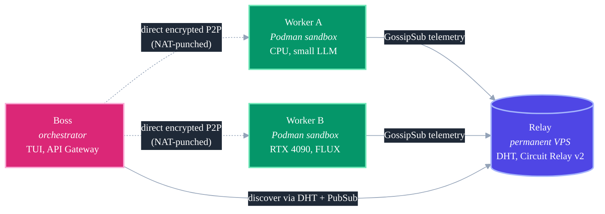

<div align="center">
  

  <br />
  <br />

  [](https://golang.org)
  [](https://libp2p.io)
  [](https://podman.io)
  [](LICENSE)
  [](#)
  [](#)

  <h3>SETI@Home, but for AI. A peer-to-peer compute grid for your containerized agents.</h3>
  <p><i>Zero-config P2P networking. Hardware-aware routing. Live artifact streaming. Private enterprise darknets.</i></p>
  <p><strong><a href="https://agentfm.net">agentfm.net</a></strong></p>

  <h4>One-Line Install (macOS &amp; Linux)</h4>

  ```bash
  curl -fsSL https://api.agentfm.net/install.sh | bash
  ```

  <br />

</div>

## Hello World: Your First Swarm

Spin up a real swarm end-to-end. This walkthrough boots a Worker that runs a local **Llama 3.2** model to draft a sick-leave email and produce a PDF, then dispatches a task to it from a Boss.

### Step 1. Install prereqs

```bash
# Podman (for Worker sandboxing)
brew install podman                            # macOS
sudo apt install podman                        # Ubuntu / Debian
podman machine init && podman machine start    # macOS only

# Ollama (to run the local LLM)
curl -fsSL https://ollama.com/install.sh | sh
```

### Step 2. Clone the agent template

```bash
git clone https://github.com/Agent-FM/agentfm-core.git
cd agentfm-core
```

The agent lives in `agent-example/sick-leave-generator/agent/`. It's a ~60 line Python script built on CrewAI + fpdf that:

1. Reads the prompt from `sys.argv[1]`.
2. Traps noisy framework logs so the Boss sees a clean stream.
3. Writes a PDF to `/tmp/output`. AgentFM zips and routes it back automatically.

### Step 3. Boot the local LLM

```bash
ollama run llama3.2
```

### Step 4. Start the Worker

```bash
agentfm -mode worker \
  -agentdir "./agent-example/sick-leave-generator/agent" \
  -image "agentfm-sick-leave:v311" \
  -model "llama3.2" \
  -agent "HR Specialist" \
  -maxtasks 10 -maxcpu 60 -maxgpu 70
```

The daemon reads the Dockerfile, builds the image (if needed), and starts listening. Telemetry pulses go out every 2 seconds.

### Step 5. Start the Boss

```bash
# In another terminal:
agentfm -mode boss
```

The radar UI lights up with your Worker. Select it with `↑/↓ + Enter`, type a prompt like *"I have a fever and need to take tomorrow off"*, and watch the stream come back live, with the PDF dropping into `./agentfm_artifacts/`.

> **Pro-Tip:** `-maxtasks`, `-maxcpu`, and `-maxgpu` are hard circuit breakers. The Worker auto-rejects new tasks when any threshold is exceeded and broadcasts BUSY on the radar. Set them conservatively on a machine you actively use.

## The Problem

Running serious AI workloads today means one of three bad choices:

1. **Rent GPUs from a monopoly** (AWS, OpenAI, Anthropic). Expensive, rate-limited, and your data leaves your network.
2. **Buy your own GPU.** A $2,000 capital expense that sits idle 90% of the time.
3. **Run it locally on a laptop.** Fine for toys, impossible for anything that needs real VRAM.

Meanwhile, there's a gaming PC in your bedroom, a workstation at your co-worker's house, and a GPU server at the office, all idle most of the day.

## The Pitch

**AgentFM is a peer-to-peer compute grid that turns idle hardware into a decentralized AI supercomputer.** Package your agent as a Podman container, advertise it on a libp2p mesh, and any Boss node on the network can instantly dispatch tasks to it over an end-to-end encrypted tunnel. No cloud accounts, no API keys, no data egress. Just raw compute between peers.

> **Elevator pitch:** Folding@Home for inference. Your friend's 4090 runs the job. Your laptop gets the artifacts. The internet is the backplane.

## Table of Contents

* [Why AgentFM](#why-agentfm)
* [How It Works](#how-it-works)
* [How AgentFM Compares](#how-agentfm-compares)
* [Installation](#installation)
* [Private Swarms (Enterprise Darknets)](#private-swarms-enterprise-darknets)
* [Authoring Agents: The Three Golden Rules of Streaming](#authoring-agents-the-three-golden-rules-of-streaming)
* [CLI Reference](#cli-reference)
* [Headless API Gateway &amp; Python SDK](#headless-api-gateway--python-sdk)
* [Inside the Boss UI](#inside-the-boss-ui)
* [Local Sandbox Testing](#local-sandbox-testing)
* [Security Model](#security-model)
* [Development &amp; Contributing](#development--contributing)

## Why AgentFM

| Feature | What it means in practice |
|---|---|
| **Zero-Config P2P Networking** | Punches through strict NATs, corporate firewalls, and home routers via libp2p AutoNAT, Kademlia DHT, mDNS, and Circuit Relay v2. You don't open ports, you don't configure anything. |
| **Ephemeral Podman Sandboxing** | Every task spins up an isolated, daemonless Podman container tied to the stream's lifecycle. The sandbox dies the instant the task ends, or the moment the tunnel drops. |
| **GossipSub Load Balancing** | Workers continuously broadcast live CPU / GPU VRAM / task-queue state over a decentralized telemetry radio. Overloaded nodes flip to BUSY and auto-reject tasks so your gaming PC never crashes. |
| **Live Artifact Streaming** | Any file the agent drops into `/tmp/output` gets zipped and securely streamed back to the Boss on a dedicated libp2p channel, with a real-time progress bar. |
| **Framework &amp; Language Agnostic** | If it runs in a container, it runs on AgentFM. Python + CrewAI, Go binaries, Ollama, FLUX image generators, Node.js scripts, all first-class. |
| **Private Enterprise Darknets** | One `-swarmkey` flag turns the public mesh into a closed, PSK-encrypted intranet. Confidential data never leaves your peer group. |
| **Headless API Gateway** | Run `agentfm -mode api` and your Next.js app, n8n workflow, or Python SDK can fire P2P tasks over plain HTTP with async webhook callbacks. |

## How It Works

### Foundation: why libp2p

AgentFM is built in Go on top of the [**libp2p**](https://libp2p.io) stack, the same networking layer that powers IPFS, Ethereum, Polkadot, and Filecoin. We chose it for three reasons that matter for a distributed AI compute grid:

* **Identity-first addressing.** Peers are identified by an Ed25519 public key, not an IP address. A Worker's IP can change, its NAT can flip, it can roam between Wi-Fi networks. The peer ID stays stable, and the mesh rediscovers it automatically.
* **Transport agnosticism.** TCP today, QUIC tomorrow, over Tor if you want. The protocol contract is just "a bidirectional authenticated byte stream to peer X."
* **Built-in NAT traversal.** 90% of the nodes AgentFM runs on are behind some kind of NAT (home routers, office firewalls, mobile hotspots). libp2p's AutoNAT, Circuit Relay v2, and hole-punching stack does the hard work so we don't.

The whole system has three cooperating node roles:



> **Color legend:** indigo is the Relay lighthouse, pink is the Boss orchestrator, emerald is a Worker compute node.

### The three node roles

| Role | Runs on | What it does |
|---|---|---|
| **Relay** | A small, permanent cloud VPS | Lighthouse for the mesh. Runs DHT in server mode, enables Circuit Relay v2 for NAT hole-punching, and keeps its peer identity stable via `relay_identity.key` so its multiaddr is permanent. |
| **Worker** | Any machine with hardware to donate | Advertises capabilities via GossipSub telemetry, accepts task streams, and executes them inside ephemeral **Podman** containers. Requires Podman; auto-detects Nvidia GPUs and attaches `nvidia.com/gpu=all`. |
| **Boss** | Any laptop or server | Stateless thin client. Either the interactive `pterm` radar TUI, or the headless HTTP gateway (`-mode api`). Discovers workers, opens encrypted P2P tunnels, streams stdout back, receives artifact zips. |

#### Relay, the lighthouse

A Relay is a **stateless public coordinator**, not a gateway. It doesn't route task traffic, it doesn't see prompts or artifacts. It only helps peers *find* each other and, when strict NAT gets in the way, briefly helps them *punch a hole* to one another. One $5/mo VPS can serve thousands of peers because it's handling metadata, not compute.

The Relay's peer identity is persisted to `relay_identity.key` (mode `0600`) so its multiaddr stays stable across restarts. This is crucial because every Worker and Boss hard-codes the public Relay's multiaddr as their bootstrap. Lose that key, lose that address.

#### Worker, the compute node

A Worker turns a specific directory into an advertised AI agent. The directory must contain a `Dockerfile` (or `Containerfile`); on startup the Worker runs `podman build --no-cache` to produce the image, then starts publishing telemetry about its hardware and capacity. Workers are the *only* nodes that need Podman; Bosses and Relays don't.

Each Worker enforces three hard **circuit breakers** (`-maxtasks`, `-maxcpu`, `-maxgpu`) that auto-reject tasks and flip the advertised status to BUSY once exceeded, so a node serving the public mesh can't be DoS'd into hurting its own operator.

#### Boss, the orchestrator

A Boss holds **zero state on disk**. It's either an interactive terminal radar (`-mode boss`) that lets a human pick a Worker and watch the stream live, or a headless HTTP gateway (`-mode api`) that exposes endpoints so Python, Node, n8n, or Next.js can fire P2P tasks over plain HTTP. Both share the same underlying libp2p dialer and stream-handler code; the UI is just a different front end for the same routing engine.

### Peer discovery and NAT traversal

One of AgentFM's defining promises is "zero-config networking." That's not marketing. It's four independent libp2p subsystems composed in layers, each with a different failure mode. Knowing which one kicked in tells you a lot about why your node connected:

| Mechanism | When it engages | Scope | What it gives you |
|---|---|---|---|
| **mDNS** | Always, in the background | Local LAN | Sub-second peer discovery on the same Wi-Fi or subnet. Your laptop finds the desktop under your kitchen table instantly. |
| **Kademlia DHT** | Every 10s after boot | Global WAN | Distributed peer lookup across the public internet. The Rendezvous string `agentfm-rendezvous` is how peers find each other without a central index. |
| **AutoNAT** | On startup | Single node | Tests whether this node is publicly reachable. If not, the node switches into "I need a relay" mode and starts opportunistically using Circuit Relay v2. |
| **Circuit Relay v2** | On demand, when AutoNAT reports closed NAT | Two peers + relay | A pre-existing Relay (like your VPS lighthouse) forwards a *single* setup packet between two peers behind strict NAT, and they coordinate a direct hole-punch. After that the relay drops out and the connection is truly peer-to-peer. |

> **Pro-Tip:** `[DHT Fallback]` log lines on the Boss are the 10-second Kademlia sweep finding peers the initial GossipSub telemetry didn't surface. `[mDNS]` means you connected to a LAN peer without even touching the internet.

The net effect: you launch a Worker on a laptop behind your home router and a Boss at a coffee shop behind enterprise firewalls, and they form a direct encrypted TCP tunnel. No port-forwarding, no VPN, no cloud router in the data path. The Relay coordinated the introduction, then got out of the way.

### The four wire protocols

AgentFM talks over four versioned protocol strings. They're defined in `agentfm-go/internal/network/constants.go` and every peer on the mesh must agree on them exactly.

| Protocol | Direction | Deadline | Purpose |
|---|---|---|---|
| `agentfm-telemetry-v1` *(GossipSub)* | Worker to mesh | (pubsub) | Heartbeat broadcast of CPU / GPU / RAM / queue state every 2s. |
| `/agentfm/task/1.0.0` | Boss to Worker | 10 min idle | JSON envelope in, streaming stdout back. Reads refresh the deadline. |
| `/agentfm/feedback/1.0.0` | Boss to Worker | 30 s | Post-task feedback message, persisted to `feedback.log` in the agent dir. |
| `/agentfm/artifacts/1.0.0` | Worker to Boss | 30 min | Size-headered zip of `/tmp/output` on a dedicated stream. |

**Stream hygiene rules** (enforced throughout the codebase):

* Every stream gets an explicit `SetDeadline` / `SetReadDeadline` / `SetWriteDeadline` on accept. No unbounded streams, ever.
* Error paths call `stream.Reset()` (RST-equivalent, aborts and signals the peer). Only happy paths call `stream.Close()` (graceful FIN).
* Incoming task JSON is capped at **1 MB** via `io.LimitReader`. Malicious peers can't OOM the Worker with an infinite payload.
* The artifact stream is length-prefixed: the first 8 bytes are the zip size as a little-endian int64. The Boss reads exactly that many bytes or aborts.

**Task envelope** (what the Boss writes to `/agentfm/task/1.0.0`):

```json
{
  "version": "1.0.0",
  "task":    "agent_task",
  "data":    "<the user's prompt>",
  "task_id": "task_1718923891000"
}
```

**Stream markers** (what the Worker writes back on stdout, before closing):

| Marker | Meaning |
|---|---|
| `\n[AGENTFM: FILES_INCOMING]\n` | "I'm about to open an artifact stream on `/agentfm/artifacts/1.0.0`. Start expecting a zip." |
| `\n[AGENTFM: NO_FILES]\n` | "Task finished with no artifacts. Don't wait." |

The Boss and Python SDK parse these out of the stdout stream so users never see them in the rendered output.

> **Pro-Tip:** If you're forking the repo to run your own isolated mesh, bump the version suffixes in `constants.go` (`TaskProtocol`, `FeedbackProtocol`, `ArtifactProtocol`, `TelemetryTopic`). A `/agentfm/task/1.0.0` Boss will happily ignore a `/agentfm/task/1.0.1` Worker's existence at the libp2p protocol-negotiation layer. The cleanest way to partition dev from prod.

### Execution model: inside the Podman sandbox

When a task stream arrives at a Worker, the sequence is fully scripted:

1. **Capacity check.** The Worker grabs its mutex, compares current task count against `-maxtasks`, checks `-maxcpu` against its latest CPU sample, and queries `nvidia-smi` for current VRAM usage against `-maxgpu`. If any threshold is hit, the Worker writes a human-readable rejection message onto the stream and gracefully closes. No sandbox starts. This is the **circuit breaker**.
2. **Payload decode.** Reads up to 1 MB of JSON through an `io.LimitReader`, decodes into the shared `types.TaskPayload` struct, and rejects anything whose `version` doesn't match the Worker's own `version.AppVersion`.
3. **Sandbox assembly.** A per-task scratch directory `./.agentfm_temp/run_<session_id>/` is created (mode `0755`) and bind-mounted to `/tmp/output` inside the container with SELinux relabelling (`:z`). If the agent directory contains a `.env` file, Podman loads it via `--env-file`. The advertised `-model` is injected as `AGENTFM_MODEL=<model>`. If nvidia-smi reported a GPU, `--device nvidia.com/gpu=all` is added.
4. **Sub-process launch.** The container runs via `exec.CommandContext(taskCtx, "podman", "run", "--rm", ...)`. The `taskCtx` is bounded by `TaskExecutionTimeout` (10 min) *and* watched by a goroutine that cancels it if `s.Conn().IsClosed()`. The net result: **if the Boss disappears mid-task, the Podman container is SIGKILLed within 2 seconds**, not left running to natural completion.
5. **Streaming.** The container's stdout and stderr are wired directly to the libp2p stream as `io.Writer`s. Provided the agent follows the [Three Golden Rules](#authoring-agents-the-three-golden-rules-of-streaming), output flows to the Boss's terminal in real time.
6. **Artifact handoff.** After the sandbox exits, the Worker checks `/tmp/output`. If non-empty, it writes `[AGENTFM: FILES_INCOMING]` onto the task stream, zips the directory, opens a fresh libp2p stream on `/agentfm/artifacts/1.0.0`, and uploads the zip (with its own `ArtifactStreamTimeout` deadline). Otherwise it writes `[AGENTFM: NO_FILES]` and closes.
7. **Cleanup.** A deferred `podman rm -f <container>` runs on a detached 10-second ctx so shutdown doesn't orphan containers. The scratch directory and its zip are `os.RemoveAll`'d.

> **Sandbox guarantees and non-guarantees:** Podman's `--rm --network host` gives you process isolation, filesystem isolation (the container sees only what you mount), and user-namespace isolation in rootless mode. It does **not** give you network isolation (host mode) or kernel-level isolation; containers share the host kernel. If your threat model requires kernel isolation, run AgentFM inside a gVisor / Firecracker / Kata VM.

### Telemetry and circuit breakers

Every 2 seconds, every Worker publishes a `WorkerProfile` to the `agentfm-telemetry-v1` GossipSub topic. The profile is JSON and carries exactly the shape the radar UI and `/api/workers` endpoint render:

```json
{
  "peer_id": "12D3KooW...",
  "agent_name": "HR Specialist",
  "agent_desc": "Handles sick leave policies...",
  "model": "llama3.2",
  "author": "Anonymous",
  "status": "AVAILABLE",
  "cpu_cores": 12,
  "cpu_usage_pct": 14.2,
  "ram_free_gb": 12.5,
  "has_gpu": false,
  "gpu_used_gb": 0.0,
  "gpu_total_gb": 0.0,
  "gpu_usage_pct": 0.0,
  "current_tasks": 0,
  "max_tasks": 10
}
```

The `status` field is derived on each tick from the circuit-breaker logic. A Worker flips to `BUSY` when **any** of these is true:

* `current_tasks >= max_tasks` (queue full)
* `cpu_usage_pct >= -maxcpu` (CPU saturated)
* `has_gpu && gpu_usage_pct > -maxgpu` (VRAM saturated)

The Boss-side radar consumes this topic, de-dupes by peer ID, and **ages out** entries after 15 seconds of silence. A Worker that crashes or loses the network disappears from the radar on its own. No central registry, no heartbeat timeout service, no Kubernetes. Just 2-second pulses over GossipSub.

### Data flow of a single task

Putting it all together, here's the full wire-level sequence from "user hits Enter in the TUI" to "zip extracted to `./agentfm_artifacts/`":

```
┌──────┐                          ┌─────────┐                     ┌────────┐
│ Boss │                          │  Relay  │                     │ Worker │
└──┬───┘                          └────┬────┘                     └───┬────┘
   │                                   │                              │
   │   (1) Subscribe to telemetry ─────►                              │
   │                                   ◄───── GossipSub heartbeat ────┤
   │                                   │                              │
   │   (2) User selects worker in TUI  │                              │
   │                                   │                              │
   │   (3) libp2p NAT punch ──────────►│◄─────── relay coordination ──┤
   │                                   │                              │
   │   (4) Direct encrypted stream ────┼──────────────────────────────►
   │       { "version": "1.0.0",       │                              │
   │         "task": "agent_task",     │                      Pull image
   │         "data": "<prompt>" }      │                      Start Podman
   │                                   │                      exec.CommandContext
   │                                   │                              │
   │   (5) ◄──── live stdout stream ───┼───────────────── PYTHONUNBUFFERED
   │                                   │                              │
   │   (6) ◄──── [AGENTFM: FILES_INCOMING] ────────────────────────── │
   │                                   │                              │
   │   (7) ◄──── /agentfm/artifacts/1.0.0 stream (zip) ─────────────── │
   │       (separate libp2p stream with its own 30-min deadline)      │
   │                                   │                              │
   │   (8) Extract to ./agentfm_artifacts/                            │
   │                                   │                              │
   │   (9) ──── /agentfm/feedback/1.0.0 ──────────────────────────────►
```

Steps 1 to 3 happen continuously in the background. Steps 4 to 8 are the task hot path. Step 9 is optional. The operator can leave feedback for the node owner, which lands in `feedback.log` in the agent directory.

### Failure modes and graceful degradation

Because AgentFM runs across the messy public internet, not inside a single datacenter, we designed it to degrade predictably when things go wrong.

| What breaks | What happens |
|---|---|
| **Boss disappears mid-task** | Worker's task ctx watcher detects `s.Conn().IsClosed()` within 2s and SIGKILLs the Podman container. No wasted compute. |
| **Worker disappears mid-task** | Boss's `timeoutReader` hits its idle deadline and the `io.Copy` returns with a timeout error. Stream is `Reset()`ed, user sees `WORKER GHOSTED`. |
| **Worker overloaded when task arrives** | Capacity check rejects the task with a human-readable message; the stream closes gracefully (not Reset) so the Boss sees the reason. Status flips to BUSY on the next telemetry tick. |
| **Artifact zip too slow** | 30-min `ArtifactStreamTimeout` caps the transfer. Partial zip is discarded, stream is Reset. |
| **Operator hits Ctrl+C on Worker** | `signal.NotifyContext` cancels the root ctx, task ctx inherits cancellation, `exec.CommandContext` SIGKILLs running container, libp2p `Host.Close()`, clean exit. |
| **Operator hits Ctrl+C on Boss TUI** | Keyboard callback sets a quit flag, defers unwind (cancel UI, stop progress area), `Host.Close` runs, clean exit. |
| **API gateway webhook URL hangs** | Webhook POST is bounded by a 30s `http.Client{Timeout}` and a `context.WithTimeout` tied to the task ctx. A hostile webhook can't stall server shutdown. |
| **Pubsub join fails at startup** | Telemetry degrades: Worker still accepts direct-dialed tasks, but won't appear on the radar until restarted. Logged at `Error`, not fatal. |

No goroutine in the system calls `os.Exit` or `pterm.Fatal`. Every libp2p stream has a deadline. Every sub-process is tied to a ctx. The design target: **any failure propagates cleanly to the operator as a logged error, never as a zombie process or a silently ghosted task.**

### Private swarms at the protocol level

A public AgentFM mesh uses only libp2p's default Noise / TLS encryption between peers, which is plenty for "don't let the coffee shop Wi-Fi sniff my prompt," but not enough for "my laptop and my co-worker's GPU workstation must not be visible to any other AgentFM user."

For that, AgentFM wraps every libp2p transport in a **Pre-Shared Key (PSK)** via libp2p's `pnet` package. You generate a key once with `agentfm -mode genkey` (32 random bytes plus a mandatory libp2p header), distribute it out-of-band, and pass `-swarmkey ./swarm.key` to every node.

Under the hood: when any peer tries to open a connection, the `pnet` transport XORs the stream with the PSK before the Noise handshake even begins. Peers without the right key see ciphertext garbage at the TCP layer and the connection is dropped **before a single byte of AgentFM protocol is exchanged**. The result is a darknet-level isolation: your private swarm is literally invisible and unjoinable to the public internet, running over the same libp2p machinery.

> **Operational note:** Relay nodes can serve either public *or* private swarms, never both simultaneously, because a PSK-gated Relay will drop all public traffic. If you want a shared lighthouse for a private team, run a dedicated `agentfm-relay -swarmkey ./swarm.key -port 4001` on the VPS.

## How AgentFM Compares

| | AgentFM | OpenAI / Anthropic API | AWS SageMaker / RunPod | Ollama (local) |
|---|:---:|:---:|:---:|:---:|
| Data never leaves your peer group | yes | no | no | yes |
| Multi-machine compute | yes | n/a | yes | no |
| Runs any framework / container | yes | no | yes | no |
| Works behind NAT with no port-forwarding | yes | n/a | n/a | yes |
| Cost per million tokens | **$0** | $$ | $$ | $0 |
| Private swarms for enterprise | yes | no | partial (VPC) | n/a |
| GPU-aware task routing | yes | n/a | yes | no |
| Setup time | ~2 min | API key | days | minutes |

## Installation

### Prerequisites

| Requirement | Needed for | Notes |
|---|---|---|
| **Go 1.25+** | Building from source | Only required if you're not using the pre-built installer. |
| **Podman** | Worker nodes | Boss / API-gateway nodes don't need it. Daemonless, rootless by default. |

### Option 1. One-line install (recommended)

Grabs the latest release binary for your OS/arch and drops both `agentfm` and `agentfm-relay` into `/usr/local/bin`.

```bash
curl -fsSL https://api.agentfm.net/install.sh | bash
```

### Option 2. Build from source

```bash
git clone https://github.com/Agent-FM/agentfm-core.git
cd agentfm-core/agentfm-go
make build          # builds ./agentfm and ./relay for your current OS
make install        # installs to /usr/local/bin (prompts for sudo)
```

### Verify

```bash
agentfm --help
agentfm-relay --help
```

> **Pro-Tip:** Run `make build-all` to cross-compile for macOS / Linux / Windows on amd64 and arm64 in one shot. Binaries drop in `./build/`.

## Private Swarms (Enterprise Darknets)

Need to connect your office laptop to your home GPU PC behind a strict corporate firewall, without exposing a single byte of traffic to the public mesh? Three steps:

### Step 1. Boot a relay on a cheap VPS

Any $5/mo Hetzner, DigitalOcean, or Fly.io box will do.

```bash
# On the VPS
agentfm-relay -port 4001
```

It prints a **permanent multiaddr** (backed by `relay_identity.key`) that looks like:

```
/ip4/198.51.100.23/tcp/4001/p2p/12D3KooWQHw8...
```

Copy that. You'll use it everywhere.

### Step 2. Generate a swarm key

```bash
agentfm -mode genkey        # writes ./swarm.key to the current dir
```

This is a 256-bit Pre-Shared Key that libp2p uses to drop **all** traffic from peers who don't hold it, at the encryption layer, before any protocol is spoken. Securely copy `swarm.key` to every machine you want in the swarm.

### Step 3. Join nodes to the private mesh

```bash
# On the GPU box at home
agentfm -mode worker \
  -agentdir "./my-agent" -image "my-agent:latest" \
  -agent "Home Rig" -model "mistral-nemo" \
  -swarmkey ./swarm.key \
  -bootstrap "/ip4/198.51.100.23/tcp/4001/p2p/12D3KooWQHw8..."

# On your laptop at the coffee shop
agentfm -mode boss \
  -swarmkey ./swarm.key \
  -bootstrap "/ip4/198.51.100.23/tcp/4001/p2p/12D3KooWQHw8..."
```

Both nodes negotiate a direct end-to-end encrypted TCP tunnel via the relay's NAT-punching assistance. Your swarm is now completely isolated from the public internet, and from every other AgentFM user.

> **Security note:** The swarm key is a classic PSK. Treat it like an SSH private key. Anyone with a copy can join your mesh.

## Authoring Agents: The Three Golden Rules of Streaming

Because AgentFM pipes your container's **stdout** directly over a libp2p stream to the Boss, how you write to stdout is the single most important UX decision in your agent. Follow these three rules and your agent will feel like it's running natively on the user's laptop.

### Rule 1. Always flush

Python buffers stdout by default. Without a flush, the Boss sees nothing for 30 seconds, then a wall of text.

```python
# ❌ Bad, Boss freezes
print("Analyzing the CSV file...")

# ✅ Good, streams live
print("Analyzing the CSV file...", flush=True)
```

### Rule 2. Disable container buffering

Even with `flush=True`, the container runtime can add its own buffer. One line in your Dockerfile fixes it for good:

```dockerfile
ENV PYTHONUNBUFFERED=1
```

### Rule 3. Trap the framework, show the result

Modern agent frameworks (CrewAI, LangChain, AutoGen) print *thousands* of lines of ANSI colour codes, HTTP traces, and chain-of-thought noise. Your users don't want that. Redirect framework stdout into a `StringIO` black hole, and keep the Boss's tunnel clean:

```python
import sys, io
from contextlib import redirect_stdout, redirect_stderr

# Keep a reference to the real stdout: our tunnel to the Boss.
boss_stream = sys.stdout

def progress(step):
    boss_stream.write(f"Thinking... step {step}\n")
    boss_stream.flush()

print("Initializing AI swarm...", flush=True)

# Redirect noisy framework chatter into a StringIO trap
trap = io.StringIO()
with redirect_stdout(trap), redirect_stderr(trap):
    result = run_heavy_pipeline(callback=progress)

# Clean output resumes
print("\nDone:", flush=True)
print(str(result), flush=True)
```

### Drop artifacts into `/tmp/output`

Anything your agent writes to `/tmp/output` gets **automatically** zipped and streamed back to the Boss on `/agentfm/artifacts/1.0.0`. Your Dockerfile needs to create the directory with the right permissions:

```dockerfile
RUN mkdir -p /tmp/output && chmod 777 /tmp/output
```

That's the whole contract. No SDK, no decorators, no callbacks.

## CLI Reference

| Flag | Type | Default | Description |
|---|:---:|:---:|---|
| `-mode` | string | *required* | `boss`, `worker`, `relay`, `api`, `test`, `genkey` |
| `-agentdir` | string | (none) | Path to the agent directory (must contain a `Dockerfile` or `Containerfile`). |
| `-image` | string | (none) | Podman image tag to build/run (e.g., `my-agent:v1`). |
| `-agent` | string | (none) | Advertised agent name (max 20 chars). |
| `-model` | string | `llama3.2` | Advertised model capability (max 40 chars). |
| `-desc` | string | (none) | Agent description (max 1000 chars). |
| `-author` | string | `Anonymous` | Your name or handle (max 50 chars). |
| `-maxtasks` | int | `1` | Max concurrent tasks (1-1000). Circuit breaker. |
| `-maxcpu` | float | `80.0` | Reject tasks once CPU load exceeds this % (0-99). |
| `-maxgpu` | float | `80.0` | Reject tasks once GPU VRAM usage exceeds this % (0-99). |
| `-apiport` | string | `8080` | Port for the headless API gateway (`-mode api` only). |
| `-swarmkey` | string | (none) | Path to `swarm.key`, enables private darknet mode. |
| `-bootstrap` | string | *public lighthouse* | Custom relay multiaddr. |
| `-port` | int | `0` | Listen port. `0` = random. Relays should use `4001`. |
| `-prompt` | string | (none) | One-shot prompt for `-mode test`. Interactive if omitted. |

## Headless API Gateway and Python SDK

Need to trigger AgentFM from a Next.js app, n8n workflow, or Slack bot? Run the Boss in API-gateway mode:

```bash
agentfm -mode api -apiport 9090
```

This exposes endpoints on `http://127.0.0.1:9090`. All responses are JSON; long-running tasks stream as chunked plain text.

### `GET /api/workers`

Real-time list of every worker on the mesh with live telemetry.

```json
{
  "success": true,
  "agents": [
    {
      "peer_id": "12D3KooW...",
      "name": "HR Specialist",
      "status": "AVAILABLE",
      "hardware": "llama3.2 (CPU: 12 Cores)",
      "cpu_usage_pct": 14.2,
      "ram_free_gb": 12.5,
      "current_tasks": 0,
      "max_tasks": 10,
      "has_gpu": false
    }
  ]
}
```

### `POST /api/execute` (synchronous, streaming)

Opens a P2P tunnel and streams the worker's stdout back over HTTP chunked encoding.

```json
{ "worker_id": "12D3KooW...", "prompt": "Draft a 500-word leave policy." }
```

### `POST /api/execute/async` (fire-and-forget, webhook)

Dispatches the task, responds `202 Accepted` immediately with a `task_id`. When the artifact zip has been received and extracted, AgentFM POSTs a completion payload to your webhook URL.

```json
{
  "worker_id": "12D3KooW...",
  "prompt": "Generate a 1024×1024 cyberpunk city image.",
  "webhook_url": "https://your-app.com/api/agent-webhook"
}
```

Webhook POSTs are bounded by a 30-second timeout and tied to the gateway's shutdown signal; a hostile webhook URL cannot block server shutdown.

### OpenAI-compatible endpoints

The same gateway also speaks OpenAI's wire format on `/v1/*`, so existing OpenAI SDKs (LangChain, LlamaIndex, LiteLLM, Continue, the raw `openai` Python or Node clients, Open WebUI, and so on) point at an AgentFM mesh by changing only `base_url` and `api_key`.

```python
from openai import OpenAI

client = OpenAI(
    base_url="http://127.0.0.1:9090/v1",
    api_key="anything",  # see "Auth" below
)

resp = client.chat.completions.create(
    model="llama3.2",
    messages=[{"role": "user", "content": "Draft a 500-word leave policy."}],
)
print(resp.choices[0].message.content)
```

Or with `curl`:

```bash
curl http://127.0.0.1:9090/v1/chat/completions \
  -H 'Content-Type: application/json' \
  -d '{"model":"llama3.2","messages":[{"role":"user","content":"hi"}]}'
```

#### Routes

| Route | Behaviour |
|---|---|
| `GET /v1/models` | One entry per peer currently visible in telemetry. Each entry's `id` IS the libp2p peer ID; every field traces to that exact peer's `WorkerProfile`, no grouping, no aggregation, no consensus. Per-peer state (status, hardware, GPU, load) is exposed as `agentfm_*` extension fields. Routing by AgentName or Model engine still works on `/v1/chat/completions` (the matcher is multi-tier) but those strings are NOT listed here, because in a federated mesh no single party owns or stabilizes them. The listing reflects what's concretely addressable; the matcher offers convenience routing on top with full caller awareness. |
| `POST /v1/chat/completions` | Standard OpenAI chat. Set `stream:true` for SSE deltas terminating with `data: [DONE]`. |
| `POST /v1/completions` | Legacy text-completion endpoint. `prompt` must be a string in this build (array form returns 400). |

#### How the `model` field routes (hybrid)

To preserve AgentFM's "I want THIS specific worker" UX while staying OpenAI-compatible, the incoming `model` is matched against three identifiers in order, first hit wins:

1. **PeerID exact match.** Pin a request to a specific machine: `model: "12D3KooW..."`.
2. **AgentName** (case-insensitive). Target a named agent: `model: "my-research-agent"`.
3. **Model engine** (case-insensitive). Standard OpenAI semantics: `model: "llama3.2"` routes to any worker advertising that engine.

Within a tier with multiple matches, the least-loaded worker wins (lowest `current_tasks/max_tasks`, tie-break on lower CPU). Match found but every candidate at capacity returns `503 mesh_overloaded`. No match anywhere returns `404 model_not_found`.

#### Artifacts

The artifact stream is independent of the inbound HTTP route. A worker that drops files into `/tmp/output/` still ships them back over `/agentfm/artifacts/1.0.0` and the boss writes them to `./agentfm_artifacts/run_<sessionID>/`, exactly as with `/api/execute`. The OpenAI client gets the worker's stdout as the assistant message; the files land on the boss machine's disk.

#### Errors

All errors return OpenAI's envelope so existing client error handlers keep working:

```json
{"error": {"message": "...", "type": "invalid_request_error", "code": "model_not_found"}}
```

Once SSE has begun (headers flushed), errors emit a terminal `data: {"error":{...}}` frame followed by `data: [DONE]` and the stream closes.

#### Caveats / out of scope (v1)

* **Auth.** `Authorization: Bearer ...` is accepted but not validated; pass any value. The gateway binds to `127.0.0.1` by default. For any public exposure, put a reverse proxy with auth in front, same posture as the existing `/api/*` routes.
* **Token counts** in `usage` are returned as `0`; AgentFM does not tokenize. Cost-tracking tools that read these will see zeros (honest 0 beats a fake estimate).
* **Streaming is line-buffered**, not character-by-character. Workers that emit per-token without newlines will look chunkier than ChatGPT-style smooth streaming.
* Not yet implemented: `tools` / `tool_choice`, `logprobs`, image / vision parts, `n>1`, `prompt` array form, `/v1/embeddings`, `/v1/images/generations`, `/v1/audio/*`. These are tracked as separate follow-up issues.

### Python SDK

```bash
pip install -e ./agentfm-python
```

```python
from agentfm import AgentFMClient, LocalMeshGateway

# Option A: talk to an already-running agentfm -mode api daemon
client = AgentFMClient(gateway_url="http://127.0.0.1:8080")

# Option B: spawn an ephemeral daemon for the lifetime of a with-block
with LocalMeshGateway(port=8080) as gw:
    client = AgentFMClient(gateway_url=gw.url)
    workers = client.discover_workers(models=["llama3.2"], wait_for_workers=1)
    files = client.execute_task(workers[0].peer_id, "Draft a sick-leave email.")
    print(f"Got {len(files)} artifact(s) back: {files}")
```

The SDK also supports **scatter-gather**: pass a list of prompts to `batch_execute()` and it auto-distributes across available workers filtered by model, with retries and a per-worker capacity cap.

## Inside the Boss UI

When you run `agentfm -mode boss`, you're not just starting a CLI. You're booting a **live decentralized radar**. Here's what happens during a task's lifecycle:

1. **Discovery.** The UI subscribes to `agentfm-telemetry-v1` and renders every active worker's CPU bar, GPU VRAM gauge, and task queue in real time. Stale entries vanish after 15 seconds of silence.
2. **Selection.** `↑/↓` to navigate the radar, `Enter` to hire a node.
3. **NAT punch.** The Boss dials the target over libp2p AutoNAT + Circuit Relay v2, forming a direct encrypted TCP tunnel. No port-forwarding required.
4. **Streaming.** The worker's sandbox stdout flows live to your terminal with a 10-minute idle-timeout deadman switch.
5. **Artifact transfer.** If the worker emits `[AGENTFM: FILES_INCOMING]`, a separate libp2p stream kicks in on `/agentfm/artifacts/1.0.0`, complete with a real-time progress bar, and extracts the zip into `./agentfm_artifacts/`.
6. **Feedback loop.** You can leave a feedback message that's routed back to the node operator for iterating on agent quality.

## Local Sandbox Testing

Before broadcasting your agent to the world, test it entirely offline. `-mode test` bypasses libp2p completely and runs your container against a real prompt in a local scratch directory.

```bash
agentfm -mode test \
  -agentdir "./my-agent" -image "my-agent:latest" \
  -agent "My Bot" -model "llama3.2" \
  -prompt "Write a haiku about compilers."
```

Omit `-prompt` and AgentFM drops you into an interactive input. Artifacts land in a `.agentfm_temp/run_<id>/` folder for inspection.

## Security Model

AgentFM is designed for a zero-trust threat model. Every remote peer is treated as potentially slow, faulty, or malicious.

| Layer | Defense |
|---|---|
| **Transport** | End-to-end encrypted libp2p streams (Noise / TLS). No plaintext data on the wire, ever. |
| **Authentication** | Peer IDs are Ed25519 public keys. Identities persist via `.agentfm_<mode>_identity.key` (mode `0600`). |
| **Private networks** | `-swarmkey` enables PSK. Any peer without the key is dropped at the encryption layer before a single byte of protocol is exchanged. |
| **Execution** | Every task runs in a fresh Podman container with `--rm --network host` and `exec.CommandContext`. The sandbox is SIGKILLed the instant the stream dies. |
| **DoS / Slow-loris** | Every libp2p stream has an explicit `SetDeadline`. Error paths `Reset()` immediately. HTTP server has `ReadHeaderTimeout`, `ReadTimeout`, `WriteTimeout`, `IdleTimeout`. Payloads capped with `io.LimitReader`. |
| **Payload safety** | 1 MB cap on incoming task JSON. Artifact zips are size-header gated and extracted with path-traversal sanitization. |
| **Resource budgets** | Workers reject tasks when `-maxcpu`, `-maxgpu`, or `-maxtasks` thresholds are exceeded, broadcasting BUSY to the radar. |

> **What AgentFM does NOT protect against:** a malicious **worker** you've voluntarily dispatched to with sensitive prompt data. On the public mesh, treat your prompt as "published." If confidentiality matters, **use a private swarm.**

## Development and Contributing

### Repo layout

```
agentfm-core/
├── agentfm-go/                    # Core Go daemon (agentfm + relay binaries)
│   ├── cmd/                       # Binary entry points
│   ├── internal/                  # Production code + in-package unit tests
│   │   ├── boss/                  # TUI + API gateway
│   │   ├── worker/                # Podman sandbox + telemetry
│   │   ├── network/               # libp2p mesh + artifact streams
│   │   ├── types/                 # Shared DTOs
│   │   └── utils/                 # Zip helper
│   ├── test/                      # Dedicated test tree
│   │   ├── testutil/              # Reusable fixtures (libp2p hosts, zip builders, ...)
│   │   └── integration/           # Cross-package end-to-end scenarios
│   └── Makefile
│
├── agentfm-python/                # Official Python SDK (thin HTTP client)
│
└── agent-example/                 # Reference agents
    ├── sick-leave-generator/
    └── image-generator/
```

### Local development

```bash
git clone https://github.com/Agent-FM/agentfm-core.git
cd agentfm-core/agentfm-go
go mod tidy
make build-agentfm
./agentfm --help
```

Full branching, commit-message, and PR workflow lives in [`CONTRIBUTING.md`](CONTRIBUTING.md).

> **Pro-Tip for contributors:** When developing against a custom relay, bump the version suffixes in `internal/network/constants.go` (`TaskProtocol`, `FeedbackProtocol`, `ArtifactProtocol`, `TelemetryTopic`) so your dev mesh can't accidentally talk to production peers.

### Testing

AgentFM runs a **two-tier Go test suite**, every tier under the race detector.

| Command | Scope | Runtime |
|---|---|---|
| `make test` | Unit tests, `./internal/...` | ~4 s |
| `make test-integration` | End-to-end scenarios, `./test/integration/...` | ~3 s |
| `make test-race` | Everything under `-race` | ~7 s |
| `make test-coverage` | Unit tests + `coverage.out` + per-function summary | ~5 s |

See [`agentfm-go/test/README.md`](agentfm-go/test/README.md) for the full layout contract, testutil API, the white-box vs. black-box split, and the "what goes where" matrix.

**Where to put a new test:**

| If you're writing… | Location | Package |
|---|---|---|
| Unit test for `internal/foo.Bar` | `internal/foo/bar_test.go` | `package foo` |
| Black-box test of `internal/foo`'s public API | `internal/foo/bar_api_test.go` | `package foo_test` |
| Scenario spanning 2+ internal packages | `test/integration/<scenario>_test.go` | `package integration` |
| Reusable fixture used in 3+ tests | `test/testutil/<topic>.go` | `package testutil` |

**Every test must:**

- ✅ Pass under `go test -race` — no goroutine leaks, no data races, no flakes.
- ✅ Clean up via `t.Cleanup` — no lingering file handles, goroutines, or libp2p hosts after return.
- ✅ Use `t.TempDir`, `t.Chdir`, `t.Setenv` (never raw `os.*`) so parallel runs stay isolated.
- ✅ Bound every network / sub-process call with `context.WithTimeout` — prefer `testutil.WithTimeout(t, d)`.
- ✅ Use **real** libp2p hosts (`testutil.NewHost` / `NewConnectedMesh`) rather than mocknet. Mocknet's in-memory streams do not support `SetDeadline`, which silently bypasses half of AgentFM's error paths.

---

### ✅ PR checklist

**libp2p discipline** &nbsp;·&nbsp; §1.1
- [ ] Every stream gets an explicit `SetDeadline` / `SetReadDeadline` / `SetWriteDeadline` on accept.
- [ ] Error paths call `stream.Reset()`; success paths call `stream.Close()`.
- [ ] `NewStream` and `DHT.FindPeer` wrapped in bounded `context.WithTimeout`.
- [ ] Incoming payloads capped with `io.LimitReader` before decoding.

**Concurrency & state** &nbsp;·&nbsp; §1.2 – §1.3
- [ ] No `go func()` without a guaranteed exit (ctx cancel / done channel / WaitGroup).
- [ ] No `context.Context` stored on a struct.
- [ ] No `pterm.Fatal` / `os.Exit` inside a goroutine — log and return, let the parent unwind.
- [ ] Read-heavy shared state uses `sync.RWMutex`, not `sync.Mutex`.

**Errors & I/O boundaries** &nbsp;·&nbsp; §1.4
- [ ] No blank-identifier (`_`) drops on I/O, JSON decoding, or peer-ID parsing.
- [ ] Errors wrapped with `%w` so `errors.Is` / `errors.As` work upstream.

**Sub-processes & filesystem** &nbsp;·&nbsp; §1.5
- [ ] External binaries (Podman, nvidia-smi, …) launched via `exec.CommandContext` tied to the caller's lifecycle.
- [ ] Directories created with `0755`, secrets with `0600`. Never `0777`.

**Tests** &nbsp;·&nbsp; see above
- [ ] New production code has accompanying unit tests.
- [ ] `make test-race` passes locally.
- [ ] Coverage has not dropped below the previous level (`make test-coverage`).

---

<div align="center">

**Built with Go, libp2p, and a belief that compute should belong to everyone.**

</div>
