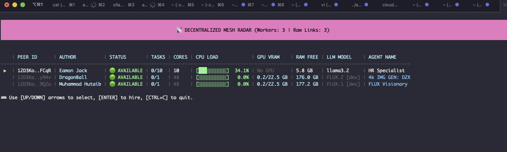
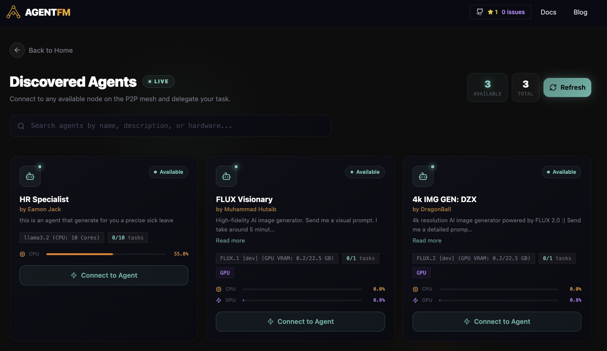
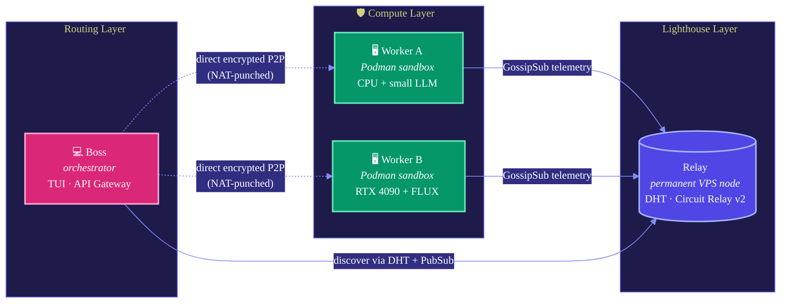

<div align="center">
  

  <br />
  <br />

  [](https://golang.org)
  [](https://libp2p.io)
  [](https://podman.io)
  [](LICENSE)
  [](#)
  [](#)

  <h3>SETI@Home, but for AI. A peer-to-peer compute grid for your containerized agents.</h3>
  <p><i>Zero-config P2P networking • Hardware-aware routing • Live artifact streaming • Private enterprise darknets</i></p>
  <p><strong>🌐 <a href="https://agentfm.net">agentfm.net</a></strong></p>

  <h4>⚡ One-Line Install (macOS & Linux)</h4>

  ```bash
  curl -fsSL https://api.agentfm.net/install.sh | bash
  ```

  <br />

  
  <br /><br />
  

</div>

---

## 🤔 The Problem

Running serious AI workloads today means one of three bad choices:

1. **Rent GPUs from a monopoly** (AWS, OpenAI, Anthropic) — expensive, rate-limited, and your data leaves your network.
2. **Buy your own GPU** — a $2,000 capital expense that sits idle 90% of the time.
3. **Run it locally on a laptop** — fine for toys, impossible for anything that needs real VRAM.

Meanwhile, there's a gaming PC in your bedroom, a workstation at your co-worker's house, and a GPU server at the office — all idle most of the day.

## 💡 The Pitch

**AgentFM is a peer-to-peer compute grid that turns idle hardware into a decentralized AI supercomputer.** Package your agent as a Podman container, advertise it on a libp2p mesh, and any Boss node on the network can instantly dispatch tasks to it over an end-to-end encrypted tunnel. No cloud accounts, no API keys, no data egress — just raw compute between peers.

> **💬 The elevator pitch:** Think Folding@Home for inference. Your friend's 4090 runs the job. Your laptop gets the artifacts. The internet is the backplane.

---

## 📑 Table of Contents

- [✨ Why AgentFM](#-why-agentfm)
- [🏗️ How It Works](#️-how-it-works)
- [📊 How AgentFM Compares](#-how-agentfm-compares)
- [⚡ Installation](#-installation)
- [🚀 Hello World: Your First Swarm](#-hello-world-your-first-swarm)
- [🕶️ Private Swarms (Enterprise Darknets)](#️-private-swarms-enterprise-darknets)
- [🧠 Authoring Agents: The Three Golden Rules of Streaming](#-authoring-agents-the-three-golden-rules-of-streaming)
- [⚙️ CLI Reference](#️-cli-reference)
- [🤖 Headless API Gateway & Python SDK](#-headless-api-gateway--python-sdk)
- [📡 Inside the Boss UI](#-inside-the-boss-ui)
- [🧪 Local Sandbox Testing](#-local-sandbox-testing)
- [🛡️ Security Model](#️-security-model)
- [🛠️ Development & Contributing](#️-development--contributing)

---

## ✨ Why AgentFM

| Feature | What it means in practice |
|---|---|
| 🌐 **Zero-Config P2P Networking** | Punches through strict NATs, corporate firewalls, and home routers via libp2p AutoNAT, Kademlia DHT, mDNS, and Circuit Relay v2. You don't open ports, you don't configure anything. |
| 🔒 **Ephemeral Podman Sandboxing** | Every task spins up an isolated, daemonless Podman container tied to the stream's lifecycle. The sandbox dies the instant the task ends — or the moment the tunnel drops. |
| ⚖️ **GossipSub Load Balancing** | Workers continuously broadcast live CPU / GPU VRAM / task-queue state over a decentralized telemetry radio. Overloaded nodes glow 🔴 BUSY and auto-reject tasks so your gaming PC never crashes. |
| 📡 **Live Artifact Streaming** | Any file the agent drops into `/tmp/output` gets zipped and securely streamed back to the Boss on a dedicated libp2p channel — with a real-time progress bar. |
| 🧠 **Framework & Language Agnostic** | If it runs in a container, it runs on AgentFM. Python + CrewAI, Go binaries, Ollama, FLUX image generators, Node.js scripts — all first-class. |
| 🕶️ **Private Enterprise Darknets** | One `-swarmkey` flag turns the public mesh into a closed, PSK-encrypted intranet. Confidential data never leaves your peer group. |
| 🔌 **Headless API Gateway** | Run `agentfm -mode api` and suddenly your Next.js app / n8n workflow / Python SDK can fire P2P tasks over plain HTTP with async webhook callbacks. |

---

## 🏗️ How It Works

AgentFM is built in Go on top of the **libp2p** stack (the same networking layer that powers IPFS and Ethereum). The system has three cooperating node roles:



### The three node roles

| Role | Runs on | What it does |
|---|---|---|
| **🗼 Relay** | A small, permanent cloud VPS | "Lighthouse" for the mesh. Runs DHT in server mode, enables Circuit Relay v2 for NAT hole-punching, and keeps its peer identity stable via `relay_identity.key` so its multiaddr is permanent. |
| **🛡️ Worker** | Any machine with hardware to donate | Advertises capabilities via GossipSub telemetry, accepts task streams, and executes them inside ephemeral **Podman** containers. Requires Podman; auto-detects Nvidia GPUs and attaches `nvidia.com/gpu=all`. |
| **🧠 Boss** | Any laptop or server | Stateless thin-client. Either the interactive `pterm` radar TUI, or the headless HTTP gateway (`-mode api`). Discovers workers, opens encrypted P2P tunnels, streams stdout back, receives artifact zips. |

### The four libp2p protocols

AgentFM talks over four versioned protocol strings. Change any of them without bumping versions and your mesh will silently partition.

| Protocol | Direction | Purpose |
|---|---|---|
| `agentfm-telemetry-v1` *(GossipSub)* | Worker → mesh | Heartbeat broadcast of CPU / GPU / RAM / queue state every 2s. |
| `/agentfm/task/1.0.0` | Boss → Worker | Prompt JSON in, streaming stdout out. 10-minute idle deadline per read. |
| `/agentfm/feedback/1.0.0` | Boss → Worker | Post-task feedback message for the node operator. |
| `/agentfm/artifacts/1.0.0` | Worker → Boss | Zipped `/tmp/output` contents after the task finishes. |

Every stream in the system has an explicit deadline on accept. Error paths `Reset()` the stream (RST-equivalent); only happy paths `Close()` it. Task containers run under `exec.CommandContext` so when the tunnel dies — or the operator hits Ctrl+C — the Podman sandbox gets SIGKILLed instantly.

> **💬 Pro-Tip:** If you want to fork the repo and run your own isolated mesh, change the version suffixes in `agentfm-go/internal/network/constants.go`. A bumped `TaskProtocol` is the cleanest way to partition your dev swarm from production.

### Data flow of a single task

```
┌──────┐                          ┌─────────┐                     ┌────────┐
│ Boss │                          │  Relay  │                     │ Worker │
└──┬───┘                          └────┬────┘                     └───┬────┘
   │                                   │                              │
   │   (1) Subscribe to telemetry ─────►                              │
   │                                   ◄───── GossipSub heartbeat ────┤
   │                                   │                              │
   │   (2) User selects worker in TUI  │                              │
   │                                   │                              │
   │   (3) libp2p NAT punch ──────────►│◄─────── relay coordination ──┤
   │                                   │                              │
   │   (4) Direct encrypted stream ────┼──────────────────────────────►
   │       { "version": "1.0.0",       │                              │
   │         "task": "agent_task",     │                      Pull image
   │         "data": "<prompt>" }      │                      Start Podman
   │                                   │                      exec.CommandContext
   │                                   │                              │
   │   (5) ◄──── live stdout stream ───┼───────────────── PYTHONUNBUFFERED
   │                                   │                              │
   │   (6) ◄──── [AGENTFM: FILES_INCOMING] ────────────────────────── │
   │                                   │                              │
   │   (7) ◄──── /agentfm/artifacts/1.0.0 stream (zip) ─────────────── │
   │       (separate libp2p stream with its own 30-min deadline)      │
   │                                   │                              │
   │   (8) Extract to ./agentfm_artifacts/  ✅                        │
   │                                   │                              │
   │   (9) ──── /agentfm/feedback/1.0.0 ──────────────────────────────►
```

---

## 📊 How AgentFM Compares

|  | AgentFM | OpenAI / Anthropic API | AWS SageMaker / RunPod | Ollama (local) |
|---|:---:|:---:|:---:|:---:|
| Data never leaves your peer group | ✅ | ❌ | ❌ | ✅ |
| Multi-machine compute | ✅ | n/a | ✅ | ❌ |
| Runs any framework / container | ✅ | ❌ | ✅ | ❌ |
| Works behind NAT with no port-forwarding | ✅ | n/a | n/a | ❌ |
| Cost per million tokens | **$0** | 💸💸💸 | 💸💸 | $0 |
| Private swarms for enterprise | ✅ | ❌ | Partial (VPC) | n/a |
| GPU-aware task routing | ✅ | n/a | ✅ | ❌ |
| Setup time | ~2 min | API key | days | minutes |

---

## ⚡ Installation

### Prerequisites

| Requirement | Needed for | Notes |
|---|---|---|
| **Go 1.25+** | Building from source | Only required if you're not using the pre-built installer. |
| **Podman** | Worker nodes | Boss / API-gateway nodes don't need it. Daemonless, rootless by default. |

### Option 1 — One-line install (recommended)

Grabs the latest release binary for your OS/arch and drops both `agentfm` and `agentfm-relay` into `/usr/local/bin`.

```bash
curl -fsSL https://api.agentfm.net/install.sh | bash
```

### Option 2 — Build from source

```bash
git clone https://github.com/Agent-FM/agentfm-core.git
cd agentfm-core/agentfm-go
make build          # builds ./agentfm and ./relay for your current OS
make install        # installs to /usr/local/bin (prompts for sudo)
```

### Verify

```bash
agentfm --help
agentfm-relay --help
```

> **💬 Pro-Tip:** Run `make build-all` to cross-compile for macOS / Linux / Windows × amd64 / arm64 in one shot. Binaries drop in `./build/`.

---

## 🚀 Hello World: Your First Swarm

Let's run a real swarm end-to-end. This example spins up a Worker that uses a local **Llama 3.2** model to draft a sick-leave email and generate a PDF, then dispatches a task to it from a Boss.

### Step 1 — Install prereqs

```bash
# Podman (for Worker sandboxing)
brew install podman                 # macOS
sudo apt install podman             # Ubuntu / Debian
podman machine init && podman machine start   # macOS only

# Ollama (to run the local LLM)
curl -fsSL https://ollama.com/install.sh | sh
```

### Step 2 — Clone the agent template

```bash
git clone https://github.com/Agent-FM/agentfm-core.git
cd agentfm-core
```

The agent lives in `agent-example/sick-leave-generator/agent/`. It's a ~60-line Python script built on CrewAI + fpdf that:
1. Reads the prompt from `sys.argv[1]`.
2. Traps noisy framework logs so the Boss sees a clean stream.
3. Writes a PDF to `/tmp/output` — AgentFM zips and routes it back automatically.

### Step 3 — Boot the local LLM

```bash
ollama run llama3.2
```

### Step 4 — Start the Worker

```bash
agentfm -mode worker \
  -agentdir "./agent-example/sick-leave-generator/agent" \
  -image "agentfm-sick-leave:v311" \
  -model "llama3.2" \
  -agent "HR Specialist" \
  -maxtasks 10 -maxcpu 60 -maxgpu 70
```

The daemon reads the Dockerfile, builds the image (if needed), and starts listening. Telemetry pulses go out every 2 seconds.

### Step 5 — Start the Boss

```bash
# In another terminal:
agentfm -mode boss
```

You'll see the **radar UI** light up with your Worker. Select it with `↑/↓ + Enter`, type a prompt like _"I have a fever and need to take tomorrow off"_, and watch the stream come back live — with the PDF dropping into `./agentfm_artifacts/`.

> **💬 Pro-Tip:** `-maxtasks`, `-maxcpu`, and `-maxgpu` are hard circuit breakers. The worker auto-rejects new tasks when any threshold is exceeded and broadcasts `🔴 BUSY` on the radar. Set them conservatively on a machine you actively use.

---

## 🕶️ Private Swarms (Enterprise Darknets)

Need to connect your office laptop to your home GPU PC behind a strict corporate firewall, without exposing a single byte of traffic to the public mesh? Three steps:

### Step 1 — Boot a relay on a cheap VPS

Any $5/mo Hetzner, DigitalOcean, or Fly.io box will do.

```bash
# On the VPS
agentfm-relay -port 4001
```

It prints a **permanent multiaddr** (backed by `relay_identity.key`) that looks like:

```
/ip4/198.51.100.23/tcp/4001/p2p/12D3KooWQHw8...
```

Copy that. You'll use it everywhere.

### Step 2 — Generate a swarm key

```bash
agentfm -mode genkey        # writes ./swarm.key to the current dir
```

This is a 256-bit Pre-Shared Key that libp2p uses to drop **all** traffic from peers who don't hold it — at the encryption layer, before any protocol is spoken. Securely copy `swarm.key` to every machine you want in the swarm.

### Step 3 — Join nodes to the private mesh

```bash
# On the GPU box at home
agentfm -mode worker \
  -agentdir "./my-agent" -image "my-agent:latest" \
  -agent "Home Rig" -model "mistral-nemo" \
  -swarmkey ./swarm.key \
  -bootstrap "/ip4/198.51.100.23/tcp/4001/p2p/12D3KooWQHw8..."

# On your laptop at the coffee shop
agentfm -mode boss \
  -swarmkey ./swarm.key \
  -bootstrap "/ip4/198.51.100.23/tcp/4001/p2p/12D3KooWQHw8..."
```

Both nodes negotiate a direct end-to-end-encrypted TCP tunnel via the relay's NAT-punching assistance. Your swarm is now completely isolated from the public internet — and from every other AgentFM user.

> **🛡️ Security note:** The swarm key is a classic PSK. Treat it like an SSH private key. Anyone with a copy can join your mesh.

---

## 🧠 Authoring Agents: The Three Golden Rules of Streaming

Because AgentFM pipes your container's **stdout** directly over a libp2p stream to the Boss, how you write to stdout is the single most important UX decision in your agent. Follow these three rules and your agent will feel like it's running natively on the user's laptop.

### Rule 1 — Always flush

Python buffers stdout by default. Without a flush, the Boss sees nothing for 30 seconds, then a wall of text.

```python
# ❌ Bad — Boss freezes
print("Analyzing the CSV file...")

# ✅ Good — streams live
print("Analyzing the CSV file...", flush=True)
```

### Rule 2 — Disable container buffering

Even with `flush=True`, the container runtime can add its own buffer. One line in your Dockerfile fixes it for good:

```dockerfile
ENV PYTHONUNBUFFERED=1
```

### Rule 3 — Trap the framework, show the result

Modern agent frameworks (CrewAI, LangChain, AutoGen) print *thousands* of lines of ANSI colour codes, HTTP traces, and chain-of-thought noise. Your users don't want that. Redirect framework stdout into a `StringIO` black hole, and keep the Boss's tunnel clean:

```python
import sys, io
from contextlib import redirect_stdout, redirect_stderr

# Keep a reference to the real stdout — our tunnel to the Boss.
boss_stream = sys.stdout

def progress(step):
    boss_stream.write(f"💭 Thinking... step {step}\n")
    boss_stream.flush()

print("Initializing AI swarm...", flush=True)

# Redirect noisy framework chatter into a StringIO trap
trap = io.StringIO()
with redirect_stdout(trap), redirect_stderr(trap):
    result = run_heavy_pipeline(callback=progress)

# Clean output resumes
print("\n✅ Done:", flush=True)
print(str(result), flush=True)
```

### Drop artifacts into `/tmp/output`

Anything your agent writes to `/tmp/output` gets **automatically** zipped and streamed back to the Boss on `/agentfm/artifacts/1.0.0`. Your Dockerfile needs to create the directory with the right permissions:

```dockerfile
RUN mkdir -p /tmp/output && chmod 777 /tmp/output
```

That's the whole contract. No SDK, no decorators, no callbacks.

---

## ⚙️ CLI Reference

| Flag | Type | Default | Description |
|---|:---:|:---:|---|
| `-mode` | string | *required* | `boss` · `worker` · `relay` · `api` · `test` · `genkey` |
| `-agentdir` | string | — | Path to the agent directory (must contain a `Dockerfile` or `Containerfile`). |
| `-image` | string | — | Podman image tag to build/run (e.g., `my-agent:v1`). |
| `-agent` | string | — | Advertised agent name (max 20 chars). |
| `-model` | string | `llama3.2` | Advertised model capability (max 40 chars). |
| `-desc` | string | — | Agent description (max 1000 chars). |
| `-author` | string | `Anonymous` | Your name / handle (max 50 chars). |
| `-maxtasks` | int | `1` | Max concurrent tasks (1–1000). Circuit breaker. |
| `-maxcpu` | float | `80.0` | Reject tasks once CPU load exceeds this % (0–99). |
| `-maxgpu` | float | `80.0` | Reject tasks once GPU VRAM usage exceeds this % (0–99). |
| `-apiport` | string | `8080` | Port for the headless API gateway (`-mode api` only). |
| `-swarmkey` | string | — | Path to `swarm.key` — enables private darknet mode. |
| `-bootstrap` | string | *public lighthouse* | Custom relay multiaddr. |
| `-port` | int | `0` | Listen port. `0` = random. Relays should use `4001`. |
| `-prompt` | string | — | One-shot prompt for `-mode test`. Interactive if omitted. |

---

## 🤖 Headless API Gateway & Python SDK

Need to trigger AgentFM from a Next.js app, n8n workflow, or Slack bot? Run the Boss in API-gateway mode:

```bash
agentfm -mode api -apiport 9090
```

This exposes three endpoints on `http://127.0.0.1:9090`. All responses are JSON; long-running tasks stream as chunked plain text.

### `GET /api/workers`

Real-time list of every worker on the mesh with live telemetry.

```json
{
  "success": true,
  "agents": [
    {
      "peer_id": "12D3KooW...",
      "name": "HR Specialist",
      "status": "AVAILABLE",
      "hardware": "llama3.2 (CPU: 12 Cores)",
      "cpu_usage_pct": 14.2,
      "ram_free_gb": 12.5,
      "current_tasks": 0,
      "max_tasks": 10,
      "has_gpu": false
    }
  ]
}
```

### `POST /api/execute` (synchronous, streaming)

Opens a P2P tunnel and streams the worker's stdout back over HTTP chunked encoding.

```json
{ "worker_id": "12D3KooW...", "prompt": "Draft a 500-word leave policy." }
```

### `POST /api/execute/async` (fire-and-forget, webhook)

Dispatches the task, responds `202 Accepted` immediately with a `task_id`. When the artifact zip has been received and extracted, AgentFM POSTs a completion payload to your webhook URL.

```json
{
  "worker_id": "12D3KooW...",
  "prompt": "Generate a 1024×1024 cyberpunk city image.",
  "webhook_url": "https://your-app.com/api/agent-webhook"
}
```

Webhook POSTs are bounded by a 30-second timeout and tied to the gateway's shutdown signal — a hostile webhook URL cannot block server shutdown.

### Python SDK

```bash
pip install -e ./agentfm-python
```

```python
from agentfm import AgentFMClient, LocalMeshGateway

# Option A: talk to an already-running agentfm -mode api daemon
client = AgentFMClient(gateway_url="http://127.0.0.1:8080")

# Option B: spawn an ephemeral daemon for the lifetime of a with-block
with LocalMeshGateway(port=8080) as gw:
    client = AgentFMClient(gateway_url=gw.url)
    workers = client.discover_workers(models=["llama3.2"], wait_for_workers=1)
    files = client.execute_task(workers[0].peer_id, "Draft a sick-leave email.")
    print(f"Got {len(files)} artifact(s) back: {files}")
```

The SDK also supports **scatter-gather**: pass a list of prompts to `batch_execute()` and it auto-distributes across available workers filtered by model, with retries and a per-worker capacity cap.

---

## 📡 Inside the Boss UI

When you run `agentfm -mode boss`, you're not just starting a CLI — you're booting a **live decentralized radar**. Here's what happens during a task's lifecycle:

1. **Discovery** — The UI subscribes to `agentfm-telemetry-v1` and renders every active worker's CPU bar, GPU VRAM gauge, and task queue in real time. Stale entries vanish after 15 seconds of silence.
2. **Selection** — `↑/↓` to navigate the radar, `Enter` to hire a node.
3. **NAT punch** — The Boss dials the target over libp2p AutoNAT + Circuit Relay v2, forming a direct encrypted TCP tunnel. No port-forwarding required.
4. **Streaming** — The worker's sandbox stdout flows live to your terminal with a 10-minute idle-timeout deadman switch.
5. **Artifact transfer** — If the worker emits `[AGENTFM: FILES_INCOMING]`, a separate libp2p stream kicks in on `/agentfm/artifacts/1.0.0` — complete with a real-time progress bar — and extracts the zip into `./agentfm_artifacts/`.
6. **Feedback loop** — You can leave a feedback message that's routed back to the node operator for iterating on agent quality.

---

## 🧪 Local Sandbox Testing

Before broadcasting your agent to the world, test it entirely offline. `-mode test` bypasses libp2p completely and runs your container against a real prompt in a local scratch directory.

```bash
agentfm -mode test \
  -agentdir "./my-agent" -image "my-agent:latest" \
  -agent "My Bot" -model "llama3.2" \
  -prompt "Write a haiku about compilers."
```

Omit `-prompt` and AgentFM drops you into an interactive input. Artifacts land in a `.agentfm_temp/run_<id>/` folder for inspection.

---

## 🛡️ Security Model

AgentFM is designed for a zero-trust threat model. Every remote peer is treated as potentially slow, faulty, or malicious.

| Layer | Defense |
|---|---|
| **Transport** | End-to-end encrypted libp2p streams (Noise / TLS). No plaintext data on the wire, ever. |
| **Authentication** | Peer IDs are Ed25519 public keys. Identities persist via `.agentfm_<mode>_identity.key` (mode `0600`). |
| **Private networks** | `-swarmkey` enables PSK — any peer without the key is dropped at the encryption layer before a single byte of protocol is exchanged. |
| **Execution** | Every task runs in a fresh Podman container with `--rm --network host` and `exec.CommandContext`. The sandbox is SIGKILLed the instant the stream dies. |
| **DoS / Slow-loris** | Every libp2p stream has an explicit `SetDeadline`. Error paths `Reset()` immediately. HTTP server has `ReadHeaderTimeout`, `ReadTimeout`, `WriteTimeout`, `IdleTimeout`. Payloads capped with `io.LimitReader`. |
| **Payload safety** | 1 MB cap on incoming task JSON. Artifact zips are size-header gated and extracted with path-traversal sanitization. |
| **Resource budgets** | Workers reject tasks when `-maxcpu` / `-maxgpu` / `-maxtasks` thresholds are exceeded, broadcasting `🔴 BUSY` to the radar. |

> **⚠️ What AgentFM does NOT protect against:** a malicious **worker** you've voluntarily dispatched to with sensitive prompt data. On the public mesh, treat your prompt as "published." If confidentiality matters, **use a private swarm.**

---

## 🛠️ Development & Contributing

The monorepo has three top-level directories:

```
agentfm-core/
├── agentfm-go/          # Core Go daemon (agentfm + relay binaries)
│   ├── cmd/
│   ├── internal/
│   │   ├── boss/        # TUI + API gateway
│   │   ├── worker/      # Podman sandbox + telemetry
│   │   ├── network/     # libp2p mesh + artifact streams
│   │   └── types/       # shared DTOs
│   └── Makefile
│
├── agentfm-python/      # Official Python SDK (thin HTTP client)
│
└── agent-example/       # Reference agents
    ├── sick-leave-generator/
    └── image-generator/
```

Full contributor workflow — including setting up a private dev relay, versioning the libp2p protocol strings, and submitting PRs — lives in [`CONTRIBUTING.md`](CONTRIBUTING.md). TL;DR:

```bash
git clone https://github.com/Agent-FM/agentfm-core.git
cd agentfm-core/agentfm-go
go mod tidy
make build-agentfm
./agentfm --help
```

> **💬 Pro-Tip for contributors:** When developing against a custom relay, bump the version suffixes in `internal/network/constants.go` (`TaskProtocol`, `FeedbackProtocol`, `ArtifactProtocol`, `TelemetryTopic`) so your dev mesh can't accidentally talk to production peers.

### Project status

AgentFM `v1.0.0` is released and stable. The Go side has been hardened against the CLAUDE.md defensive-programming checklist: explicit stream deadlines, `Reset()` on error, `exec.CommandContext` on every sub-process, bounded HTTP server timeouts, and zero `os.Exit` / `pterm.Fatal` inside goroutines.

### License

[MIT](LICENSE) — do whatever you want with it. Attribution appreciated but not required.

---

<div align="center">

**Built with 🐹 Go, 🚀 libp2p, and a belief that compute should belong to everyone.**

<br />

<sub>If AgentFM saved you from an AWS bill, drop a ⭐ on the repo.</sub>

</div>
