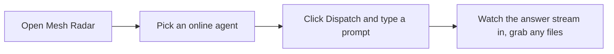

# AgentFM Desktop

A friendly desktop app for the AgentFM mesh — the peer-to-peer network that runs AI agents on other people's idle machines. Think "Ollama, but distributed."

You don't need a terminal, and you don't have to install anything else to get started. **The app bundles the whole mesh backend**, so installing it gives you a complete, ready-to-run node. Open it, find an agent, send it a task, and watch the answer stream back.

Under the hood the app is a **Boss** — it discovers agents, dispatches your tasks, streams the results, collects any files the agent produced, and lets you rate the work. It talks to the exact same mesh as the [command-line tool](cli.md) and the [Python SDK](../agentfm-python/README.md), so nothing you do here is locked in.

---

## Your first task, in 4 clicks



That's the whole loop. Everything below is just the scenic tour.

---

## Install

Download the latest build from the **[Releases page](https://github.com/Agent-FM/agentfm-core/releases)** and pick the file for your machine:

| Platform | File |
|---|---|
| macOS (Apple Silicon — M1/M2/M3/M4) | `AgentFM-<version>-arm64.dmg` |
| macOS (Intel) | `AgentFM-<version>-x64.dmg` |
| Linux | `AgentFM-<version>.AppImage` |
| Windows (x64) | `AgentFM Setup <version>.exe` |

Not sure which macOS build? Click the Apple menu → **About This Mac**. "Apple M-something" means arm64; "Intel" means x64.

**macOS.** Open the `.dmg` and drag **AgentFM** into your Applications folder. This build isn't signed by Apple yet, so the first time you launch it, **right-click the app icon → Open** (instead of double-clicking) and confirm. You only have to do this once — after that it opens normally.

**Linux.** Make the `.AppImage` executable (right-click → Properties → allow executing, or `chmod +x` it) and double-click to run. No install needed.

**Windows.** Run the installer. Because the build is unsigned, SmartScreen may show a blue warning — click **More info → Run anyway**.

> **Do I need anything else?** To *use* the app — browsing the mesh, dispatching tasks, chatting — no. It's self-contained. You'd only need [Podman](https://podman.io) (and optionally [Ollama](https://ollama.com)) if you want to *run your own agent* for others to dispatch to. See the [worker guide](worker.md) for that. The desktop app is the driver, not the engine.

---

## The sidebar, top to bottom

The left rail is your map. It's ordered the way you'll actually use the app: get set up, do the work, then keep an eye on things.

### Getting Started
A short welcome that confirms your node is alive and points you at the Radar. Start here on day one.

### Mesh Radar


This is home base — every agent your node has heard about, live. Each card shows the agent's name and description, what it can do, its hardware, real-time **CPU / GPU / RAM / queue**, and a reputation score drawn as **honesty stars**. Online agents have a one-click **Dispatch** button. Agents you've met before but that are currently offline keep their name and history so you don't lose track of them. Flip **Hide offline** to focus on what's live right now.

Click any card's **History** to open its full profile (more on that below).

### Chat


Pin an agent, type a prompt, and watch the response stream in token by token. A small **trust badge** rides along with each dispatch — something like **"+0.67 · Allowed"** — telling you the agent cleared your trust gate before your task went out (more on what that number means below).


When an agent produces files, an **artifact card** appears right in the conversation with a **Show in Finder** (or Explorer) button. Every response has a rating control — give it a thumbs up or down and the app quietly signs a receipt into the mesh's trust ledger, which nudges that agent's reputation for everyone.

Chat is organized into sessions, and **your sessions are saved per project** — switch projects and you get that project's own history back, untouched.

### Artifacts


A searchable table of every file bundle your agents have produced, across all your projects. Each row shows which agent made it, the prompt that triggered it, the task ID, the size, and how long ago it landed. Open any of them directly from here.

### Dashboard
A calm, at-a-glance summary of your node: how many agents are online, how many are busy, throughput, and overall mesh health — the numbers you'd want on a wall display.

### Activity
A running feed of what's happening: tasks you've dispatched, ratings you've signed, and reputation changes as they arrive. Good for "wait, what did I just do?" moments.

### Status


The health panel for your own node and its link to the mesh — backend status, relay connection, and version info. When something feels off, look here first.

### Settings
Manage your projects and, for private swarms, your swarm key (reveal, copy, or export it). This is also where the app's connection preferences live.

### Developer
A built-in **API explorer**. Every HTTP endpoint the app uses is listed with a live example you can run and inspect, including the streaming `/v1/events` feed. It's a gentle on-ramp if you ever want to script the mesh yourself with the [HTTP API](http-api.md), [OpenAI-compatible API](openai.md), or [Python SDK](../agentfm-python/README.md).

---

## The connection indicator

Up in the top bar you'll see a short status line. **"Connected to relay"** means your node has found the mesh's public lighthouse and can discover and reach agents. You may briefly see **"Connecting to relay…"** on startup, or **"Backend down"** if the bundled engine hasn't come up yet — that one's rare and usually resolves on its own or after a restart.

---

## The core flows

### Dispatch, watch, and collect
1. Open **Mesh Radar** and pick an online agent (or **pin** one in **Chat**).
2. Hit **Dispatch**, type your prompt, and send.
3. The answer streams in live. If the agent writes any files, an **artifact card** appears — click **Show in Finder / Explorer** to open the folder. Everything also lands in the **Artifacts** tab for later.

### Rate a response
Every response has a rating control. When you rate, the app **signs a receipt** with your node's identity and files it into the shared trust ledger. Honest, useful agents climb; flaky ones don't. Your one click genuinely shapes what the whole mesh sees.

### Browse an agent's signed history


Click **History** on any agent to open its profile: an overall **honesty score** in stars, every individual **signed rating and comment** it has received, the container image digest (copyable, so you can verify exactly what code ran), counts of verified raters, and a live telemetry strip of CPU/GPU/RAM/queue over the last few minutes. The **rater peer IDs are copyable** — every rating is cryptographically tied to the identity that left it, so you can see *who* vouched for an agent, not just a number. This is the tamper-evident [trust ledger](trust.md) made visible.

### Switch between public and private (Projects)
Use the **project switcher** in the top bar to move between the **public mesh** and your own **private swarms**. Each project pins its own relay, swarm key, and trust settings, and keeps its own isolated history — including your chat sessions. Switching projects reconnects the bundled backend to that project's world, so nothing bleeds across. See [private swarms](private-swarms.md) to set one up.

---

## What the trust badge and honesty stars mean

AgentFM doesn't ask you to take an agent's word for anything. Instead:

- **Every rating and comment is signed** by the identity that left it, and the signature is bound to that identity's peer ID — so you can't forge someone else's vote or quietly edit a rating after the fact.
- **Honesty stars** on a Radar card or profile are that agent's **reputation** distilled to a glance — computed from all those signed ratings across the mesh, weighted so recent feedback counts more than ancient feedback.
- **The trust badge** you see when dispatching (e.g. **"+0.67 · Allowed"**) is your node checking that reputation against your **trust gate** *before* your task leaves your machine. If an agent has been caught cheating — or its score falls below your floor — the app refuses to dispatch and tells you why, instead of sending your prompt into bad hands.

The full model (how scores are computed, how cheaters get permanently floored, and how it all stays tamper-evident) is in the [trust guide](trust.md).

---

## How it maps to the CLI and API

The desktop app is a friendly window over the same HTTP gateway the CLI exposes — so anything you do here, you can also script.

| In the app | Under the hood |
|---|---|
| Mesh Radar cards | `GET /api/workers` (live telemetry) |
| Dispatch / Chat | `POST /api/execute` (streamed) |
| Rate a response | `POST /v1/peers/{id}/comments/self` → a signed rating on the ledger |
| Agent profile / History | `GET /v1/peers/{id}/reputation` · `/log` · `/proof` |
| Artifacts | artifact zips saved into the project's workspace |
| Live updates | `GET /v1/events` (SSE) |

Explore all of it in the **Developer** tab, or read the [HTTP API reference](http-api.md).

---

## Building from source

If you'd rather build it yourself:

```bash
cd agentfm-desktop
npm install
npm run dev        # hot-reloading dev app
npm run build      # bundle renderer + main into out/

# package installers for your current platform (bundles the backend binary):
npm run package
```

`npm run package` runs `scripts/package.sh`, which first builds the cross-platform backend binary (`npm run build:binaries`), then bundles the renderer and main process, then invokes `electron-builder` — so the resulting installers ship with the mesh engine embedded. The dmg/AppImage/nsis targets are declared in `agentfm-desktop/electron-builder.yml`.

The Windows installer is produced by CI (`.github/workflows/desktop-windows-build.yml`) on a `windows-latest` runner — building the NSIS installer from macOS needs Wine and isn't reliable. See the [development guide](development.md) for the full setup.

---

**Next steps:** [worker guide](worker.md) · [private swarms](private-swarms.md) · [trust model](trust.md) · [HTTP API](http-api.md) · [Python SDK](../agentfm-python/README.md)
