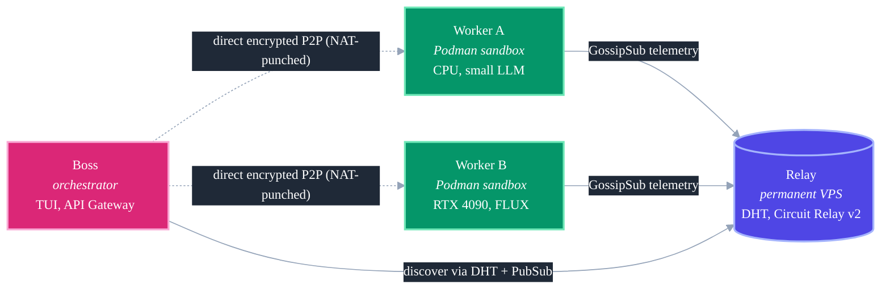

# Architecture

Three roles connected by libp2p, four wire protocols, end-to-end encrypted streams.

## Topology

## Roles

| Role | Binary | Responsibility |
|---|---|---|
| **Relay** | `agentfm-relay` (or `agentfm -mode relay`) | Permanent lighthouse on a public IP. Runs a DHT in server mode, enables Circuit Relay v2, persists peer identity. |
| **Worker** | `agentfm -mode worker` | Advertises hardware via GossipSub. Accepts task streams. Executes inside ephemeral Podman containers. |
| **Boss** | `agentfm -mode boss` (TUI) or `-mode api` (HTTP gateway) | Discovers peers, dispatches tasks, surfaces results. Both flavours share the same dial logic. |

## Wire protocols

| Protocol | Direction | Deadline | Purpose |
|---|---|---|---|
| `agentfm-telemetry-v1` (GossipSub) | Worker → mesh | (pubsub) | 2s heartbeat: CPU / GPU / RAM / queue. |
| `/agentfm/task/1.0.0` | Boss → Worker | 10 min idle | JSON envelope in, streaming stdout back. |
| `/agentfm/feedback/1.0.0` | Boss → Worker | 30 s | Post-task feedback message. |
| `/agentfm/artifacts/1.0.0` | Worker → Boss | 30 min | Size-headered zip of `/tmp/output`, capped at 5 GiB. |

The four protocol strings live in `agentfm-go/internal/network/constants.go`. Changing them is a wire-breaking event — every node in the mesh must rebuild before old + new can coexist.

## Stream hygiene

- Every stream gets explicit `SetDeadline` on accept. No unbounded streams.
- Error paths call `stream.Reset()`; only happy paths call `stream.Close()`.
- Incoming task JSON capped at 1 MiB via `io.LimitReader`.
- Artifact stream length-prefixed (8-byte int64) and additionally `LimitReader`-bounded — a worker that lies about size can't push more than its declaration.
- Workers attribute artifacts by SDK-generated UUID basename (`<task_id>.zip`); concurrent `tasks.run` calls cannot steal each other's outputs.
- Task IDs that join into filesystem paths are validated against `^[a-zA-Z0-9][a-zA-Z0-9_.-]{0,127}$`. Anything else falls back to `fallback_<unixnano>`.

## Stream sentinel markers

Workers emit two protocol-level markers on stdout that the Boss + SDK parse and strip before forwarding to the user:

- `[AGENTFM: FILES_INCOMING]` — an artifact zip is about to arrive on the artifact stream.
- `[AGENTFM: NO_FILES]` — task produced no artifacts.

Anything else on stdout is forwarded live.

## Boss internals

When `agentfm -mode api` is running:

1. `listenTelemetry` subscribes to `agentfm-telemetry-v1`, populates `activeWorkers` map (RWMutex).
2. A 5s ticker calls `pruneDisconnectedWorkers` — evicts peers libp2p says are disconnected OR whose last gossip is >15s old. Both `/api/workers` and the TUI are pure reads.
3. `/api/execute/async` acquires from a 256-slot semaphore (`asyncSlots`). When saturated → 503 with `Retry-After: 5`.
4. Async tasks spawn the goroutine BEFORE writing the 202 ack — a 202 means the work is committed, even if the client hung up before reading the body.
5. `dialOmni` tries peerstore (cached), then DHT lookup, then circuit-relay (only if the relay is currently connected).

## Related

- [OpenAI-Compatible API](openai.md) — `/v1/*` routes layered on top
- [Run a Worker](worker.md) — how the task-stream protocol is consumed
- [Private Swarms](private-swarms.md) — libp2p `pnet` PSK at the transport layer
- [Security Model](security.md) — defense-in-depth layer-by-layer
