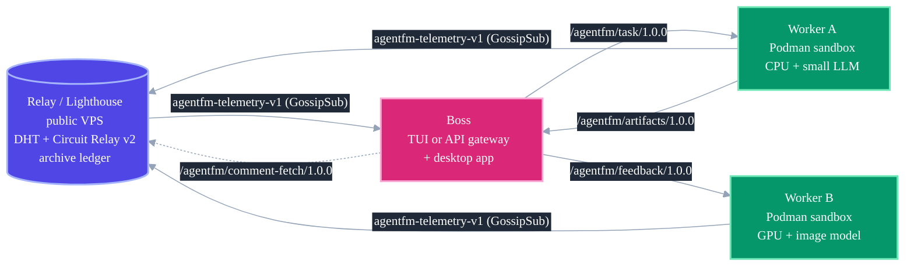
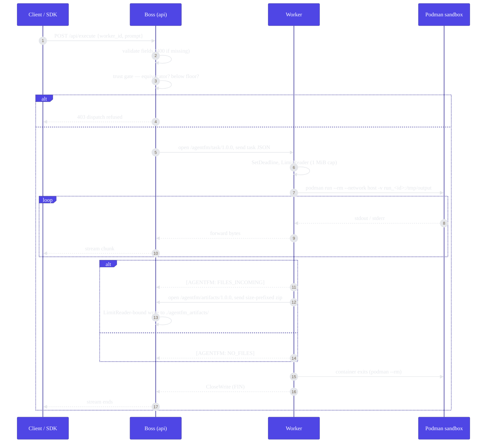
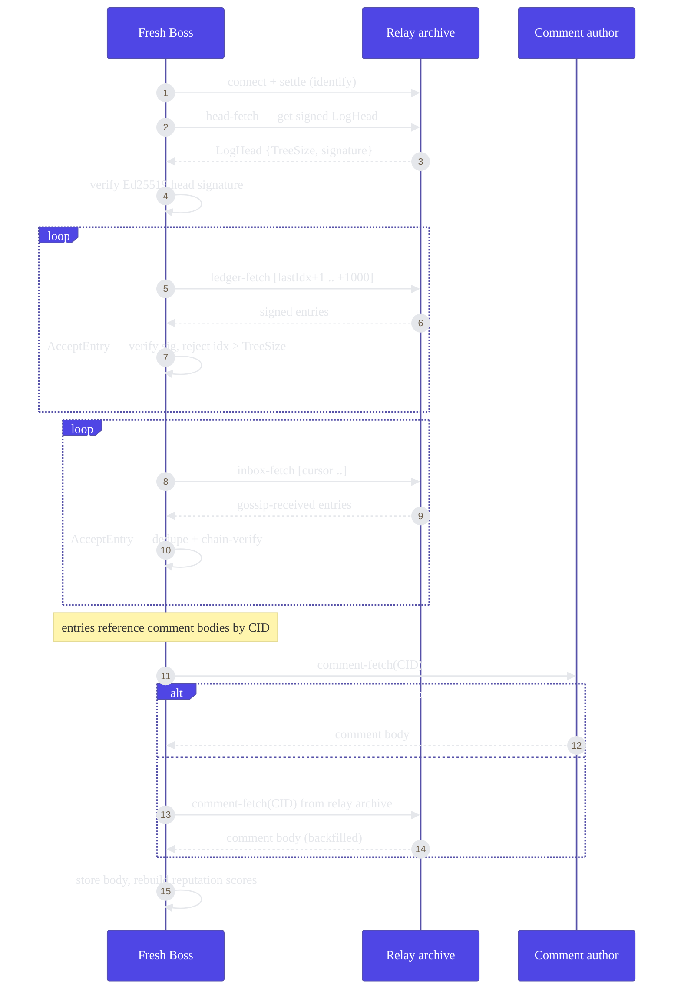

# Architecture

AgentFM is a peer-to-peer compute mesh: one binary, three roles, wired together by libp2p over end-to-end encrypted streams. This guide is diagram-led — start with the topology, follow a task from dispatch to artifact, watch a fresh node rebuild its trust ledger from the relay, then read the prose on discovery, the ledger, and private swarms.

> **One binary, many roles.** Everything below ships as a single `agentfm` executable. You pick a role with `-mode`: `worker`, `boss`, `api`, `relay`, `witness`, or `genkey`. There is no separate relay or worker binary.

---

## Topology: three roles, five protocols



Telemetry fans out over GossipSub so every Boss builds the same live radar. Task dispatch and artifact return are **direct** peer-to-peer streams (NAT-punched where possible, relayed through Circuit Relay v2 as a fallback). The dashed comment-fetch edge is trust-ledger replication — covered in [Ledger catch-up](#ledger-catch-up-a-fresh-boss-rebuilds-trust) below.

### Roles

| Role | Command | Responsibility |
|---|---|---|
| **Relay** | `agentfm -mode relay` | Permanent lighthouse on a public IP. Circuit Relay v2 (infinite limits), Kademlia DHT in server mode, telemetry routing, an archive ledger + comment-body store, and a persistent peer identity so its multiaddr is stable across restarts. |
| **Worker** | `agentfm -mode worker` | Advertises hardware (CPU / GPU / RAM / queue) over GossipSub every ~2s. Accepts task streams and runs each agent inside an ephemeral Podman container. |
| **Boss** | `agentfm -mode boss` (interactive pterm TUI) or `agentfm -mode api` (headless HTTP + OpenAI gateway) | Discovers peers, gates dispatch on trust, streams results back. The desktop app bundles the **api** boss. Both flavours share the same dialer. |
| **Witness** | `agentfm -mode witness` | Ledger-only replica. Subscribes to feedback + equivocation topics, co-signs heads, and serves head-fetch / ledger-fetch / inbox-fetch / comment-fetch streams so a fresh boss can catch up. |

`agentfm -mode genkey` is a one-shot: it prints a pre-shared key for bootstrapping a [private swarm](private-swarms.md).

### The five libp2p protocols

All protocol strings are defined in `agentfm-go/internal/network/constants.go`. They are **load-bearing** — change one and every node in the mesh must rebuild before old and new can interoperate. Bumping any of them is a release-gating event.

| Protocol | Kind | Direction | Deadline | Purpose |
|---|---|---|---|---|
| `agentfm-telemetry-v1` | GossipSub topic | Worker → mesh | pubsub | ~2s heartbeat of CPU / GPU / RAM / queue depth. |
| `/agentfm/task/1.0.0` | Stream | Boss → Worker | 30s to receive payload, then 10 min idle while streaming | JSON task envelope in; live stdout/stderr back. |
| `/agentfm/artifacts/1.0.0` | Stream | Worker → Boss | 30 min | Length-prefixed zip of `/tmp/output`, capped at `MaxArtifactBytes` (5 GiB). |
| `/agentfm/feedback/1.0.0` | Stream | Boss → Worker | 30s | Post-task user feedback message. |
| `/agentfm/comment-fetch/1.0.0` | Stream | Boss → author or relay | 30s | Pull a content-addressed comment body by CID. |

Three more protocols carry the verifiable trust ledger under the hood — `/agentfm/ledger-fetch/1.0.0` (own-authored entries), `/agentfm/inbox-fetch/1.0.0` (third-party entries), and `/agentfm/witness/1.0.0` (head co-signing) — plus a package-private `/agentfm/head-fetch/1.0.0` for the signed-head handshake. Two GossipSub topics complete the set: `agentfm-feedback-v1` (signed rating/comment entries) and `agentfm-equivocation-v1` (witness alerts).

---

## Task dispatch: end to end

A Boss picks a worker off the radar, clears the trust gate, opens `/agentfm/task/1.0.0`, and streams the container's stdout straight back to the caller. If the agent wrote files, they arrive afterward on `/agentfm/artifacts/1.0.0`.



Things worth calling out:

- **Trust gate first.** `/api/execute` and `/api/execute/async` validate required fields (missing `worker_id` or `prompt` → `400`), then run the two-check dispatch gate **before dialing**. An equivocator is refused with `403 peer_is_equivocator`; a peer below `--reputation-floor` gets `403 reputation_below_floor`. See [Trust & reputation](trust.md).
- **The sandbox is ephemeral.** The worker launches `podman run --rm --network host` with `.agentfm_temp/run_<sessionID>` bind-mounted to `/tmp/output`. `exec.CommandContext` ties the container to the stream's lifetime — if the stream dies, the container is `SIGKILL`ed and force-removed.
- **Sentinel markers.** The worker emits `[AGENTFM: FILES_INCOMING]` or `[AGENTFM: NO_FILES]` on stdout; the Boss and SDK parse and strip these before forwarding. Everything else on stdout is passed through live, which is why containerized agents must flush unbuffered.
- **Stream hygiene.** Every stream gets an explicit deadline on accept. Task JSON is `io.LimitReader`-capped at 1 MiB; the artifact zip is length-prefixed (8-byte size header) *and* `LimitReader`-bound, so a worker that lies about its size can't push past `MaxArtifactBytes`. Happy paths `Close()` (sending FIN); error paths `Reset()` immediately to avoid connection leaks.
- **Async variant.** `POST /api/execute/async` mints a `task_id`, acquires one of 256 inflight slots (`503` + `Retry-After` when saturated), and spawns the work **before** writing the `202` — a 202 means the task is committed even if the client hung up. See [HTTP API](http-api.md).

---

## Ledger catch-up: a fresh Boss rebuilds trust

Trust data — signed ratings and comment bodies — lives in a per-peer append-only log that replicates over gossip. A Boss that was offline (or is brand new) rebuilds its view from the relay's archive without trusting the relay blindly: it fetches the relay's **signed head** first and refuses any entry past that committed size.



How the pieces fit:

- **Signed-head handshake.** `FetchRemoteHead` pulls the relay's `LogHead` over the head-fetch protocol and `VerifyHeadSignature` checks its Ed25519 signature. `CatchUp` then walks `ledger-fetch` in 1000-entry pages and rejects any entry whose index exceeds the head's `TreeSize` — a malicious relay can't serve forged entries beyond what it has publicly committed. A full page that fails to advance the cursor is treated as a stall attack and aborts the walk.
- **Own log vs. inbox.** `CatchUp` recovers this peer's own-authored entries from the relay; `CatchUpInbox` pulls **third-party** entries the relay (or a witness) received over gossip while this Boss was down. At startup a fresh Boss runs `CatchUp` against the relay, then `CatchUpInbox` against the relay plus up to four already-connected peers.
- **Comment bodies replicate separately.** Ledger entries carry only a comment's CID, not its text. A `bodyFetcher` goroutine enqueues a `comment-fetch` for every gossip-accepted comment whose body is missing, hitting the author first. A periodic **backfill sweep** (first pass ~1 min after startup, then every 10 min, up to 256 bodies per sweep) re-scans the inbox for still-missing bodies and re-fetches them. Because the relay archives bodies and runs the same sweep, a fresh Boss can recover the full history — ratings *and* comment text — from the relay alone even when the original authors are offline. See [Trust & reputation](trust.md) and [HTTP API](http-api.md).

---

## Discovery

AgentFM finds peers two ways and keeps its lifeline to the relay alive on a timer.

- **mDNS (same LAN).** Every node runs an mDNS service under the `agentfm-local` tag. When a peer is found on the local network, the node dials it with a bounded context — instant discovery for a laptop and a workstation on the same Wi-Fi, no relay required.
- **DHT rendezvous (wider internet).** Workers `Advertise` themselves under the `agentfm-rendezvous` string in the Kademlia DHT. Boss nodes run `discoverPeers`, which sweeps `FindPeers` every 10 seconds and dials any advertised peer they aren't already connected to. Each sweep is individually timeout-bounded so one unresponsive peer can't stall the tick.
- **Relay keepalive / reconnect.** On startup a node dials the bootstrap lighthouse, `Protect`s that connection from connection-manager trimming (`lighthouse` tag), and reserves a Circuit Relay v2 slot for NAT-traversal fallback. Because an idle relay connection can still be pruned — or its reservation TTL can expire — `maintainLighthouseConnection` re-checks every 30 seconds and re-dials + re-reserves if the connection dropped. Without it a node loses its relay permanently after the first blip, and `/v1/about` reports the relay as unreachable forever.

The production lighthouse is hardcoded as `PublicLighthouse` in `constants.go`:

```
/ip4/78.47.21.107/tcp/4001/p2p/12D3KooWQHw8mVQkx17kLTNiRTbYckU2cAGcAwFFLzVJhhmBs5zL
```

DHT lookups and relay dials are all wrapped in a 20-second `StreamDialTimeout` — routing never blocks indefinitely.

---

## The trust ledger

Every rating and comment is an **Ed25519-signed** entry. The verifier extracts the public key *from the rater's peer ID*, so identity and signature are cryptographically bound: you cannot forge another peer's rating, and you cannot tamper with a field without breaking verification.

- **Merkle log.** Each peer keeps an append-only log structured as an RFC 6962 Merkle tree, so any entry's membership can be proven with a compact inclusion proof against a signed head (`GET /v1/peers/{id}/proof`).
- **Reputation = EigenTrust-lite.** Scores are computed by iterating trust across the mesh with α=0.15 mixing and a 30-day age half-life, seeded by a genesis seed (the lighthouse) plus a per-boss self-seed (the boss trusts its own ID at 1.0). Query it at `GET /v1/peers/{id}/reputation`.
- **Equivocation → permanent floor.** A peer that double-signs two conflicting log heads is equivocating. Witnesses catch this, broadcast an `EquivocationAlert` on `agentfm-equivocation-v1`, and every node marks the offender as a permanent equivocator floored at −1.0 mesh-wide. The dispatch gate blocks equivocators outright and refuses anyone below `--reputation-floor` with a `403`.

The full trust model — signing, scoring, seeds, and the dispatch gate — is documented in [Trust & reputation](trust.md).

---

## Private swarms

Pass `-swarmkey <path>` and libp2p applies a pre-shared key at the transport layer (`pnet.PrivateNetwork`): the node refuses any peer that doesn't hold the identical key, and the public DHT and lighthouse are bypassed entirely. A private swarm typically runs its own `agentfm -mode relay` on a VPS and connects nodes with both `-swarmkey` and `-bootstrap <multiaddr>`. Generate the key with `agentfm -mode genkey`. Full walkthrough in [Private swarms](private-swarms.md).

---

## Related

- [Trust & reputation](trust.md) — signing, EigenTrust, equivocation, the dispatch gate
- [Private swarms](private-swarms.md) — PSK isolation and self-hosted relays
- [HTTP API](http-api.md) — every endpoint, request/response shapes, auth
- [OpenAI-compatible API](openai.md) — `/v1/*` routes layered on top
- [Run a Worker](worker.md) — how the task-stream protocol is consumed
- [Security model](security.md) — defense-in-depth, layer by layer