# HTTP API Reference

The headless Boss (`agentfm -mode api`, also the backend the [desktop app](DESKTOP.md) bundles) exposes a plain HTTP gateway. It speaks two dialects from one server:

- **AgentFM-native** routes (`/api/*`, `/v1/about`, `/v1/events`, `/v1/peers/*`) — dispatch, telemetry, and the verifiable-mesh ledger.
- **OpenAI-compatible** routes (`/v1/chat/completions`, `/v1/completions`, `/v1/models`) — point any OpenAI SDK at the Boss. Documented in depth in [OpenAI-Compatible API](openai.md); summarised here for completeness.

Every endpoint below is registered in `internal/boss/api.go`. The desktop app ships a live API explorer (Developer tab) driven by the same catalog.

---

## Authentication

Auth is **off by default**. The gateway binds to loopback (`127.0.0.1`), so an unset key set means any local tool can call it — convenient for solo dev.

To require auth, set `AGENTFM_API_KEYS` to a comma-separated list of bearer tokens (**each token must be ≥ 16 characters**). Every request to `/api/*` and `/v1/*` then needs:

```
Authorization: Bearer <one-of-your-keys>
```

Always exempt, even with auth enabled:

- `GET /health` — load-balancer / uptime probes
- `GET /metrics` — Prometheus scrapers
- `GET /ui/peer/{id}` — the static reputation viewer

See [Authentication](auth.md) for the full setup, the public-bind refusal guard, and per-IP rate limiting.

### Error envelope

Auth failures and every OpenAI-compatible route use OpenAI's standard error envelope:

```json
{
  "error": {
    "message": "human-readable reason",
    "type": "invalid_request_error | server_error",
    "code": "machine_code"
  }
}
```

Auth-specific codes: `unauthorized` (missing/malformed header, 401), `invalid_api_key` (401), `rate_limited` (429 after 30 bad attempts/min per IP). A handful of the older `/api/*` routes reply with a plain-text body and an HTTP status instead of the JSON envelope — noted per endpoint.

---

## Endpoint map

```mermaid
flowchart TD
  C["HTTP Gateway (agentfm -mode api)"]

  C --> Core["Core /api/*"]
  C --> OAI["OpenAI-compatible /v1/*"]
  C --> Mesh["Verifiable mesh /v1/peers/*"]
  C --> Ops["Ops"]

  Core --> W["GET /api/workers"]
  Core --> E["POST /api/execute (stream)"]
  Core --> EA["POST /api/execute/async (202)"]
  Core --> RT["POST /api/relay/test"]
  Core --> AB["GET /v1/about"]
  Core --> EV["GET /v1/events (SSE)"]

  OAI --> M["GET /v1/models"]
  OAI --> CC["POST /v1/chat/completions"]
  OAI --> TC["POST /v1/completions"]

  Mesh --> PS["GET /v1/peers/{id}"]
  Mesh --> PR["GET /v1/peers/{id}/reputation"]
  Mesh --> PL["GET /v1/peers/{id}/log"]
  Mesh --> PP["GET /v1/peers/{id}/proof"]
  Mesh --> PC["POST .../comments (+ /self)"]
  Mesh --> PB["GET .../comments/{cid}(.json)"]

  Ops --> H["GET /health"]
  Ops --> MT["GET /metrics"]
  Ops --> UI["GET /ui/peer/{id}"]
```



All examples assume the gateway on `http://127.0.0.1:8080` and, where auth is enabled, a `-H 'Authorization: Bearer YOUR_KEY'` header (omitted below for brevity).

---

# Core

## `GET /api/workers`

**Purpose.** The radar: every worker the Boss has seen broadcast a telemetry snapshot, with capabilities, live load, and trust fields.
**Auth.** Bearer (when enabled).

| Query | Default | Description |
|---|---|---|
| `include_offline` | `false` | Set `true` to also list peers remembered from the ledger that aren't currently broadcasting. |

```bash
curl 'http://127.0.0.1:8080/api/workers?include_offline=true'
```

```json
{
  "success": true,
  "online_count": 1,
  "offline_count": 0,
  "agents": [
    {
      "peer_id": "12D3KooW...",
      "author": "alice",
      "name": "HR Agent",
      "status": "AVAILABLE",
      "hardware": "llama3.2 (CPU: 12 Cores)",
      "description": "sick-leave policy specialist",
      "cpu_usage_pct": 24.0,
      "ram_free_gb": 12.5,
      "current_tasks": 0,
      "max_tasks": 3,
      "has_gpu": false,
      "gpu_used_gb": 0.0,
      "gpu_total_gb": 0.0,
      "gpu_usage_pct": 0.0,
      "honesty_score": 0.42,
      "is_equivocator": false,
      "dispatch_allowed": true,
      "online": true,
      "last_seen": "2026-07-09T15:50:00Z"
    }
  ]
}
```

`peer_id` is the handle you pass as `worker_id` / `model` everywhere else. `honesty_score` is the EigenTrust-lite reputation in `[-1, 1]`; `dispatch_allowed` (and, on refusal, `dispatch_refuse_reason`) previews whether the trust gate would let you dispatch. `last_seen` is the last telemetry timestamp the Boss recorded for the peer — present for online and offline peers alike, and omitted only when unknown.

**Errors.** `405` (plain text) on non-GET. On a ledger read error the Boss degrades to active-only rather than failing.

---

## `POST /api/execute` — dispatch (streaming)

**Purpose.** The core dispatch call. The Boss runs the trust gate, dials the named worker over libp2p, sends the prompt, and streams the worker's stdout straight back as `text/plain` (chunked) while its Podman container runs.
**Auth.** Bearer (when enabled). State-changing, so a cross-site browser `Origin` is refused (`403`).

| Body field | Required | Description |
|---|---|---|
| `worker_id` | yes | Target worker's libp2p peer id (from `/api/workers`). No auto-pick — use `/v1/chat/completions` for model-based selection. |
| `prompt` | yes | The task prompt. |
| `task_id` | no | Client id; generated if omitted. Must match `SafeTaskIDPattern`. |
| `feedback` | no | Free-text comment appended to the ledger (signed) after the task succeeds. Best-effort. |
| `feedback_rating` | no | Number in `[-1.0, +1.0]`; co-appends an honesty `Rating`. |

```bash
curl -N http://127.0.0.1:8080/api/execute \
  -H 'Content-Type: application/json' \
  -d '{"worker_id":"12D3KooW...","prompt":"Summarize our sick-leave policy in 3 bullets."}'
```

```
- Employees accrue 1.5 sick days per month...
- Notify your manager before 10am...
- Doctor's note required after 3 consecutive days...
[AGENTFM: NO_FILES]
```

The body is raw worker stdout, forwarded line by line. Two sentinel markers terminate it: `[AGENTFM: FILES_INCOMING]` (an artifact zip lands separately under `./agentfm_artifacts/<task_id>.zip`) or `[AGENTFM: NO_FILES]`.

**Errors** (plain text unless noted):

| Status | When |
|---|---|
| `400` | Body isn't valid JSON; `worker_id is required`; `prompt is required`; `Invalid task_id format`; `Invalid Worker ID format`. |
| `403` | Trust gate refused: `dispatch refused: peer_is_equivocator` or `dispatch refused: reputation_below_floor`. Checked **before** any dial. |
| `404` | `Worker not found or offline` (worker_id present but not currently on telemetry). |
| `500` | Failed to dial the worker via DHT/relay, or a stream write error. |

> Containers run with `--network host` on the worker. Treat agent images as trusted code.

---

## `POST /api/execute/async` — dispatch (202 + webhook)

**Purpose.** Same dispatch as `/api/execute`, but returns immediately with a server-minted `task_id` and runs the work in the background. Optionally delivers a webhook on completion.
**Auth.** Bearer (when enabled). Cross-site `Origin` refused (`403`).

| Body field | Required | Description |
|---|---|---|
| `worker_id` | yes | Target worker peer id. |
| `prompt` | yes | The task prompt. |
| `webhook_url` | no | Public HTTPS callback POSTed on completion. Field is `webhook_url` (not `webhook`). |

There is **no** client-supplied `task_id` — the server always mints its own and returns it in the 202 body. That id is the sole handle for artifact retrieval and webhook correlation.

```bash
curl http://127.0.0.1:8080/api/execute/async \
  -H 'Content-Type: application/json' \
  -d '{
    "worker_id": "12D3KooW...",
    "prompt": "Long-running batch job",
    "webhook_url": "https://my-host.example.com/cb"
  }'
```

```json
{ "task_id": "task_abc123", "status": "queued", "message": "Task dispatched to P2P mesh." }
```

**Webhook.** After the task's stdout drains, the Boss waits up to ~10s for the artifact zip to land, then POSTs `application/json`:

```json
{ "task_id": "task_abc123", "worker_id": "12D3KooW...", "status": "completed" }
```

- 30s timeout, no redirects, response body read is capped at 64 KiB.
- **SSRF guard:** `webhook_url` must resolve to a public IP — private/loopback/link-local addresses are refused *at dial time* (re-validated after DNS resolution to close TOCTOU). So `127.0.0.1`/LAN targets are rejected even though the API itself is loopback; tunnel a public URL (ngrok, webhook.site) for local testing.
- **Signing:** when `AGENTFM_WEBHOOK_SECRET` is set, each POST carries `X-AgentFM-Signature: <hex HMAC-SHA256(body)>`. Verify in constant time (the Python `WebhookReceiver` does).

**Contract.** The background goroutine is spawned **before** the 202 ack is written — a 202 means the task is committed even if the ack write later fails on a client hang-up.

**Errors:**

| Status | When |
|---|---|
| `400` | Invalid JSON; `worker_id is required`; `prompt is required`; `Invalid Worker ID format`. |
| `403` | Trust gate refused (same reasons as `/api/execute`), checked before a slot is committed. |
| `404` | `Worker not found or offline`. |
| `503` | Capacity cap hit — `MaxInflightAsyncTasks` (256) in flight. Carries `Retry-After: 5` and the JSON envelope below. |

```json
{
  "error": {
    "message": "too many async tasks in flight; retry shortly",
    "type": "server_error",
    "code": "async_capacity_exhausted"
  }
}
```

---

## `POST /api/relay/test`

**Purpose.** Dials a candidate relay/bootstrap multiaddr from this machine and reports reachability. Read-only — no mesh side effects. Backs the desktop "Test connection" button.
**Auth.** Bearer (when enabled). Cross-site `Origin` refused.

```bash
curl http://127.0.0.1:8080/api/relay/test \
  -H 'Content-Type: application/json' \
  -d '{"multiaddr":"/ip4/78.47.21.107/tcp/4001/p2p/12D3KooWQHw8..."}'
```

```json
{ "ok": true, "peer_id": "12D3KooWQHw8..." }
```

**Behaviour & errors:**

| Status | Body | When |
|---|---|---|
| `400` | `{ok:false, error}` | Body isn't valid JSON, or `multiaddr` missing. |
| `200` | `{ok:false, error}` | Parsed but unusable: malformed multiaddr, missing `/p2p/<peer>` suffix, private/link-local range refused (SSRF), or the dial failed (timeout/refused). |
| `200` | `{ok:true, peer_id}` | Relay answered (or was already connected). |
| `503` | `{ok:false, error}` | Boss libp2p host not initialised. |
| `405` | `{ok:false, error:"POST only"}` | Non-POST. |

Loopback and global-unicast (real VPS) addresses are allowed; private/link-local/multicast/unspecified ranges are refused.

---

## `GET /v1/about`

**Purpose.** Node identity + status snapshot: which Boss and relay you're talking to, the reputation floor in effect, ledger size, version, uptime.
**Auth.** Bearer (when enabled).

```bash
curl http://127.0.0.1:8080/v1/about
```

```json
{
  "boss_peer_id": "12D3KooW...",
  "relay_peer_id": "12D3KooWQHw8...",
  "relay_multiaddr": "/ip4/78.47.21.107/tcp/4001/p2p/12D3KooWQHw8...",
  "reputation_floor": -0.5,
  "ledger_tree_size": 42,
  "version": "1.3.0",
  "uptime_seconds": 9213
}
```

`relay_peer_id` / `relay_multiaddr` are populated **only when the relay is currently connected** — empty strings mean "no relay" or "configured but unreachable". `reputation_floor` is the threshold the dispatch trust gate enforces.

**Errors.** `405` on non-GET.

---

## `GET /v1/events` — live mesh events (SSE)

**Purpose.** A long-lived Server-Sent Events stream of mesh activity. Powers the desktop's live radar without polling.
**Auth.** Bearer (when enabled).

```bash
curl -N http://127.0.0.1:8080/v1/events
```

```
:ready

event: worker_online
data: {"peer_id":"12D3KooW...","agent_name":"HR Agent","honesty_score":0.42}

event: entry_appended
data: {"subject_peer_id":"00240801...","kind":"Rating"}

event: worker_offline
data: {"peer_id":"12D3KooW..."}
```

Each message is an `event:` line plus a JSON `data:` payload. A `:heartbeat` comment is emitted every 15s so proxies don't reap idle streams; an initial `:ready` confirms the connection.

| Event | Payload | Meaning |
|---|---|---|
| `worker_online` | `peer_id`, `agent_name`, `honesty_score` | A worker started broadcasting telemetry. |
| `worker_offline` | `peer_id` | A worker was pruned (stopped broadcasting). |
| `entry_appended` | `subject_peer_id` (hex), `kind` (`Rating`\|`Comment`) | A signed ledger entry landed. |

Use an `EventSource`/SSE client and reconnect on disconnect — the stream does not replay missed events.

**Errors.** `405` on non-GET; `503` `events disabled` if the event bus isn't wired.

---

# OpenAI-compatible

Point any OpenAI SDK at the Boss by setting its `base_url` to `http://127.0.0.1:8080/v1`. See [OpenAI-Compatible API](openai.md) for SDK snippets. Address a specific agent by passing its **peer id** as `model` (agent display names and engine strings also work as routing shortcuts, but peer ids are the only stable, unique identifier on a federated mesh). These routes apply the same trust gate as `/api/execute`, but as a *filter*: trust-blocked peers (equivocators, or peers below the reputation floor) are removed from worker selection, so addressing one returns `404 model_not_found` rather than a distinct `403`.

## `GET /v1/models`

**Purpose.** OpenAI model list — one entry per online worker, `id` = the worker's peer id.
**Auth.** Bearer (when enabled).

```bash
curl http://127.0.0.1:8080/v1/models
```

```json
{ "object": "list", "data": [ { "id": "12D3KooW...", "object": "model", "owned_by": "agentfm" } ] }
```

**Errors.** `405` (envelope) on non-GET.

## `POST /v1/chat/completions`

**Purpose.** OpenAI chat-completions. Routes to a worker by `model`, returns an OpenAI-shaped completion; `stream:true` yields `data:` token deltas ending in `[DONE]`.
**Auth.** Bearer (when enabled).

```bash
curl http://127.0.0.1:8080/v1/chat/completions \
  -H 'Content-Type: application/json' \
  -d '{"model":"12D3KooW...","messages":[{"role":"user","content":"Hello"}],"stream":false}'
```

```json
{
  "id": "chatcmpl-1",
  "object": "chat.completion",
  "choices": [
    { "index": 0, "message": { "role": "assistant", "content": "Hi there." }, "finish_reason": "stop" }
  ]
}
```

**Errors** (envelope):

| Status | Code | When |
|---|---|---|
| `400` | `model_required` / `prompt_required` / `invalid_request_error` | Missing `model`, empty `messages`, or bad JSON. |
| `404` | `model_not_found` | No worker advertises that model. Trust-blocked peers are filtered out of selection, so addressing one surfaces here too. |
| `503` | `mesh_overloaded` | All matching workers at capacity. |
| `502` | `worker_stream_failed` | Worker stream read failed mid-flight. |
| `500` | `internal_error` | Selected worker had a malformed peer id, etc. |

## `POST /v1/completions`

**Purpose.** Legacy OpenAI text-completions — a single `prompt` instead of `messages`. Prefer chat for new code.
**Auth.** Bearer (when enabled).

```bash
curl http://127.0.0.1:8080/v1/completions \
  -H 'Content-Type: application/json' \
  -d '{"model":"12D3KooW...","prompt":"Hello","stream":false}'
```

```json
{ "id": "cmpl-1", "object": "text_completion", "choices": [ { "index": 0, "text": "Hi there.", "finish_reason": "stop" } ] }
```

**Errors.** Same envelope and codes as chat completions.

---

# Verifiable mesh (peers / ledger / comments)

Every rating and comment is Ed25519-signed and appended to a per-peer Merkle log (RFC 6962). See [Trust & Verification](trust.md) for the threat model and CLI/SDK equivalents. These routes read this Boss's local ledger + inbox; on a comment-body miss the Boss fetches from the author or relay.

## `GET /v1/peers/{id}`

**Purpose.** Compact reputation card: trust score, equivocator/dispatch status, entry + distinct-rater counts, and live telemetry when the peer is online.
**Auth.** Bearer (when enabled).

```bash
curl http://127.0.0.1:8080/v1/peers/12D3KooW...
```

```json
{
  "peer_id": "12D3KooW...",
  "agent_name": "HR Agent",
  "online": true,
  "last_seen": "2026-07-09T15:50:00Z",
  "honesty_score": 0.42,
  "is_equivocator": false,
  "dispatch_allowed": true,
  "entries_count": 15,
  "last_entry_at": "2026-06-20T15:50:00Z",
  "rater_summary": { "verified_raters_count": 4, "unverified_raters_count": 1 }
}
```

A rater counts as `verified` when its own honesty score is ≥ 0.1. When `dispatch_allowed` is false, `dispatch_refuse_reason` is included.

**Errors** (envelope). `400` `bad_peer_id`; `503` `ledger_unavailable`.

## `GET /v1/peers/{id}/reputation`

**Purpose.** Detailed reputation: EigenTrust honesty score(s), equivocator flag, rating count. This is what the dispatch reputation-floor check reads. Recomputed fresh-on-read (throttled to once/second).
**Auth.** Bearer (when enabled).

```bash
curl http://127.0.0.1:8080/v1/peers/12D3KooW.../reputation
```

```json
{
  "peer_id": "12D3KooW...",
  "scores": { "honesty": 0.42 },
  "rating_count": 7,
  "last_updated": "2026-06-20T15:50:00Z",
  "is_equivocator": false,
  "agent_image_ref": "ghcr.io/agentfm/sick-leave-generator:v1",
  "agent_image_digest": "sha256:abc...",
  "agent_capability": "hr-specialist"
}
```

Equivocators always report `is_equivocator: true` and `scores.honesty: -1.0` regardless of other ratings — the floor is permanent.

**Errors** (envelope). `400` `bad_peer_id`; `503` `ledger_unavailable`.

## `GET /v1/peers/{id}/log`

**Purpose.** The append-only ledger feed about a peer — every signed Rating and Comment, newest first, each decorated with the rater's trust status. This is the only HTTP surface that exposes a comment's `text_cid`, and each entry's `entry_hash` feeds straight into `/proof`.
**Auth.** Bearer (when enabled).

| Query | Default | Notes |
|---|---|---|
| `limit` | `50` | Clamped to `1..500`. |
| `offset` | `0` | Clamped to `≤ 1000000`. |

```bash
curl 'http://127.0.0.1:8080/v1/peers/12D3KooW.../log?limit=50&offset=0'
```

```json
{
  "subject": "12D3KooW...",
  "limit": 50,
  "offset": 0,
  "returned": 2,
  "entries": [
    {
      "received_at": "2026-06-20T15:50:00Z",
      "kind": "Rating",
      "entry_hash": "9f2c4e...(64 hex)",
      "rater_peer_id": "12D3KooW...",
      "dimension": "honesty",
      "score": 0.3,
      "rater_status": "verified",
      "rater_honesty_score": 0.42
    },
    {
      "received_at": "2026-06-20T15:49:00Z",
      "kind": "Comment",
      "entry_hash": "7a1b8d...(64 hex)",
      "rater_peer_id": "12D3KooW...",
      "language": "en",
      "text_cid": "1220a1b2c3...",
      "rater_status": "verified",
      "rater_honesty_score": 0.42
    }
  ]
}
```

Feed `entry_hash` to `GET .../proof?entry=` for a Merkle proof, and a Comment's `text_cid` to `GET .../comments/{cid}` for its body.

**Errors** (envelope). `400` `bad_peer_id`; `503` `ledger_unavailable`.

## `GET /v1/peers/{id}/proof`

**Purpose.** RFC 6962 Merkle inclusion proof for one ledger entry, so a client can verify it against the signed log head without trusting the server.
**Auth.** Bearer (when enabled).

| Query | Required | Notes |
|---|---|---|
| `entry` | yes | 64-char hex leaf hash — the `entry_hash` from `/log`. |

```bash
curl 'http://127.0.0.1:8080/v1/peers/12D3KooW.../proof?entry=9f2c4e...'
```

```json
{
  "entry_hash": "9f2c4e...",
  "position": 7,
  "audit_path": ["ab12...", "cd34..."],
  "head": { "tree_size": 42, "root_hash": "ff00...", "witness_count": 1, "signed_at": "2026-06-20T15:50:00Z" }
}
```

Verify offline: hash the entry with `HashLeaf` = `SHA-256(0x00 || canonical_bytes)`, fold up the `audit_path` with `HashChildren` = `SHA-256(0x01 || left || right)`, and compare the derived root to `head.root_hash` (prefer `witness_count > 0`).

**Errors** (envelope). `400` `bad_request` (missing `entry`, or not 64-char hex); `404` `entry_not_found`; `503` `ledger_unavailable`.

## `POST /v1/peers/{id}/comments` — external-signed

**Purpose.** Submit a comment the caller has signed with their own libp2p key. **v1.3 accepts self-submission only** — the `rater_peer_id` must be this Boss's own identity; external-submitter delegation lands in v1.4. For the no-key-handling path use `/comments/self` below.
**Auth.** Bearer (when enabled). Cross-site `Origin` refused.

| Body field | Required | Description |
|---|---|---|
| `rater_peer_id` | yes | Signer's peer id (must equal this Boss's identity in v1.3). |
| `text` | yes | Comment body (≤ 10 KiB). |
| `timestamp_unix_ns` | yes | Positive; signed over. |
| `signature` | yes | Base64 Ed25519 over `SHA-256(CanonicalComment)`. |
| `language` | no | e.g. `en`. |
| `attached_rating_hash` | no | Hex; links an existing Rating entry. |

```bash
curl http://127.0.0.1:8080/v1/peers/12D3KooW.../comments \
  -H 'Content-Type: application/json' \
  -d '{"rater_peer_id":"12D3KooW...","text":"Worked great for our use case","language":"en","timestamp_unix_ns":1718900000000000000,"signature":"<base64 Ed25519>"}'
```

```json
{ "cid": "1220abc...", "ledger_hash": "deadbeef..." }
```

**Errors** (envelope):

| Status | Code | When |
|---|---|---|
| `400` | `bad_request` / `bad_json` / `missing_field` / `body_too_large` / `bad_peer_id` | Malformed body, missing required field, or text > 10 KiB. |
| `401` | `bad_signature` | Signature didn't verify against the rater's libp2p key. |
| `403` | `non_self_submitter` | `rater_peer_id` isn't this Boss's own identity. |
| `503` | `ledger_unavailable` | Ledger not wired on this Boss. |

## `POST /v1/peers/{id}/comments/self` — self-signed

**Purpose.** The easy feedback path: send just the text (and optionally a rating) and the Boss signs the entry with **its own** libp2p identity before appending and gossiping it. No caller signature — the author can't be spoofed. This is what the desktop "rate/leave feedback" flow calls.
**Auth.** Bearer (when enabled). Cross-site `Origin` refused.

| Body field | Required | Description |
|---|---|---|
| `text` | yes | Comment body (≤ 10 KiB). |
| `language` | no | e.g. `en`. |
| `rating` | no | Finite number in `[-1.0, +1.0]`; co-appends a paired honesty `Rating` and recomputes reputation. |
| `attached_rating_hash` | no | Hex; links an existing Rating instead. |

```bash
curl http://127.0.0.1:8080/v1/peers/12D3KooW.../comments/self \
  -H 'Content-Type: application/json' \
  -d '{"text":"Reliable worker, fast turnaround.","language":"en","rating":0.8}'
```

```json
{ "cid": "1220abc...", "ledger_hash": "9f2c4e..." }
```

The rater is implicit — this node's identity (see `/v1/about` → `boss_peer_id`).

**Errors** (envelope):

| Status | Code | When |
|---|---|---|
| `400` | `bad_json` / `missing_field` / `body_too_large` / `bad_rating` / `bad_peer_id` | Missing text, text > 10 KiB, or rating NaN/Inf/out of `[-1, 1]`. |
| `503` | `ledger_unavailable` / `comments_unavailable` / `host_unavailable` | Ledger, comment store, or libp2p host not wired. |

## `GET /v1/peers/{id}/comments/{cid}` — comment body

**Purpose.** Resolve a comment's content id (CID) to its plain-text body. The CID comes from a `/log` entry's `text_cid`. On a local miss the Boss fetches the body from the comment's author (via the inbox) or the relay archive, then caches it — so a fresh Boss recovers full comment text from the relay alone.
**Auth.** Bearer (when enabled).

```bash
curl http://127.0.0.1:8080/v1/peers/12D3KooW.../comments/1220a1b2c3...
```

```
Reliable worker, fast turnaround.
```

Returned as `text/plain; charset=utf-8`.

**Errors** (envelope). `400` `bad_cid` (CID isn't a valid multihash — validated up front, not a slow 404); `404` `comment_not_found` (not found locally, from the author, or from the relay); `503` `comments_unavailable`.

### `GET /v1/peers/{id}/comments/{cid}.json`

Same body, JSON envelope:

```bash
curl http://127.0.0.1:8080/v1/peers/12D3KooW.../comments/1220a1b2c3....json
```

```json
{ "cid": "1220a1b2c3...", "body": "Reliable worker, fast turnaround.", "language": "en" }
```

Same error codes as the text variant.

---

# Ops

## `GET /health`

**Purpose.** Unauthenticated liveness probe. A 200 means the gateway is up and connected to the mesh.
**Auth.** None (always exempt).

```bash
curl http://127.0.0.1:8080/health
```

```json
{ "status": "ok", "online_workers": 1 }
```

`online_workers` is the count of workers currently visible on telemetry — poll it on startup to wait for at least one reachable agent.

**Errors.** `405` on non-GET.

## `GET /metrics`

**Purpose.** Prometheus text-exposition scrape endpoint. Unauthenticated. See [Observability](observability.md).
**Auth.** None (always exempt).

```bash
curl http://127.0.0.1:8080/metrics
```

```
# HELP agentfm_tasks_total Total tasks dispatched
# TYPE agentfm_tasks_total counter
agentfm_tasks_total{status="ok"} 4
agentfm_tasks_total{status="error"} 0
```

Key series: `agentfm_tasks_total{status}`, `agentfm_stream_errors_total{protocol}`, `agentfm_artifacts_built_total`, `agentfm_auth_attempts_total{outcome}`, plus the standard Go process metrics. Content-Type is `text/plain`, not JSON.

## `GET /ui/peer/{id}`

**Purpose.** A static, single-page reputation viewer for one peer, rendered server-side. Unauthenticated (it only reads data already exposed under auth via `/v1/peers/{id}/*`). Open it in a browser.
**Auth.** None (always exempt).

```
http://127.0.0.1:8080/ui/peer/12D3KooW...
```

---

## Related

- [OpenAI-Compatible API](openai.md) — SDK setup for `/v1/chat/completions`, `/v1/completions`, `/v1/models`
- [Authentication](auth.md) — bearer-token setup, public-bind guard, rate limiting
- [Trust & Verification](trust.md) — signing, EigenTrust, equivocation, the dispatch trust gate
- [Security model](security.md) — SSRF guards, CSRF/Origin policy, container isolation
- [Observability](observability.md) — `/metrics` + `/health`
- [Architecture](architecture.md) — how the Boss, workers, and relay fit together
- [Desktop app](DESKTOP.md) — the GUI that bundles this gateway
- [Python SDK](../agentfm-python/README.md) — typed client over these routes