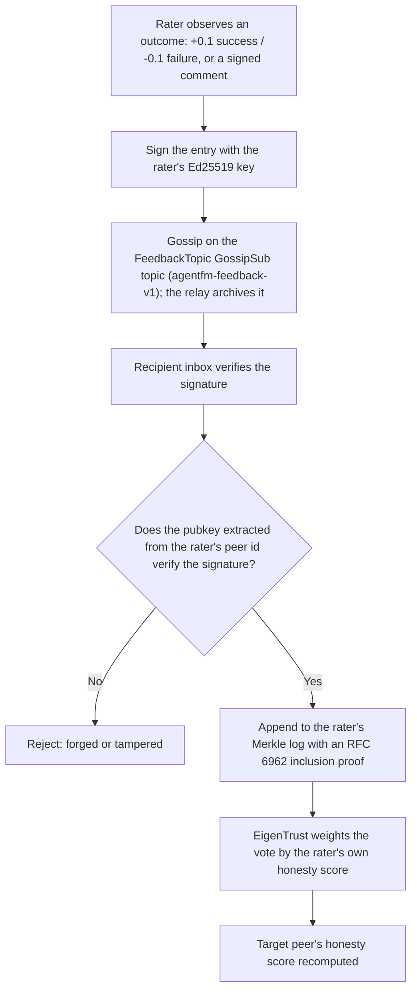
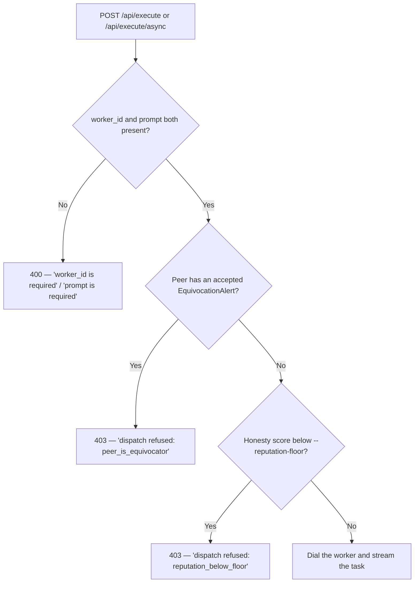
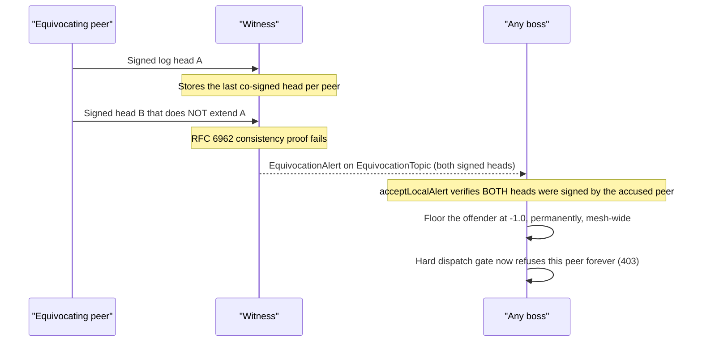

# Trust & Verification

v1.3.1 replaces the old allow-list-based attestation system with **reputation-driven trust**. This document describes what the system does, how to observe it, and where its limits are. It does not oversell.

> **TL;DR.** Trust is not granted upfront — it is earned through behaviour. Every rating is a signed receipt on a tamper-evident Merkle log, and the signature is cryptographically bound to the rater's peer id, so you cannot forge another peer's rating or tamper a single field without breaking verification. Equivocators are caught by witnesses and permanently floored. Bad actors auto-reject below a configurable honesty threshold. No allow-lists. No central authority. No blockchain. "Trust-through-evidence" is the accurate framing, not "trustless."

See also: [architecture.md](architecture.md) for the node roles and protocols, [http-api.md](http-api.md) for the endpoint reference, [private-swarms.md](private-swarms.md) for running your own seeded mesh, and [security.md](security.md) for the threat model.

---

## How a rating becomes trust

Every score you see started life as a single signed observation and traveled through the same pipeline. Nothing is trusted because a peer *says* it happened — each hop re-verifies the evidence.



The load-bearing step is the diamond. The verifier does **not** take a claimed identity on faith — it calls `ExtractPublicKey()` on the rater's peer id and checks the signature against *that* key (`internal/ledger/sign.go`, `internal/ledger/catchup.go`). Because a libp2p peer id is derived from its public key, identity and signature are the same fact. Consequences:

- You cannot sign a rating **as** another peer — your key won't match their id.
- You cannot flip one field (a `+0.5` into a `-0.5`, or swap the subject) — the signature covers the canonical entry bytes and breaks on any edit.
- A relay or a middle-hop boss cannot silently rewrite history it relays; a rewritten entry fails verification at the next inbox.

The final weighting step is why a brand-new identity can't just spam ratings: EigenTrust multiplies each vote by the **rater's** current honesty, so an unproven rater barely moves the needle (see [Sybil resistance](#sybil-resistance)).

---

## The two-check dispatch gate

Before every dispatch the Boss evaluates two conditions:

| Check | Kind | Logic |
|---|---|---|
| **Equivocator gate** | Hard block | If the peer's ledger has an accepted `EquivocationAlert`, dispatch is permanently refused regardless of any other score. |
| **Reputation floor** | Soft block (configurable) | If the peer's EigenTrust-derived honesty score is below `--reputation-floor` (default `-0.5`), dispatch is refused. The gate is a plain threshold comparison. |

A peer passes the gate only if it clears both checks. The equivocator gate can never be overridden; the reputation floor can be tuned via the CLI flag.

As of v1.3.1 this gate runs on the **HTTP dispatch path too** — `POST /api/execute` and `POST /api/execute/async` evaluate it *before* dialing the worker, so a refused dispatch never touches the network:



Note the field validation on the left: a missing `worker_id` or `prompt` now returns a clear `400` (it used to surface as a misleading `404`).

### Adjusting the floor

```bash
# Stricter: refuse anyone below -0.3
agentfm -mode boss -reputation-floor=-0.3

# Relaxed: effectively disable the floor
agentfm -mode boss -reputation-floor=-1.0

# Default
agentfm -mode boss   # floor = -0.5
```

The same flag applies to the headless gateway (`-mode api`) and to the desktop app, which bundles the API boss. See [cli.md](cli.md) for the full flag reference.

---

## How ratings happen

### Automatic hourly aggregates

After every completed or failed dispatch, the Boss records an aggregate outcome rating for the worker:

- `+0.1` per success
- `-0.1` per failure

Ratings are capped at `±0.5` per peer per hour to blunt burst manipulation. Each rating is a signed Protobuf entry written to the local ledger and gossiped to the relay archive.

These machine-issued ratings are why the Boss **self-seeds** its own peer id at `1.0` in its local reputation engine (`cmd/agentfm/bossbootstrap.go`). EigenTrust's premise is "a rater's voting weight equals their own reputation," so without a self-seed a fresh boss's own attestation ratings would carry zero weight and never move a score. Self-seeding makes *your own* ratings count fully **in your own view** — and only there. Other peers don't inherit that trust; they have to accumulate independent evidence about you through the genesis seeds.

### Interactive signed Comment feedback

Operators can attach qualitative feedback to any dispatch outcome:

- **TUI**: after a task completes, the peer-view screen prompts for a free-text comment and a numeric rating.
- **HTTP**: `POST /api/execute` accepts `feedback` (string) and `feedback_rating` (float in `[-1.0, 1.0]`). You can also post a standalone signed comment via `POST /v1/peers/{id}/comments/self` (boss self-signs; optional `rating` in `[-1, +1]`).

Comments are content-addressed (SHA-256 CID), signed by the commenter's Ed25519 key, and appended to the ledger. The comment body is stored separately; only the CID goes in the chain hash. Fetching a body validates the CID as a proper multihash first (`comments.ParseCIDString`), so a malformed id returns a fast `400` rather than a slow `404`.

---

## Cross-boss visibility

### Relay archive ledger

A relay (`agentfm -mode relay`) opens a full archive ledger that auto-subscribes to `FeedbackTopic` and `EquivocationTopic`. Every peer's rating and comment history accumulates there even when the originating Boss is offline.

The relay serves `/agentfm/ledger-fetch/1.0.0` — any Boss can pull missed entries on demand — and `/agentfm/comment-fetch/1.0.0` for comment **bodies**, not just their CIDs.

### Boss auto catch-up

On startup, the Boss queries the connected relay for entries it hasn't seen since its last known head. It verifies each batch against the relay's signed head (inclusion proof) before writing to the local inbox. This keeps reputation scores current even after a restart or period offline.

Comment bodies replicate the same way: on a local miss the boss fetches the body from the author or the relay, and the relay archives bodies and runs a periodic backfill sweep. The practical upshot — **a brand-new boss recovers the full history (ratings *and* comment text) from the relay alone**, no contact with the original raters required.

---

## What operators see

### TUI peer-view

From the radar screen: select a worker → ENTER → **"View ratings & feedback"**. Displays:

- Chronological list of signed `Rating` and `Comment` entries
- Rater peer ID, with `[unverified]` tag when the rater's own honesty score is below `0.1`
- Comment body hydrated on demand

The desktop app surfaces the same data as per-agent history cards (signed ratings/comments, live telemetry, Merkle-backed) — see [DESKTOP.md](DESKTOP.md).

### HTTP endpoints

```bash
# All known peers, including recently-offline ones
curl http://127.0.0.1:8080/api/workers?include_offline=true

# Full trust summary for one peer
curl -H "Authorization: Bearer $KEY" \
  http://127.0.0.1:8080/v1/peers/12D3KooW...

# Signed ledger entries (ratings + comments)
curl -H "Authorization: Bearer $KEY" \
  "http://127.0.0.1:8080/v1/peers/12D3KooW.../log?limit=50&offset=0"

# Hydrate a comment body
curl -H "Authorization: Bearer $KEY" \
  http://127.0.0.1:8080/v1/peers/12D3KooW.../comments/<cid>
```

Full endpoint reference (including `/v1/peers/{id}/reputation` and `/v1/peers/{id}/proof`) lives in [http-api.md](http-api.md). Bearer auth is documented in [auth.md](auth.md).

### CLI

```bash
agentfm reputation show 12D3KooW...
agentfm reputation show -limit 50 12D3KooW...
```

### Python SDK

```python
from agentfm import AgentFMClient

with AgentFMClient(gateway_url="http://127.0.0.1:8080") as client:
    peers = client.peers.list(include_offline=True)
    summary = client.peers.get(peers[0].peer_id)
    print(summary.dispatch_allowed, summary.honesty_score)

    entries = client.peers.log(peers[0].peer_id, limit=20)
    for e in entries:
        if e.text_cid:
            body = client.peers.comment_body(peers[0].peer_id, e.text_cid)
            print(body)

    # Post your own signed comment + rating
    client.peers.comment(peers[0].peer_id, text="clean run, artifacts intact", rating=0.5)
```

See [agentfm-python/README.md](../agentfm-python/README.md) for the full SDK surface.

---

## Sybil resistance

### Per-rater EigenTrust normalization

Votes are weighted by the rater's own honesty score before aggregation. A newly-joined identity has a near-zero score, so its ratings carry proportionally little weight. A coordinated Sybil cluster cannot meaningfully move a target's score without first building their own reputations honestly — which takes time and honest work.

### Seed gradient

EigenTrust's iterative solver requires at least one non-zero seed to avoid converging to zero everywhere. The public mesh ships exactly one genesis seed — the maintainer-run **lighthouse** relay at `12D3KooWQHw8mVQkx17kLTNiRTbYckU2cAGcAwFFLzVJhhmBs5zL` — defined in the bundled seed manifest (`internal/reputation/default_seeds.json`, loaded via `internal/reputation/seeds.go`). Each boss additionally self-seeds its **own** id at `1.0` (see [How ratings happen](#how-ratings-happen)), so the trust gradient always has both a mesh-wide anchor and a local anchor. In a private swarm the public lighthouse seed is inert — that node isn't present — so each boss's self-seed is what anchors the local gradient; the loader (`LoadSeedsFile`) already accepts a custom manifest, though a CLI flag to point at one is not yet wired. See [private-swarms.md](private-swarms.md).

### `[unverified]` rater tags

The TUI and the `/v1/peers/{id}/log` endpoint tag every rating entry with the rater's current trust status. A rating from a rater whose honesty is below `0.1` is shown as `[unverified]` — visible, but the EigenTrust weight for that rater is attenuated accordingly.

---

## What the equivocator gate catches

A peer "equivocates" when it tries to maintain two divergent versions of its own ledger simultaneously — for example, showing honest ratings to some peers and hiding bad ratings from others. Witnesses (`agentfm -mode witness`, ledger-only replicas) exist to catch exactly this.



Step by step:

1. Witnesses store the last signed head they co-signed per peer.
2. When a new head arrives that does not extend the prior head (RFC 6962 consistency proof fails), the witness gossips an `EquivocationAlert` containing both conflicting heads.
3. Any Boss receiving the alert verifies both heads were signed by the accused peer before accepting the alert.
4. The equivocator is permanently floored at `-1.0` and blocked by the hard dispatch gate.

A rogue witness that falsely brands an innocent peer: the `acceptLocalAlert` verifier requires valid signatures from the accused peer on **both** conflicting heads. A fabricated alert without those signatures is rejected. This is the same peer-id-bound signature check that protects individual ratings — a witness can't forge the accused's signature any more than a rater can forge someone else's vote.

---

## What this does NOT solve

| Limitation | Notes |
|---|---|
| **Runtime malice from previously-trusted peers** | A peer that has earned a positive reputation and then starts returning garbage will degrade over time via outcome ratings, but some bad tasks will be served before ejection. Podman sandboxing bounds the damage (no host filesystem access, SIGKILL on stream death), but does not prevent a dishonest response. |
| **Sybil immunity** | EigenTrust provides resistance, not immunity. A large coordinated cluster with many machines can still dilute score signals — just slowly. |
| **zkML / cryptographic proof of inference** | Out of scope for this product positioning. "Verifiable" means the rating trail is tamper-evident, not that the inference itself is proven correct. |
| **Cross-mesh reputation portability** | Reputation is local to one mesh. v1.5 problem. |
| **Right-to-be-forgotten beyond content redaction** | Entry hashes are permanent by design. Comment bodies are content-addressed and can be made unreachable, but the hash stays in the chain. |
| **Behavioural probing** | Automated golden-prompt probes for catching "right image, bad output" are deferred to v1.4. |

The honest summary: **reputation-driven trust + container sandboxing + cryptographic equivocation detection. Not trustless — trust-through-evidence.**

---

## Trust assumptions

| Assumption | What breaks if wrong |
|---|---|
| **The genesis seed is honest** (public mesh) | EigenTrust starts from the wrong gradient. Mitigation: private swarms don't rely on the public lighthouse seed at all — each boss's self-seed anchors the local gradient instead. |
| **Boss operator is honest** | A malicious Boss can ignore the reputation floor, fabricate ratings *in its own view*. The Boss is the mesh owner — this is the trust boundary, not a mesh-wide threat. Note it still cannot forge ratings **as another peer**, because signatures are bound to the rater's peer id. |
| **SHA-256 is collision-resistant** | Inclusion proofs become forgeable. Realistic only post-2030. |
| **libp2p Noise transport is secure** | An attacker on the wire can MITM streams. Same assumption all libp2p code makes. |

---

## Joining the public mesh as an agent operator

No permission needed. The full path:

1. Build your agent image and push it to any registry.
2. Run `agentfm -mode worker -image <ref> -agent <name> -capability <kebab-tag>`.
3. Your worker self-advertises via libp2p and starts receiving tasks.
4. Complete tasks honestly → reputation climbs → you keep receiving tasks.

No PR. No allow-list. No maintainer review. Full worker setup is in [worker.md](worker.md).

---

## Reading the source

| Component | Code |
|---|---|
| Dispatch gate (equivocator + floor) | `internal/boss/trust_gate.go` |
| Peer-id-bound signature verification | `internal/ledger/sign.go`, `internal/ledger/catchup.go` (`ExtractPublicKey`) |
| Self-seed at boot | `cmd/agentfm/bossbootstrap.go` |
| Seed manifest loading (genesis seeds) | `internal/reputation/seeds.go` |
| EigenTrust solver | `internal/reputation/eigentrust.go` |
| Hourly aggregate ratings | `internal/boss/completion_rating.go` (writer); outcome hooks in `internal/boss/api_handlers.go` |
| Signed Comment feedback | `internal/boss/api_comments.go` |
| Relay archive ledger | `cmd/agentfm/relay.go` |
| Boss auto catch-up | `internal/ledger/catchup.go` (`CatchUp`) |
| Offline peer visibility | `internal/boss/peer_view.go` (`ListKnownPeers`) |
| Merkle log spine | `internal/ledger/ledger.go`, `internal/ledger/impl.go`, `internal/ledger/merkle/*.go` |
| Inbox + range validation | `internal/ledger/inbox/inbox.go` |
| Equivocation handling | `internal/ledger/impl.go` (`acceptLocalAlert`) |

---

## Reporting issues

Trust-model issues (forged ratings, undetected equivocation, bypassable dispatch gate): open a private issue at https://github.com/Agent-FM/agentfm-core/security/advisories — [SECURITY.md](../SECURITY.md) documents the disclosure process.
